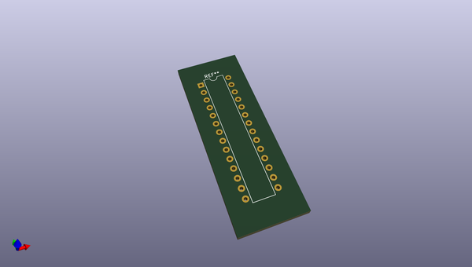
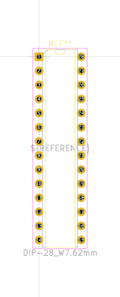

# OOMP Footprint  
## DIP-28_W7.62mm  by oomlout  
  
oomp key: oomp_oomlout_oomlout_oomp_part_footprints_id28mcuat328_electronic_ic_dip_28_mcu_atmega328_microchip_atmega328p_pu  
  
source repo at: [http://github.com/oomlout/oomlout_oomp_part_kicad_footprints/blob/master/tmp/data/oomlout_oomp_footprint_src/oomlout_oomp_part_footprints.pretty/xcr3213mhz8_electronic_ceramic_resonator_3213_3_pin_ground_pin_2_8_mega_hertz_1.kicad_mod](http://github.com/oomlout/oomlout_oomp_part_kicad_footprints/blob/master/tmp/data/oomlout_oomp_footprint_src/oomlout_oomp_part_footprints.pretty/xcr3213mhz8_electronic_ceramic_resonator_3213_3_pin_ground_pin_2_8_mega_hertz_1.kicad_mod)  
## Footprint  
  
  
  
  
| name | value | 
| --- | --- | 
| footprint name | DIP-28_W7.62mm | 
| footprint description | 28-lead though-hole mounted DIP package, row spacing 7.62 mm (300 mils) | 
| number of pads | 28 | 
| github path | http://github.com/oomlout/oomlout_oomp_part_kicad_footprints/blob/master/tmp/data/oomlout_oomp_footprint_src/oomlout_oomp_part_footprints.pretty/id28mcuat328_electronic_ic_dip_28_mcu_atmega328_microchip_atmega328p_pu.kicad_mod | 
| oomp key | oomp_oomlout_oomlout_oomp_part_footprints_id28mcuat328_electronic_ic_dip_28_mcu_atmega328_microchip_atmega328p_pu | 
| oomp bot github | https://github.com/oomlout/oomlout_oomp_footprint_bot/tree/main/tmp/data/oomlout_oomp_footprint_src/footprints/oomlout_oomlout_oomp_part_footprints_id28mcuat328_electronic_ic_dip_28_mcu_atmega328_microchip_atmega328p_pu/working | 
## Images  
