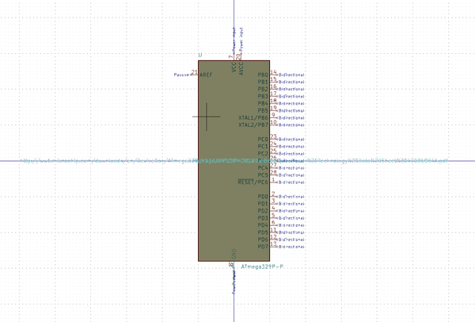
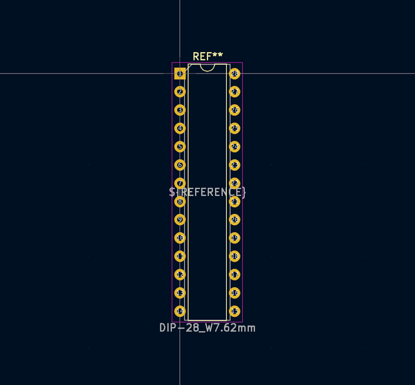

# Electronic Ic Dip 28 Mcu Atmega328 Microchip Atmega328P Pu

  
* oomp_key: oomp_electronic_ic_dip_28_mcu_atmega328_microchip_atmega328p_pu 
* short_code: id28at328
* md5_6: 5b2b5d  
* github_link: https://github.com/oomlout/oomlout_oomp_part_src/tree/main/parts/electronic_ic_dip_28_mcu_atmega328_microchip_atmega328p_pu/working  
## naming details
* classification -- electronic
* type -- ic
* size -- dip_28
* color -- mcu
* description_main -- atmega328
* description_extra -- 
* manucaturer -- microchip
* part_number -- atmega328p_pu

## symbol

  
oomp_key: oomp_kicad_mcu_microchip_atmega_atmega328p_p  
link: https://github.com/oomlout/oomlout_oomp_symbol_bot/tree/main/symbols/kicad_mcu_microchip_atmega_atmega328p_p/working  

## footprint

  
oomp_key: oomp_kicad_package_dip_dip_28_w7_62mm  
link: https://github.com/oomlout/oomlout_oomp_footprint_bot/tree/main/foootprntss/kicad_package_dip_dip_28_w7_62mm/working  

## full_summary
| name | value | 
| --- | --- | 
| name | value | 
| classification | electronic | 
| type | ic | 
| size | dip_28 | 
| color | mcu | 
| description_main | atmega328 | 
| description_extra |  | 
| manufacturer | microchip | 
| part_number | atmega328p_pu | 
| short_name | atmega328 28 pin dip | 
| id | electronic_ic_dip_28_mcu_atmega328_microchip_atmega328p_pu | 
| oomp_key | oomp_electronic_ic_dip_28_mcu_atmega328_microchip_atmega328p_pu | 
| github_link | https://github.com/oomlout/oomlout_oomp_part_src/tree/main/parts/electronic_ic_dip_28_mcu_atmega328_microchip_atmega328p_pu/working | 
| directory | parts/electronic_ic_dip_28_mcu_atmega328_microchip_atmega328p_pu | 
| name | Electronic Ic Dip 28 Mcu Atmega328 Microchip Atmega328P Pu | 
| short_code | id28at328 | 
| distributors | [] | 
| manufacturers | [] | 
| md5 | 5b2b5de6dc21043bec6c02133654d333 | 
| md5_5 | 5b2b5 | 
| md5_6 | 5b2b5d | 
| md5_10 | 5b2b5de6dc | 
| footprint | [{'link': 'https://github.com/oomlout/oomlout_oomp_footprint_bot/tree/main/foootprntss/kicad_package_dip_dip_28_w7_62mm', 'oomp_key': 'oomp_kicad_package_dip_dip_28_w7_62mm', 'directory': 'oomlout_oomp_footprint_bot/footprints/kicad_package_dip_dip_28_w7_62mm//working/working.kicad_mod'}] | 
| symbol | [{'link': 'https://github.com/oomlout/oomlout_oomp_symbol_bot/tree/main/symbols/kicad_mcu_microchip_atmega_atmega328p_p', 'oomp_key': 'oomp_kicad_mcu_microchip_atmega_atmega328p_p', 'directory': 'oomlout_oomp_symbol_bot/symbols/kicad_mcu_microchip_atmega_atmega328p_p//working/working.kicad_sym'}] | 
