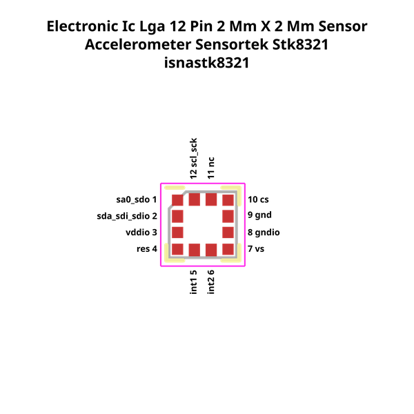

# Electronic Ic Lga 12 Pin 2 Mm X 2 Mm Sensor Accelerometer Sensortek Stk8321

  
* oomp_key: oomp_electronic_ic_lga_12_pin_2_mm_x_2_mm_sensor_accelerometer_sensortek_stk8321 
* short_code: isnastk8321
* md5_6: 53a506  
* github_link: https://github.com/oomlout/oomlout_oomp_part_src/tree/main/parts/electronic_ic_lga_12_pin_2_mm_x_2_mm_sensor_accelerometer_sensortek_stk8321/working  
## naming details
* classification -- electronic
* type -- ic
* size -- lga_12_pin_2_mm_x_2_mm
* color -- sensor
* description_main -- accelerometer
* description_extra -- 
* manucaturer -- sensortek
* part_number -- stk8321
## pinout
  
List of Pins:

* 1 : sa0_sdo
* 2 : sda_sdi_sdio
* 3 : vddio
* 4 : res
* 5 : int1
* 6 : int2
* 7 : vs
* 8 : gndio
* 9 : gnd
* 10 : cs
* 11 : nc
* 12 : scl_sck

## footprint

  
oomp_key: oomp_kicad_package_lga_lga_12_2x2mm_p0_5mm  
link: https://github.com/oomlout/oomlout_oomp_footprint_bot/tree/main/footprints/kicad_package_lga_lga_12_2x2mm_p0_5mm/working  

  
oomp_key: oomp_oomp_isnastk8321_electronic_ic_lga_12_pin_2_mm_x_2_mm_sensor_accelerometer_sensortek_stk8321  
link: https://github.com/oomlout/oomlout_oomp_footprint_bot/tree/main/footprints/oomp_isnastk8321_electronic_ic_lga_12_pin_2_mm_x_2_mm_sensor_accelerometer_sensortek_stk8321/working  

## full_summary
| name | value | 
| --- | --- | 
| name | value | 
| classification | electronic | 
| type | ic | 
| size | lga_12_pin_2_mm_x_2_mm | 
| color | sensor | 
| description_main | accelerometer | 
| description_extra |  | 
| manufacturer | sensortek | 
| part_number | stk8321 | 
| short_name | bosch sensortec bme280 pressure and temperature sensor | 
| pins_pin_1_name | sa0_sdo | 
| pins_pin_1_number | 1 | 
| pins_pin_1_type | power | 
| pins_pin_2_name | sda_sdi_sdio | 
| pins_pin_2_number | 2 | 
| pins_pin_2_type | signal | 
| pins_pin_3_name | vddio | 
| pins_pin_3_number | 3 | 
| pins_pin_3_type | signal | 
| pins_pin_4_name | res | 
| pins_pin_4_number | 4 | 
| pins_pin_4_type | signal | 
| pins_pin_5_name | int1 | 
| pins_pin_5_number | 5 | 
| pins_pin_5_type | signal | 
| pins_pin_6_name | int2 | 
| pins_pin_6_number | 6 | 
| pins_pin_6_type | power | 
| pins_pin_7_name | vs | 
| pins_pin_7_number | 7 | 
| pins_pin_7_type | power | 
| pins_pin_8_name | gndio | 
| pins_pin_8_number | 8 | 
| pins_pin_8_type | power | 
| pins_pin_9_name | gnd | 
| pins_pin_9_number | 9 | 
| pins_pin_9_type | power | 
| pins_pin_10_name | cs | 
| pins_pin_10_number | 10 | 
| pins_pin_10_type | power | 
| pins_pin_11_name | nc | 
| pins_pin_11_number | 11 | 
| pins_pin_11_type | power | 
| pins_pin_12_name | scl_sck | 
| pins_pin_12_number | 12 | 
| pins_pin_12_type | power | 
| classification_upper | ELECTRONIC | 
| classification_capital | Electronic | 
| classification_first_letter | e | 
| classification_first_letter_upper | E | 
| type_upper | IC | 
| type_capital | Ic | 
| type_first_letter | i | 
| type_first_letter_upper | I | 
| size_upper | LGA_12_PIN_2_MM_X_2_MM | 
| size_capital | Lga 12 Pin 2 mm x 2 mm | 
| size_first_letter | l | 
| size_first_letter_upper | L | 
| color_upper | SENSOR | 
| color_capital | Sensor | 
| color_first_letter | s | 
| color_first_letter_upper | S | 
| description_main_upper | ACCELEROMETER | 
| description_main_capital | Accelerometer | 
| description_main_first_letter | a | 
| description_main_first_letter_upper | A | 
| description_extra_upper |  | 
| description_extra_capital |  | 
| description_extra_first_letter |  | 
| description_extra_first_letter_upper |  | 
| manufacturer_upper | SENSORTEK | 
| manufacturer_capital | Sensortek | 
| manufacturer_first_letter | s | 
| manufacturer_first_letter_upper | S | 
| part_number_upper | STK8321 | 
| part_number_capital | Stk8321 | 
| part_number_first_letter | s | 
| part_number_first_letter_upper | S | 
| id | electronic_ic_lga_12_pin_2_mm_x_2_mm_sensor_accelerometer_sensortek_stk8321 | 
| id_no_class | ic_lga_12_pin_2_mm_x_2_mm_sensor_accelerometer_sensortek_stk8321 | 
| id_no_type | lga_12_pin_2_mm_x_2_mm_sensor_accelerometer_sensortek_stk8321 | 
| id_no_size | sensor_accelerometer_sensortek_stk8321 | 
| oomp_key | oomp_electronic_ic_lga_12_pin_2_mm_x_2_mm_sensor_accelerometer_sensortek_stk8321 | 
| github_link | https://github.com/oomlout/oomlout_oomp_part_src/tree/main/parts/electronic_ic_lga_12_pin_2_mm_x_2_mm_sensor_accelerometer_sensortek_stk8321/working | 
| directory | parts/electronic_ic_lga_12_pin_2_mm_x_2_mm_sensor_accelerometer_sensortek_stk8321 | 
| name | Electronic Ic Lga 12 Pin 2 Mm X 2 Mm Sensor Accelerometer Sensortek Stk8321 | 
| name_no_class | Ic Lga 12 Pin 2 Mm X 2 Mm Sensor Accelerometer Sensortek Stk8321 | 
| name_no_type | Lga 12 Pin 2 Mm X 2 Mm Sensor Accelerometer Sensortek Stk8321 | 
| name_no_size | Sensor Accelerometer Sensortek Stk8321 | 
| short_code | isnastk8321 | 
| short_code_upper | ISNASTK8321 | 
| distributors | [] | 
| manufacturers | [] | 
| md5 | 53a50685369ad5aa7c430e8df214d3c7 | 
| md5_5 | 53a50 | 
| md5_5_upper | 53A50 | 
| md5_6 | 53a506 | 
| md5_6_upper | 53A506 | 
| md5_6_alpha | 39hqe | 
| md5_6_alpha_upper | 39HQE | 
| md5_10 | 53a5068536 | 
| md5_10_upper | 53A5068536 | 
| size_only_numbers | 1222 | 
| size_only_numbers_no_zeros | 1222 | 
| description_only_numbers |  | 
| description_only_numbers_short |   | 
| name_no_size_short | Sensor Accelerometer Sensortek Stk8321 | 
| description_or_color | S  | 
| description_or_color_upper | S  | 
| markdown_full | [electronic_ic_lga_12_pin_2_mm_x_2_mm_sensor_accelerometer_sensortek_stk8321](https://github.com/oomlout/oomlout_oomp_part_src/tree/main/parts/electronic_ic_lga_12_pin_2_mm_x_2_mm_sensor_accelerometer_sensortek_stk8321/working) [isnastk8321](https://github.com/oomlout/oomlout_oomp_part_src/tree/main/parts/electronic_ic_lga_12_pin_2_mm_x_2_mm_sensor_accelerometer_sensortek_stk8321/working) [Electronic Ic Lga 12 Pin 2 Mm X 2 Mm Sensor Accelerometer Sensortek Stk8321](https://github.com/oomlout/oomlout_oomp_part_src/tree/main/parts/electronic_ic_lga_12_pin_2_mm_x_2_mm_sensor_accelerometer_sensortek_stk8321/working)   | 
| markdown_short | [electronic_ic_lga_12_pin_2_mm_x_2_mm_sensor_accelerometer_sensortek_stk8321](https://github.com/oomlout/oomlout_oomp_part_src/tree/main/parts/electronic_ic_lga_12_pin_2_mm_x_2_mm_sensor_accelerometer_sensortek_stk8321/working)   | 
| footprint | [{'link': 'https://github.com/oomlout/oomlout_oomp_footprint_bot/tree/main/foootprntss/kicad_package_lga_lga_12_2x2mm_p0_5mm', 'oomp_key': 'oomp_kicad_package_lga_lga_12_2x2mm_p0_5mm', 'directory': 'oomlout_oomp_footprint_bot/footprints/kicad_package_lga_lga_12_2x2mm_p0_5mm//working/working.kicad_mod', 'note': 'source footprint kicad_package_lga_lga_12_2x2mm_p0_5mm', 'index': 0}, {'link': 'https://github.com/oomlout/oomlout_oomp_footprint_bot/tree/main/foootprntss/oomp_isnastk8321_electronic_ic_lga_12_pin_2_mm_x_2_mm_sensor_accelerometer_sensortek_stk8321', 'oomp_key': 'oomp_oomp_isnastk8321_electronic_ic_lga_12_pin_2_mm_x_2_mm_sensor_accelerometer_sensortek_stk8321', 'directory': 'oomlout_oomp_footprint_bot/footprints/oomp_isnastk8321_electronic_ic_lga_12_pin_2_mm_x_2_mm_sensor_accelerometer_sensortek_stk8321//working/working.kicad_mod', 'note': 'oomp generated footprint', 'index': 1}] | 
