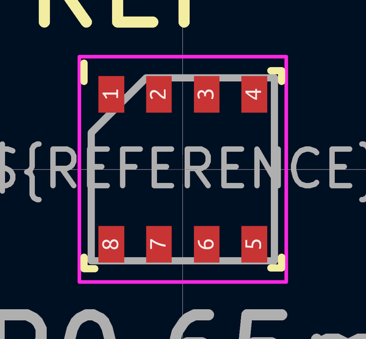

# Electronic Ic Lga 2 5 Mm X 2 5 Mm 8 Pin Sensor Pressure Temperature Bosch Bme280

  
* oomp_key: oomp_electronic_ic_lga_2_5_mm_x_2_5_mm_8_pin_sensor_pressure_temperature_bosch_bme280 
* short_code: isn280
* md5_6: a3697f  
* github_link: https://github.com/oomlout/oomlout_oomp_part_src/tree/main/parts/electronic_ic_lga_2_5_mm_x_2_5_mm_8_pin_sensor_pressure_temperature_bosch_bme280/working  
## naming details
* classification -- electronic
* type -- ic
* size -- lga_2_5_mm_x_2_5_mm_8_pin
* color -- sensor
* description_main -- pressure_temperature
* description_extra -- 
* manucaturer -- bosch
* part_number -- bme280
## pinout
  
List of Pins:

* 1 : gnd
* 2 : csb
* 3 : sdi
* 4 : sck
* 5 : sdo
* 6 : vddio
* 7 : gnd
* 8 : vdd
## distributors
* [LCSC - C92489](https://lcsc.com/product-detail/C92489.html)  

## manufacturers
* [Bosch - BME280](https://www.bosch-sensortec.com/products/environmental-sensors/humidity-sensors-bme280/)  

## symbol

  
oomp_key: oomp_kicad_sensor_bme280  
link: https://github.com/oomlout/oomlout_oomp_symbol_bot/tree/main/symbols/kicad_sensor_bme280/working  

## footprint

  
oomp_key: oomp_kicad_package_lga_bosch_lga_8_2_5x2_5mm_p0_65mm_clockwisepinnumbering  
link: https://github.com/oomlout/oomlout_oomp_footprint_bot/tree/main/footprints/kicad_package_lga_bosch_lga_8_2_5x2_5mm_p0_65mm_clockwisepinnumbering/working  

## full_summary
| name | value | 
| --- | --- | 
| name | value | 
| classification | electronic | 
| type | ic | 
| size | lga_2_5_mm_x_2_5_mm_8_pin | 
| color | sensor | 
| description_main | pressure_temperature | 
| description_extra |  | 
| manufacturer | bosch | 
| part_number | bme280 | 
| short_name | bosch sensortec bme280 pressure and temperature sensor | 
| pins_pin_1_name | gnd | 
| pins_pin_1_number | 1 | 
| pins_pin_1_type | power | 
| pins_pin_2_name | csb | 
| pins_pin_2_number | 2 | 
| pins_pin_2_type | signal | 
| pins_pin_3_name | sdi | 
| pins_pin_3_number | 3 | 
| pins_pin_3_type | signal | 
| pins_pin_4_name | sck | 
| pins_pin_4_number | 4 | 
| pins_pin_4_type | signal | 
| pins_pin_5_name | sdo | 
| pins_pin_5_number | 5 | 
| pins_pin_5_type | signal | 
| pins_pin_6_name | vddio | 
| pins_pin_6_number | 6 | 
| pins_pin_6_type | power | 
| pins_pin_7_name | gnd | 
| pins_pin_7_number | 7 | 
| pins_pin_7_type | power | 
| pins_pin_8_name | vdd | 
| pins_pin_8_number | 8 | 
| pins_pin_8_type | power | 
| id | electronic_ic_lga_2_5_mm_x_2_5_mm_8_pin_sensor_pressure_temperature_bosch_bme280 | 
| oomp_key | oomp_electronic_ic_lga_2_5_mm_x_2_5_mm_8_pin_sensor_pressure_temperature_bosch_bme280 | 
| github_link | https://github.com/oomlout/oomlout_oomp_part_src/tree/main/parts/electronic_ic_lga_2_5_mm_x_2_5_mm_8_pin_sensor_pressure_temperature_bosch_bme280/working | 
| directory | parts/electronic_ic_lga_2_5_mm_x_2_5_mm_8_pin_sensor_pressure_temperature_bosch_bme280 | 
| name | Electronic Ic Lga 2 5 Mm X 2 5 Mm 8 Pin Sensor Pressure Temperature Bosch Bme280 | 
| short_code | isn280 | 
| distributors | [{'name': 'LCSC', 'part_number': 'C92489', 'link': 'https://lcsc.com/product-detail/C92489.html', 'id': 'distributor_lcsc'}] | 
| manufacturers | [{'name': 'Bosch', 'part_number': 'BME280', 'link': 'https://www.bosch-sensortec.com/products/environmental-sensors/humidity-sensors-bme280/', 'id': 'manufacturer_bosch'}] | 
| md5 | a3697f01237d79885aae438ef33a55dd | 
| md5_5 | a3697 | 
| md5_6 | a3697f | 
| md5_10 | a3697f0123 | 
| footprint | [{'link': 'https://github.com/oomlout/oomlout_oomp_footprint_bot/tree/main/foootprntss/kicad_package_lga_bosch_lga_8_2_5x2_5mm_p0_65mm_clockwisepinnumbering', 'oomp_key': 'oomp_kicad_package_lga_bosch_lga_8_2_5x2_5mm_p0_65mm_clockwisepinnumbering', 'directory': 'oomlout_oomp_footprint_bot/footprints/kicad_package_lga_bosch_lga_8_2_5x2_5mm_p0_65mm_clockwisepinnumbering//working/working.kicad_mod'}] | 
| symbol | [{'link': 'https://github.com/oomlout/oomlout_oomp_symbol_bot/tree/main/symbols/kicad_sensor_bme280', 'oomp_key': 'oomp_kicad_sensor_bme280', 'directory': 'oomlout_oomp_symbol_bot/symbols/kicad_sensor_bme280//working/working.kicad_sym'}] | 
