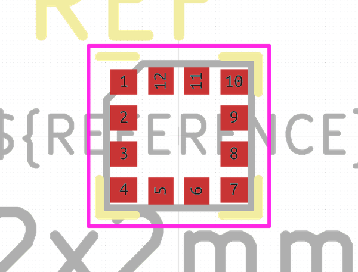

# Electronic Ic Lga 2 Mm X 2 Mm 12 Pin Sensor Accelerometer Sensortek Stk8321

  
* oomp_key: oomp_electronic_ic_lga_2_mm_x_2_mm_12_pin_sensor_accelerometer_sensortek_stk8321 
* short_code: isn
* md5_6: c4fd34  
* github_link: https://github.com/oomlout/oomlout_oomp_part_src/tree/main/parts/electronic_ic_lga_2_mm_x_2_mm_12_pin_sensor_accelerometer_sensortek_stk8321/working  
## naming details
* classification -- electronic
* type -- ic
* size -- lga_2_mm_x_2_mm_12_pin
* color -- sensor
* description_main -- accelerometer
* description_extra -- 
* manucaturer -- sensortek
* part_number -- stk8321
## pinout
  
List of Pins:

* 1 : sa0_sdo
* 2 : sda_sdi_sdio
* 3 : vddio
* 4 : res
* 5 : int1
* 6 : int2
* 7 : vs
* 8 : gndio
* 9 : gnd
* 10 : cs
* 11 : nc
* 12 : scl_sck
## distributors
* [LCSC - C966924](https://lcsc.com/product-detail/C966924.html)  

## manufacturers
* [Sensortek - STK8321](https://www.bosch-sensortec.com/products/environmental-sensors/humidity-sensors-bme280/)  

## footprint

  
oomp_key: oomp_kicad_package_lga_lga_12_2x2mm_p0_5mm  
link: https://github.com/oomlout/oomlout_oomp_footprint_bot/tree/main/footprints/kicad_package_lga_lga_12_2x2mm_p0_5mm/working  

## full_summary
| name | value | 
| --- | --- | 
| name | value | 
| classification | electronic | 
| type | ic | 
| size | lga_2_mm_x_2_mm_12_pin | 
| color | sensor | 
| description_main | accelerometer | 
| description_extra |  | 
| manufacturer | sensortek | 
| part_number | stk8321 | 
| short_name | bosch sensortec bme280 pressure and temperature sensor | 
| pins_pin_1_name | sa0_sdo | 
| pins_pin_1_number | 1 | 
| pins_pin_1_type | power | 
| pins_pin_2_name | sda_sdi_sdio | 
| pins_pin_2_number | 2 | 
| pins_pin_2_type | signal | 
| pins_pin_3_name | vddio | 
| pins_pin_3_number | 3 | 
| pins_pin_3_type | signal | 
| pins_pin_4_name | res | 
| pins_pin_4_number | 4 | 
| pins_pin_4_type | signal | 
| pins_pin_5_name | int1 | 
| pins_pin_5_number | 5 | 
| pins_pin_5_type | signal | 
| pins_pin_6_name | int2 | 
| pins_pin_6_number | 6 | 
| pins_pin_6_type | power | 
| pins_pin_7_name | vs | 
| pins_pin_7_number | 7 | 
| pins_pin_7_type | power | 
| pins_pin_8_name | gndio | 
| pins_pin_8_number | 8 | 
| pins_pin_8_type | power | 
| pins_pin_9_name | gnd | 
| pins_pin_9_number | 9 | 
| pins_pin_9_type | power | 
| pins_pin_10_name | cs | 
| pins_pin_10_number | 10 | 
| pins_pin_10_type | power | 
| pins_pin_11_name | nc | 
| pins_pin_11_number | 11 | 
| pins_pin_11_type | power | 
| pins_pin_12_name | scl_sck | 
| pins_pin_12_number | 12 | 
| pins_pin_12_type | power | 
| id | electronic_ic_lga_2_mm_x_2_mm_12_pin_sensor_accelerometer_sensortek_stk8321 | 
| oomp_key | oomp_electronic_ic_lga_2_mm_x_2_mm_12_pin_sensor_accelerometer_sensortek_stk8321 | 
| github_link | https://github.com/oomlout/oomlout_oomp_part_src/tree/main/parts/electronic_ic_lga_2_mm_x_2_mm_12_pin_sensor_accelerometer_sensortek_stk8321/working | 
| directory | parts/electronic_ic_lga_2_mm_x_2_mm_12_pin_sensor_accelerometer_sensortek_stk8321 | 
| name | Electronic Ic Lga 2 Mm X 2 Mm 12 Pin Sensor Accelerometer Sensortek Stk8321 | 
| short_code | isn | 
| distributors | [{'name': 'LCSC', 'part_number': 'C966924', 'link': 'https://lcsc.com/product-detail/C966924.html', 'id': 'distributor_lcsc'}] | 
| manufacturers | [{'name': 'Sensortek', 'part_number': 'STK8321', 'link': 'https://www.bosch-sensortec.com/products/environmental-sensors/humidity-sensors-bme280/', 'id': 'manufacturer_sensortek'}] | 
| md5 | c4fd3486a33246ce70275edc1fcf9b4a | 
| md5_5 | c4fd3 | 
| md5_6 | c4fd34 | 
| md5_10 | c4fd3486a3 | 
| markdown_full | [electronic_ic_lga_2_mm_x_2_mm_12_pin_sensor_accelerometer_sensortek_stk8321](https://github.com/oomlout/oomlout_oomp_part_src/tree/main/parts/electronic_ic_lga_2_mm_x_2_mm_12_pin_sensor_accelerometer_sensortek_stk8321/working) [isn](https://github.com/oomlout/oomlout_oomp_part_src/tree/main/parts/electronic_ic_lga_2_mm_x_2_mm_12_pin_sensor_accelerometer_sensortek_stk8321/working) [Electronic Ic Lga 2 Mm X 2 Mm 12 Pin Sensor Accelerometer Sensortek Stk8321](https://github.com/oomlout/oomlout_oomp_part_src/tree/main/parts/electronic_ic_lga_2_mm_x_2_mm_12_pin_sensor_accelerometer_sensortek_stk8321/working) [LCSC - C966924 ](https://lcsc.com/product-detail/C966924.html) [Sensortek - STK8321](https://www.bosch-sensortec.com/products/environmental-sensors/humidity-sensors-bme280/) [(L)  ](https://www.lcsc.com/search?q=STK8321)[(D)  ](https://www.digikey.com/en/products?keywords=STK8321)[(M)  ](https://www.mouser.com/Search/Refine?Keyword=STK8321)[(N)  ](https://www.newark.com/search?st=STK8321)[(SZ)  ](https://so.szlcsc.com/global.html?k=STK8321)  | 
| footprint | [{'link': 'https://github.com/oomlout/oomlout_oomp_footprint_bot/tree/main/foootprntss/kicad_package_lga_lga_12_2x2mm_p0_5mm', 'oomp_key': 'oomp_kicad_package_lga_lga_12_2x2mm_p0_5mm', 'directory': 'oomlout_oomp_footprint_bot/footprints/kicad_package_lga_lga_12_2x2mm_p0_5mm//working/working.kicad_mod'}] | 
