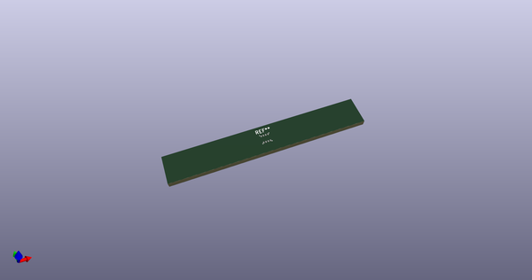
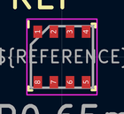
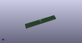

# OOMP Footprint  
## Bosch_LGA-8_2.5x2.5mm_P0.65mm_ClockwisePinNumbering  by none  
  
oomp key: oomp_kicad_package_lga_bosch_lga_8_2_5x2_5mm_p0_65mm_clockwisepinnumbering  
  
source repo at: [http://gitlab.com/kicad/libraries/kicad-footprints//blob/master/tmp/libraries/kicad-footprints/Varistor.pretty/RV_Rect_V25S440P_L26.5mm_W8.2mm_P12.7mm.kicad_mod](http://gitlab.com/kicad/libraries/kicad-footprints//blob/master/tmp/libraries/kicad-footprints/Varistor.pretty/RV_Rect_V25S440P_L26.5mm_W8.2mm_P12.7mm.kicad_mod)  
## Footprint  
  
  
  
  
| name | value | 
| --- | --- | 
| footprint name | Bosch_LGA-8_2.5x2.5mm_P0.65mm_ClockwisePinNumbering | 
| footprint description | LGA-8 | 
| number of pads | 8 | 
| github path | http://github.com/kicad/libraries/kicad-footprints//blob/master/tmp/libraries/kicad-footprints/Package_LGA.pretty/Bosch_LGA-8_2.5x2.5mm_P0.65mm_ClockwisePinNumbering.kicad_mod | 
| oomp key | oomp_kicad_package_lga_bosch_lga_8_2_5x2_5mm_p0_65mm_clockwisepinnumbering | 
| oomp bot github | https://github.com/oomlout/oomlout_oomp_footprint_bot/tree/main/footprints/kicad_package_lga_bosch_lga_8_2_5x2_5mm_p0_65mm_clockwisepinnumbering/working | 
## Images  
  
  
  
  
  
  
  
  
