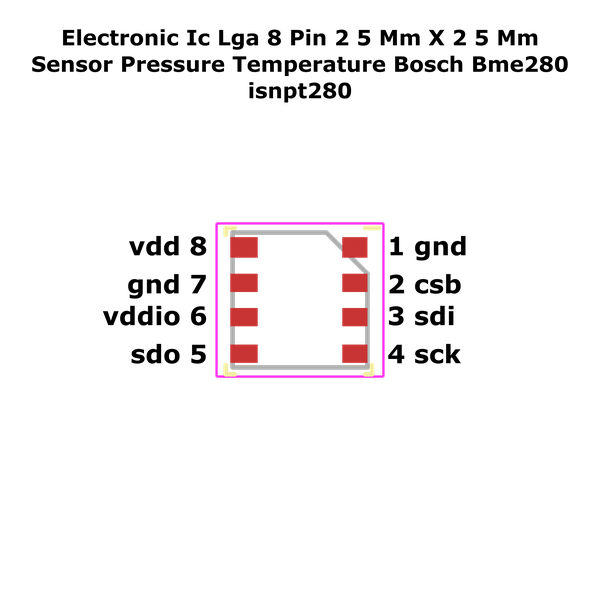

# Electronic Ic Lga 8 Pin 2 5 Mm X 2 5 Mm Sensor Pressure Temperature Bosch Bme280

  
* oomp_key: oomp_electronic_ic_lga_8_pin_2_5_mm_x_2_5_mm_sensor_pressure_temperature_bosch_bme280 
* short_code: isnpt280
* md5_6: 3c6ed6  
* github_link: https://github.com/oomlout/oomlout_oomp_part_src/tree/main/parts/electronic_ic_lga_8_pin_2_5_mm_x_2_5_mm_sensor_pressure_temperature_bosch_bme280/working  
## naming details
* classification -- electronic
* type -- ic
* size -- lga_8_pin_2_5_mm_x_2_5_mm
* color -- sensor
* description_main -- pressure_temperature
* description_extra -- 
* manucaturer -- bosch
* part_number -- bme280
## pinout
  
List of Pins:

* 1 : gnd
* 2 : csb
* 3 : sdi
* 4 : sck
* 5 : sdo
* 6 : vddio
* 7 : gnd
* 8 : vdd

## symbol

  
oomp_key: oomp_kicad_sensor_bme280  
link: https://github.com/oomlout/oomlout_oomp_symbol_bot/tree/main/symbols/kicad_sensor_bme280/working  

## footprint

  
oomp_key: oomp_kicad_package_lga_bosch_lga_8_2_5x2_5mm_p0_65mm_clockwisepinnumbering  
link: https://github.com/oomlout/oomlout_oomp_footprint_bot/tree/main/footprints/kicad_package_lga_bosch_lga_8_2_5x2_5mm_p0_65mm_clockwisepinnumbering/working  

## full_summary
| name | value | 
| --- | --- | 
| name | value | 
| classification | electronic | 
| type | ic | 
| size | lga_8_pin_2_5_mm_x_2_5_mm | 
| color | sensor | 
| description_main | pressure_temperature | 
| description_extra |  | 
| manufacturer | bosch | 
| part_number | bme280 | 
| short_name | bosch sensortec bme280 pressure and temperature sensor | 
| pins_pin_1_name | gnd | 
| pins_pin_1_number | 1 | 
| pins_pin_1_type | power | 
| pins_pin_2_name | csb | 
| pins_pin_2_number | 2 | 
| pins_pin_2_type | signal | 
| pins_pin_3_name | sdi | 
| pins_pin_3_number | 3 | 
| pins_pin_3_type | signal | 
| pins_pin_4_name | sck | 
| pins_pin_4_number | 4 | 
| pins_pin_4_type | signal | 
| pins_pin_5_name | sdo | 
| pins_pin_5_number | 5 | 
| pins_pin_5_type | signal | 
| pins_pin_6_name | vddio | 
| pins_pin_6_number | 6 | 
| pins_pin_6_type | power | 
| pins_pin_7_name | gnd | 
| pins_pin_7_number | 7 | 
| pins_pin_7_type | power | 
| pins_pin_8_name | vdd | 
| pins_pin_8_number | 8 | 
| pins_pin_8_type | power | 
| classification_upper | ELECTRONIC | 
| classification_capital | Electronic | 
| classification_first_letter | e | 
| classification_first_letter_upper | E | 
| type_upper | IC | 
| type_capital | Ic | 
| type_first_letter | i | 
| type_first_letter_upper | I | 
| size_upper | LGA_8_PIN_2_5_MM_X_2_5_MM | 
| size_capital | Lga 8 Pin 2.5 mm x 2.5 mm | 
| size_first_letter | l | 
| size_first_letter_upper | L | 
| color_upper | SENSOR | 
| color_capital | Sensor | 
| color_first_letter | s | 
| color_first_letter_upper | S | 
| description_main_upper | PRESSURE_TEMPERATURE | 
| description_main_capital | Pressure Temperature | 
| description_main_first_letter | p | 
| description_main_first_letter_upper | P | 
| description_extra_upper |  | 
| description_extra_capital |  | 
| description_extra_first_letter |  | 
| description_extra_first_letter_upper |  | 
| manufacturer_upper | BOSCH | 
| manufacturer_capital | Bosch | 
| manufacturer_first_letter | b | 
| manufacturer_first_letter_upper | B | 
| part_number_upper | BME280 | 
| part_number_capital | Bme280 | 
| part_number_first_letter | b | 
| part_number_first_letter_upper | B | 
| id | electronic_ic_lga_8_pin_2_5_mm_x_2_5_mm_sensor_pressure_temperature_bosch_bme280 | 
| id_no_class | ic_lga_8_pin_2_5_mm_x_2_5_mm_sensor_pressure_temperature_bosch_bme280 | 
| id_no_type | lga_8_pin_2_5_mm_x_2_5_mm_sensor_pressure_temperature_bosch_bme280 | 
| id_no_size | sensor_pressure_temperature_bosch_bme280 | 
| oomp_key | oomp_electronic_ic_lga_8_pin_2_5_mm_x_2_5_mm_sensor_pressure_temperature_bosch_bme280 | 
| github_link | https://github.com/oomlout/oomlout_oomp_part_src/tree/main/parts/electronic_ic_lga_8_pin_2_5_mm_x_2_5_mm_sensor_pressure_temperature_bosch_bme280/working | 
| directory | parts/electronic_ic_lga_8_pin_2_5_mm_x_2_5_mm_sensor_pressure_temperature_bosch_bme280 | 
| name | Electronic Ic Lga 8 Pin 2 5 Mm X 2 5 Mm Sensor Pressure Temperature Bosch Bme280 | 
| name_no_class | Ic Lga 8 Pin 2 5 Mm X 2 5 Mm Sensor Pressure Temperature Bosch Bme280 | 
| name_no_type | Lga 8 Pin 2 5 Mm X 2 5 Mm Sensor Pressure Temperature Bosch Bme280 | 
| name_no_size | Sensor Pressure Temperature Bosch Bme280 | 
| short_code | isnpt280 | 
| short_code_upper | ISNPT280 | 
| distributors | [] | 
| manufacturers | [] | 
| md5 | 3c6ed67a4183fc399c7d42cffc5f1f81 | 
| md5_5 | 3c6ed | 
| md5_5_upper | 3C6ED | 
| md5_6 | 3c6ed6 | 
| md5_6_upper | 3C6ED6 | 
| md5_6_alpha | 2cvyu | 
| md5_6_alpha_upper | 2CVYU | 
| md5_10 | 3c6ed67a41 | 
| md5_10_upper | 3C6ED67A41 | 
| size_only_numbers | 82525 | 
| size_only_numbers_no_zeros | 82525 | 
| description_only_numbers |  | 
| name_no_size_short | Sensor Pressure Temperature Bosch Bme280 | 
| description_only_numbers_short |   | 
| description_or_color | s  | 
| description_or_color_upper | S  | 
| markdown_full | [electronic_ic_lga_8_pin_2_5_mm_x_2_5_mm_sensor_pressure_temperature_bosch_bme280](https://github.com/oomlout/oomlout_oomp_part_src/tree/main/parts/electronic_ic_lga_8_pin_2_5_mm_x_2_5_mm_sensor_pressure_temperature_bosch_bme280/working) [isnpt280](https://github.com/oomlout/oomlout_oomp_part_src/tree/main/parts/electronic_ic_lga_8_pin_2_5_mm_x_2_5_mm_sensor_pressure_temperature_bosch_bme280/working) [Electronic Ic Lga 8 Pin 2 5 Mm X 2 5 Mm Sensor Pressure Temperature Bosch Bme280](https://github.com/oomlout/oomlout_oomp_part_src/tree/main/parts/electronic_ic_lga_8_pin_2_5_mm_x_2_5_mm_sensor_pressure_temperature_bosch_bme280/working)   | 
| markdown_short | [electronic_ic_lga_8_pin_2_5_mm_x_2_5_mm_sensor_pressure_temperature_bosch_bme280](https://github.com/oomlout/oomlout_oomp_part_src/tree/main/parts/electronic_ic_lga_8_pin_2_5_mm_x_2_5_mm_sensor_pressure_temperature_bosch_bme280/working)   | 
| footprint | [{'link': 'https://github.com/oomlout/oomlout_oomp_footprint_bot/tree/main/foootprntss/kicad_package_lga_bosch_lga_8_2_5x2_5mm_p0_65mm_clockwisepinnumbering', 'oomp_key': 'oomp_kicad_package_lga_bosch_lga_8_2_5x2_5mm_p0_65mm_clockwisepinnumbering', 'directory': 'oomlout_oomp_footprint_bot/footprints/kicad_package_lga_bosch_lga_8_2_5x2_5mm_p0_65mm_clockwisepinnumbering//working/working.kicad_mod', 'index': 0}] | 
| symbol | [{'link': 'https://github.com/oomlout/oomlout_oomp_symbol_bot/tree/main/symbols/kicad_sensor_bme280', 'oomp_key': 'oomp_kicad_sensor_bme280', 'directory': 'oomlout_oomp_symbol_bot/symbols/kicad_sensor_bme280//working/working.kicad_sym', 'index': 0}] | 
