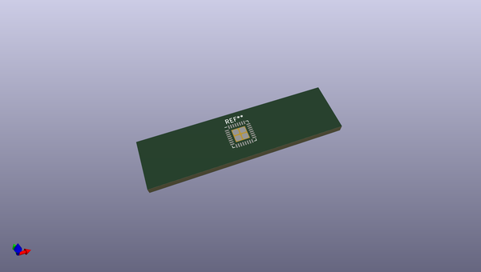
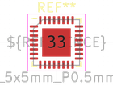
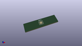

# OOMP Footprint  
## VQFN-32-1EP_5x5mm_P0.5mm_EP3.1x3.1mm  by none  
  
oomp key: oomp_kicad_package_dfn_qfn_vqfn_32_1ep_5x5mm_p0_5mm_ep3_1x3_1mm  
  
source repo at: [http://gitlab.com/kicad/kicad-footprints/blob/master/tmp/data//oomlout_oomp_footprint_src/Varistor.pretty/RV_Rect_V25S440P_L26.5mm_W8.2mm_P12.7mm.kicad_mod](http://gitlab.com/kicad/kicad-footprints/blob/master/tmp/data//oomlout_oomp_footprint_src/Varistor.pretty/RV_Rect_V25S440P_L26.5mm_W8.2mm_P12.7mm.kicad_mod)  
## Footprint  
  
  
  
  
| name | value | 
| --- | --- | 
| footprint name | VQFN-32-1EP_5x5mm_P0.5mm_EP3.1x3.1mm | 
| footprint description | VQFN, 32 Pin (http://ww1.microchip.com/downloads/en/devicedoc/atmel-9520-at42-qtouch-bsw-at42qt1110_datasheet.pdf#page=42), generated with kicad-footprint-generator ipc_noLead_generator.py | 
| number of pads | 37 | 
| github path | http://github.com/kicad/kicad-footprints/blob/master/tmp/data//oomlout_oomp_footprint_src/Package_DFN_QFN.pretty/VQFN-32-1EP_5x5mm_P0.5mm_EP3.1x3.1mm.kicad_mod | 
| oomp key | oomp_kicad_package_dfn_qfn_vqfn_32_1ep_5x5mm_p0_5mm_ep3_1x3_1mm | 
| oomp bot github | https://github.com/oomlout/oomlout_oomp_footprint_bot/tree/main/tmp/data//oomlout_oomp_footprint_src/footprints/kicad_package_dfn_qfn_vqfn_32_1ep_5x5mm_p0_5mm_ep3_1x3_1mm/working | 
## Images  
  
  
  
  
  
  
  
  
