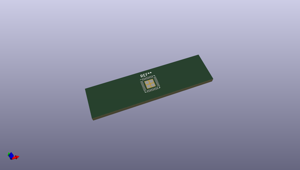
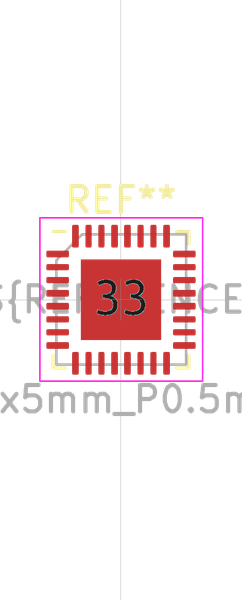

# OOMP Footprint  
## VQFN-32-1EP_5x5mm_P0.5mm_EP3.1x3.1mm  by oomlout  
  
oomp key: oomp_oomlout_oomlout_oomp_part_footprints_imlf32mcuat328_electronic_ic_mlf_32_mcu_atmega328_microchip_atmega328p_mu  
  
source repo at: [http://github.com/oomlout/oomlout_oomp_part_kicad_footprints/blob/master/tmp/data/oomlout_oomp_footprint_src/oomlout_oomp_part_footprints.pretty/xcr3213mhz8_electronic_ceramic_resonator_3213_3_pin_ground_pin_2_8_mega_hertz_1.kicad_mod](http://github.com/oomlout/oomlout_oomp_part_kicad_footprints/blob/master/tmp/data/oomlout_oomp_footprint_src/oomlout_oomp_part_footprints.pretty/xcr3213mhz8_electronic_ceramic_resonator_3213_3_pin_ground_pin_2_8_mega_hertz_1.kicad_mod)  
## Footprint  
  
  
  
  
| name | value | 
| --- | --- | 
| footprint name | VQFN-32-1EP_5x5mm_P0.5mm_EP3.1x3.1mm | 
| footprint description | VQFN, 32 Pin (http://ww1.microchip.com/downloads/en/devicedoc/atmel-9520-at42-qtouch-bsw-at42qt1110_datasheet.pdf#page=42), generated with kicad-footprint-generator ipc_noLead_generator.py | 
| number of pads | 37 | 
| github path | http://github.com/oomlout/oomlout_oomp_part_kicad_footprints/blob/master/tmp/data/oomlout_oomp_footprint_src/oomlout_oomp_part_footprints.pretty/imlf32mcuat328_electronic_ic_mlf_32_mcu_atmega328_microchip_atmega328p_mu.kicad_mod | 
| oomp key | oomp_oomlout_oomlout_oomp_part_footprints_imlf32mcuat328_electronic_ic_mlf_32_mcu_atmega328_microchip_atmega328p_mu | 
| oomp bot github | https://github.com/oomlout/oomlout_oomp_footprint_bot/tree/main/tmp/data/oomlout_oomp_footprint_src/footprints/oomlout_oomlout_oomp_part_footprints_imlf32mcuat328_electronic_ic_mlf_32_mcu_atmega328_microchip_atmega328p_mu/working | 
## Images  
