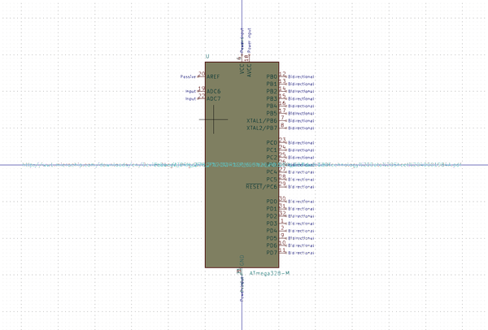
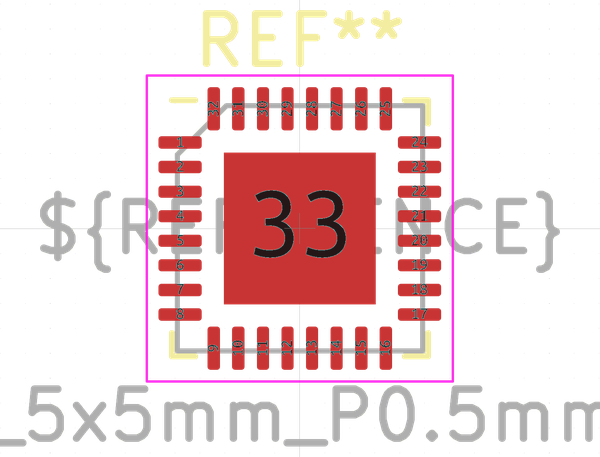

# Electronic Ic Mlf 32 Mcu Atmega328 Microchip Atmega328P Mu

  
* oomp_key: oomp_electronic_ic_mlf_32_mcu_atmega328_microchip_atmega328p_mu 
* short_code: imlf32at328
* md5_6: d6a445  
* github_link: https://github.com/oomlout/oomlout_oomp_part_src/tree/main/parts/electronic_ic_mlf_32_mcu_atmega328_microchip_atmega328p_mu/working  
## naming details
* classification -- electronic
* type -- ic
* size -- mlf_32
* color -- mcu
* description_main -- atmega328
* description_extra -- 
* manucaturer -- microchip
* part_number -- atmega328p_mu

## symbol

  
oomp_key: oomp_kicad_mcu_microchip_atmega_atmega328_m  
link: https://github.com/oomlout/oomlout_oomp_symbol_bot/tree/main/symbols/kicad_mcu_microchip_atmega_atmega328_m/working  

## footprint

  
oomp_key: oomp_kicad_package_dfn_qfn_vqfn_32_1ep_5x5mm_p0_5mm_ep3_1x3_1mm  
link: https://github.com/oomlout/oomlout_oomp_footprint_bot/tree/main/footprints/kicad_package_dfn_qfn_vqfn_32_1ep_5x5mm_p0_5mm_ep3_1x3_1mm/working  

## full_summary
| name | value | 
| --- | --- | 
| name | value | 
| classification | electronic | 
| type | ic | 
| size | mlf_32 | 
| color | mcu | 
| description_main | atmega328 | 
| description_extra |  | 
| manufacturer | microchip | 
| part_number | atmega328p_mu | 
| short_name | atmega328 32 pin mlf | 
| id | electronic_ic_mlf_32_mcu_atmega328_microchip_atmega328p_mu | 
| id_no_class | ic_mlf_32_mcu_atmega328_microchip_atmega328p_mu | 
| id_no_type | mlf_32_mcu_atmega328_microchip_atmega328p_mu | 
| oomp_key | oomp_electronic_ic_mlf_32_mcu_atmega328_microchip_atmega328p_mu | 
| github_link | https://github.com/oomlout/oomlout_oomp_part_src/tree/main/parts/electronic_ic_mlf_32_mcu_atmega328_microchip_atmega328p_mu/working | 
| directory | parts/electronic_ic_mlf_32_mcu_atmega328_microchip_atmega328p_mu | 
| name | Electronic Ic Mlf 32 Mcu Atmega328 Microchip Atmega328P Mu | 
| short_code | imlf32at328 | 
| short_code_upper | IMLF32AT328 | 
| distributors | [] | 
| manufacturers | [] | 
| md5 | d6a4452edcde90237afb3d93a423b538 | 
| md5_5 | d6a44 | 
| md5_5_upper | D6A44 | 
| md5_6 | d6a445 | 
| md5_6_upper | D6A445 | 
| md5_10 | d6a4452edc | 
| md5_10_upper | D6A4452EDC | 
| type_first_letter | i | 
| type_first_letter_upper | I | 
| size_only_numbers | 32 | 
| size_only_numbers_no_zeros | 32 | 
| color_upper | MCU | 
| color_first_letter | m | 
| color_first_letter_upper | M | 
| description_only_numbers | 328 | 
| description_only_numbers_short | 328 | 
| description_or_color | m328 | 
| description_or_color_upper | M328 | 
| markdown_full | [electronic_ic_mlf_32_mcu_atmega328_microchip_atmega328p_mu](https://github.com/oomlout/oomlout_oomp_part_src/tree/main/parts/electronic_ic_mlf_32_mcu_atmega328_microchip_atmega328p_mu/working) [imlf32at328](https://github.com/oomlout/oomlout_oomp_part_src/tree/main/parts/electronic_ic_mlf_32_mcu_atmega328_microchip_atmega328p_mu/working) [Electronic Ic Mlf 32 Mcu Atmega328 Microchip Atmega328P Mu](https://github.com/oomlout/oomlout_oomp_part_src/tree/main/parts/electronic_ic_mlf_32_mcu_atmega328_microchip_atmega328p_mu/working)   | 
| markdown_short | [electronic_ic_mlf_32_mcu_atmega328_microchip_atmega328p_mu](https://github.com/oomlout/oomlout_oomp_part_src/tree/main/parts/electronic_ic_mlf_32_mcu_atmega328_microchip_atmega328p_mu/working)   | 
| footprint | [{'link': 'https://github.com/oomlout/oomlout_oomp_footprint_bot/tree/main/foootprntss/kicad_package_dfn_qfn_vqfn_32_1ep_5x5mm_p0_5mm_ep3_1x3_1mm', 'oomp_key': 'oomp_kicad_package_dfn_qfn_vqfn_32_1ep_5x5mm_p0_5mm_ep3_1x3_1mm', 'directory': 'oomlout_oomp_footprint_bot/footprints/kicad_package_dfn_qfn_vqfn_32_1ep_5x5mm_p0_5mm_ep3_1x3_1mm//working/working.kicad_mod'}] | 
| symbol | [{'link': 'https://github.com/oomlout/oomlout_oomp_symbol_bot/tree/main/symbols/kicad_mcu_microchip_atmega_atmega328_m', 'oomp_key': 'oomp_kicad_mcu_microchip_atmega_atmega328_m', 'directory': 'oomlout_oomp_symbol_bot/symbols/kicad_mcu_microchip_atmega_atmega328_m//working/working.kicad_sym'}] | 
