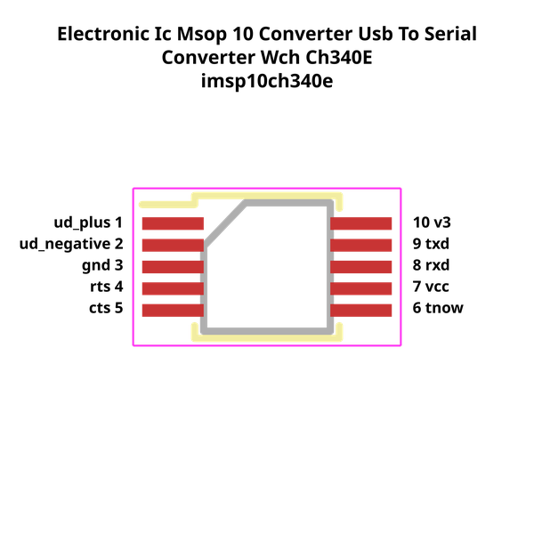
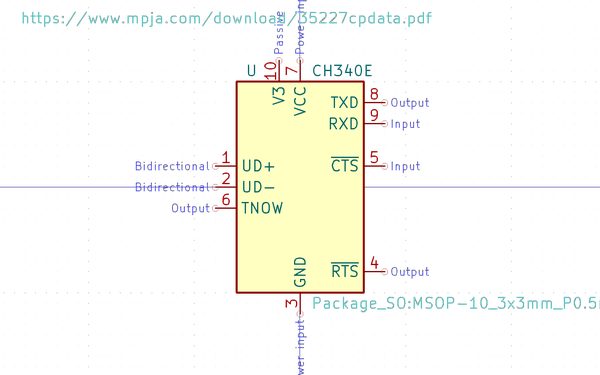

# Electronic Ic Msop 10 Converter Usb To Serial Converter Wch Ch340E

  
* oomp_key: oomp_electronic_ic_msop_10_converter_usb_to_serial_converter_wch_ch340e 
* short_code: ich340e
* md5_6: 720e79  
* github_link: https://github.com/oomlout/oomlout_oomp_part_src/tree/main/parts/electronic_ic_msop_10_converter_usb_to_serial_converter_wch_ch340e/working  
## naming details
* classification -- electronic
* type -- ic
* size -- msop_10
* color -- converter
* description_main -- usb_to_serial_converter
* description_extra -- 
* manucaturer -- wch
* part_number -- ch340e
## pinout
  
List of Pins:

* 1 : ud_plus
* 2 : ud_negative
* 3 : gnd
* 4 : rts
* 5 : cts
* 6 : tnow
* 7 : vcc
* 8 : rxd
* 9 : txd
* 10 : v3
## distributors
* [LCSC - C99652](https://lcsc.com/product-detail/C99652.html)  

## symbol

  
oomp_key: oomp_kicad_interface_usb_ch340e  
link: https://github.com/oomlout/oomlout_oomp_symbol_bot/tree/main/symbols/kicad_interface_usb_ch340e/working  

## full_summary
| name | value | 
| --- | --- | 
| name | value | 
| classification | electronic | 
| type | ic | 
| size | msop_10 | 
| color | converter | 
| description_main | usb_to_serial_converter | 
| description_extra |  | 
| manufacturer | wch | 
| part_number | ch340e | 
| short_name | usb to serial converter (ch340e) | 
| pins_pin_1_name | ud_plus | 
| pins_pin_1_number | 1 | 
| pins_pin_1_type | signal | 
| pins_pin_2_name | ud_negative | 
| pins_pin_2_number | 2 | 
| pins_pin_2_type | signal | 
| pins_pin_3_name | gnd | 
| pins_pin_3_number | 3 | 
| pins_pin_3_type | signal | 
| pins_pin_4_name | rts | 
| pins_pin_4_number | 4 | 
| pins_pin_4_type | signal | 
| pins_pin_5_name | cts | 
| pins_pin_5_number | 5 | 
| pins_pin_5_type | signal | 
| pins_pin_6_name | tnow | 
| pins_pin_6_number | 6 | 
| pins_pin_6_type | gnd | 
| pins_pin_7_name | vcc | 
| pins_pin_7_number | 7 | 
| pins_pin_7_type | signal | 
| pins_pin_8_name | rxd | 
| pins_pin_8_number | 8 | 
| pins_pin_8_type | signal | 
| pins_pin_9_name | txd | 
| pins_pin_9_number | 9 | 
| pins_pin_9_type | signal | 
| pins_pin_10_name | v3 | 
| pins_pin_10_number | 10 | 
| pins_pin_10_type | signal | 
| kicad_reference | U | 
| notes | [] | 
| id | electronic_ic_msop_10_converter_usb_to_serial_converter_wch_ch340e | 
| oomp_key | oomp_electronic_ic_msop_10_converter_usb_to_serial_converter_wch_ch340e | 
| github_link | https://github.com/oomlout/oomlout_oomp_part_src/tree/main/parts/electronic_ic_msop_10_converter_usb_to_serial_converter_wch_ch340e/working | 
| directory | parts/electronic_ic_msop_10_converter_usb_to_serial_converter_wch_ch340e | 
| name | Electronic Ic Msop 10 Converter Usb To Serial Converter Wch Ch340E | 
| short_code | ich340e | 
| distributors | [{'name': 'LCSC', 'part_number': 'C99652', 'link': 'https://lcsc.com/product-detail/C99652.html', 'id': 'distributor_lcsc'}] | 
| manufacturers | [] | 
| md5 | 720e79ba82a5c6f254f73ddb976ddcc2 | 
| md5_5 | 720e7 | 
| md5_6 | 720e79 | 
| md5_10 | 720e79ba82 | 
| symbol | [{'link': 'https://github.com/oomlout/oomlout_oomp_symbol_bot/tree/main/symbols/kicad_interface_usb_ch340e', 'oomp_key': 'oomp_kicad_interface_usb_ch340e', 'directory': 'oomlout_oomp_symbol_bot/symbols/kicad_interface_usb_ch340e//working/working.kicad_sym'}] | 
