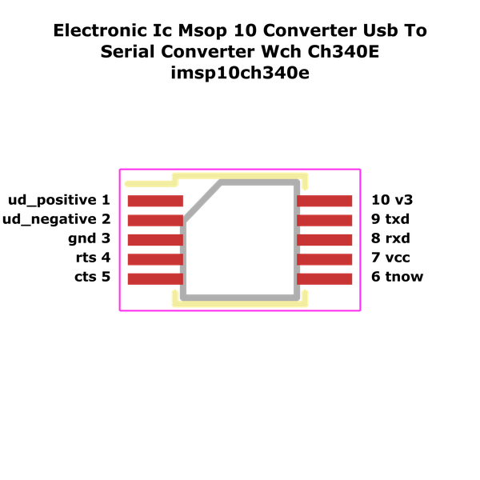

# Electronic Ic Msop 10 Converter Usb To Serial Converter Wch Ch340E

  
* oomp_key: oomp_electronic_ic_msop_10_converter_usb_to_serial_converter_wch_ch340e 
* short_code: imsp10ch340e
* md5_6: 720e79  
* github_link: https://github.com/oomlout/oomlout_oomp_part_src/tree/main/parts/electronic_ic_msop_10_converter_usb_to_serial_converter_wch_ch340e/working  
## naming details
* classification -- electronic
* type -- ic
* size -- msop_10
* color -- converter
* description_main -- usb_to_serial_converter
* description_extra -- 
* manucaturer -- wch
* part_number -- ch340e
## pinout
  
List of Pins:

* 1 : ud_positive
* 2 : ud_negative
* 3 : gnd
* 4 : rts
* 5 : cts
* 6 : tnow
* 7 : vcc
* 8 : rxd
* 9 : txd
* 10 : v3
## distributors
* [LCSC - C99652](https://lcsc.com/product-detail/C99652.html)   

## symbol

  
oomp_key: oomp_kicad_interface_usb_ch340e  
link: https://github.com/oomlout/oomlout_oomp_symbol_bot/tree/main/symbols/kicad_interface_usb_ch340e/working  

## footprint

  
oomp_key: oomp_kicad_package_so_msop_10_3x3mm_p0_5mm  
link: https://github.com/oomlout/oomlout_oomp_footprint_bot/tree/main/footprints/kicad_package_so_msop_10_3x3mm_p0_5mm/working  

  
oomp_key: oomp_oomlout_oomlout_oomp_part_footprints_imsp10ch340e_electronic_ic_msop_10_converter_usb_to_serial_converter_wch_ch340e  
link: https://github.com/oomlout/oomlout_oomp_footprint_bot/tree/main/footprints/oomlout_oomlout_oomp_part_footprints_imsp10ch340e_electronic_ic_msop_10_converter_usb_to_serial_converter_wch_ch340e/working  

## full_summary
| name | value | 
| --- | --- | 
| name | value | 
| classification | electronic | 
| type | ic | 
| size | msop_10 | 
| color | converter | 
| description_main | usb_to_serial_converter | 
| description_extra |  | 
| manufacturer | wch | 
| part_number | ch340e | 
| short_name | usb to serial converter (ch340e) | 
| pins_pin_1_name | ud_positive | 
| pins_pin_1_number | 1 | 
| pins_pin_1_type | signal | 
| pins_pin_2_name | ud_negative | 
| pins_pin_2_number | 2 | 
| pins_pin_2_type | signal | 
| pins_pin_3_name | gnd | 
| pins_pin_3_number | 3 | 
| pins_pin_3_type | signal | 
| pins_pin_4_name | rts | 
| pins_pin_4_number | 4 | 
| pins_pin_4_type | signal | 
| pins_pin_5_name | cts | 
| pins_pin_5_number | 5 | 
| pins_pin_5_type | signal | 
| pins_pin_6_name | tnow | 
| pins_pin_6_number | 6 | 
| pins_pin_6_type | gnd | 
| pins_pin_7_name | vcc | 
| pins_pin_7_number | 7 | 
| pins_pin_7_type | signal | 
| pins_pin_8_name | rxd | 
| pins_pin_8_number | 8 | 
| pins_pin_8_type | signal | 
| pins_pin_9_name | txd | 
| pins_pin_9_number | 9 | 
| pins_pin_9_type | signal | 
| pins_pin_10_name | v3 | 
| pins_pin_10_number | 10 | 
| pins_pin_10_type | signal | 
| kicad_reference | U | 
| notes | [ ] | 
| classification_upper | ELECTRONIC | 
| classification_capital | Electronic | 
| classification_first_letter | e | 
| classification_first_letter_upper | E | 
| type_upper | IC | 
| type_capital | Ic | 
| type_first_letter | i | 
| type_first_letter_upper | I | 
| size_upper | MSOP_10 | 
| size_capital | Msop 10 | 
| size_first_letter | m | 
| size_first_letter_upper | M | 
| color_upper | CONVERTER | 
| color_capital | Converter | 
| color_first_letter | c | 
| color_first_letter_upper | C | 
| description_main_upper | USB_TO_SERIAL_CONVERTER | 
| description_main_capital | Usb To Serial Converter | 
| description_main_first_letter | u | 
| description_main_first_letter_upper | U | 
| description_extra_upper |  | 
| description_extra_capital |  | 
| description_extra_first_letter |  | 
| description_extra_first_letter_upper |  | 
| manufacturer_upper | WCH | 
| manufacturer_capital | Wch | 
| manufacturer_first_letter | w | 
| manufacturer_first_letter_upper | W | 
| part_number_upper | CH340E | 
| part_number_capital | Ch340E | 
| part_number_first_letter | c | 
| part_number_first_letter_upper | C | 
| id | electronic_ic_msop_10_converter_usb_to_serial_converter_wch_ch340e | 
| id_no_class | ic_msop_10_converter_usb_to_serial_converter_wch_ch340e | 
| id_no_type | msop_10_converter_usb_to_serial_converter_wch_ch340e | 
| id_no_size | converter_usb_to_serial_converter_wch_ch340e | 
| oomp_key | oomp_electronic_ic_msop_10_converter_usb_to_serial_converter_wch_ch340e | 
| github_link | https://github.com/oomlout/oomlout_oomp_part_src/tree/main/parts/electronic_ic_msop_10_converter_usb_to_serial_converter_wch_ch340e/working | 
| directory | parts/electronic_ic_msop_10_converter_usb_to_serial_converter_wch_ch340e | 
| name | Electronic Ic Msop 10 Converter Usb To Serial Converter Wch Ch340E | 
| name_no_class | Ic Msop 10 Converter Usb To Serial Converter Wch Ch340E | 
| name_no_type | Msop 10 Converter Usb To Serial Converter Wch Ch340E | 
| name_no_size | Converter Usb To Serial Converter Wch Ch340E | 
| short_code | imsp10ch340e | 
| short_code_upper | IMSP10CH340E | 
| distributors | [ { ' n a m e ' :   ' L C S C ' ,   ' p a r t _ n u m b e r ' :   ' C 9 9 6 5 2 ' ,   ' l i n k ' :   ' h t t p s : / / l c s c . c o m / p r o d u c t - d e t a i l / C 9 9 6 5 2 . h t m l ' ,   ' i d ' :   ' d i s t r i b u t o r _ l c s c ' } ] | 
| manufacturers | [ ] | 
| md5 | 720e79ba82a5c6f254f73ddb976ddcc2 | 
| md5_5 | 720e7 | 
| md5_5_upper | 720E7 | 
| md5_6 | 720e79 | 
| md5_6_upper | 720E79 | 
| md5_6_alpha | 4g7ll | 
| md5_6_alpha_upper | 4G7LL | 
| md5_10 | 720e79ba82 | 
| md5_10_upper | 720E79BA82 | 
| size_only_numbers | 10 | 
| size_only_numbers_no_zeros | 1 | 
| description_only_numbers |  | 
| description_only_numbers_short |   | 
| name_no_size_short | Converter Usb To Serial Converter Wch Ch340E | 
| description_or_color | C  | 
| description_or_color_upper | C  | 
| markdown_full | [electronic_ic_msop_10_converter_usb_to_serial_converter_wch_ch340e](https://github.com/oomlout/oomlout_oomp_part_src/tree/main/parts/electronic_ic_msop_10_converter_usb_to_serial_converter_wch_ch340e/working) [imsp10ch340e](https://github.com/oomlout/oomlout_oomp_part_src/tree/main/parts/electronic_ic_msop_10_converter_usb_to_serial_converter_wch_ch340e/working) [Electronic Ic Msop 10 Converter Usb To Serial Converter Wch Ch340E](https://github.com/oomlout/oomlout_oomp_part_src/tree/main/parts/electronic_ic_msop_10_converter_usb_to_serial_converter_wch_ch340e/working) [LCSC - C99652 ](https://lcsc.com/product-detail/C99652.html)  | 
| markdown_short | [electronic_ic_msop_10_converter_usb_to_serial_converter_wch_ch340e](https://github.com/oomlout/oomlout_oomp_part_src/tree/main/parts/electronic_ic_msop_10_converter_usb_to_serial_converter_wch_ch340e/working) [LCSC - C99652 ](https://lcsc.com/product-detail/C99652.html)  | 
| footprint | [ { ' l i n k ' :   ' h t t p s : / / g i t h u b . c o m / o o m l o u t / o o m l o u t _ o o m p _ f o o t p r i n t _ b o t / t r e e / m a i n / f o o o t p r n t s s / k i c a d _ p a c k a g e _ s o _ m s o p _ 1 0 _ 3 x 3 m m _ p 0 _ 5 m m ' ,   ' o o m p _ k e y ' :   ' o o m p _ k i c a d _ p a c k a g e _ s o _ m s o p _ 1 0 _ 3 x 3 m m _ p 0 _ 5 m m ' ,   ' d i r e c t o r y ' :   ' o o m l o u t _ o o m p _ f o o t p r i n t _ b o t / f o o t p r i n t s / k i c a d _ p a c k a g e _ s o _ m s o p _ 1 0 _ 3 x 3 m m _ p 0 _ 5 m m / / w o r k i n g / w o r k i n g . k i c a d _ m o d ' ,   ' n o t e ' :   ' s o u r c e   f o o t p r i n t   k i c a d _ p a c k a g e _ s o _ m s o p _ 1 0 _ 3 x 3 m m _ p 0 _ 5 m m ' ,   ' i n d e x ' :   0 } ,   { ' l i n k ' :   ' h t t p s : / / g i t h u b . c o m / o o m l o u t / o o m l o u t _ o o m p _ f o o t p r i n t _ b o t / t r e e / m a i n / f o o o t p r n t s s / o o m l o u t _ o o m l o u t _ o o m p _ p a r t _ f o o t p r i n t s _ i m s p 1 0 c h 3 4 0 e _ e l e c t r o n i c _ i c _ m s o p _ 1 0 _ c o n v e r t e r _ u s b _ t o _ s e r i a l _ c o n v e r t e r _ w c h _ c h 3 4 0 e ' ,   ' o o m p _ k e y ' :   ' o o m p _ o o m l o u t _ o o m l o u t _ o o m p _ p a r t _ f o o t p r i n t s _ i m s p 1 0 c h 3 4 0 e _ e l e c t r o n i c _ i c _ m s o p _ 1 0 _ c o n v e r t e r _ u s b _ t o _ s e r i a l _ c o n v e r t e r _ w c h _ c h 3 4 0 e ' ,   ' d i r e c t o r y ' :   ' o o m l o u t _ o o m p _ f o o t p r i n t _ b o t / f o o t p r i n t s / o o m l o u t _ o o m l o u t _ o o m p _ p a r t _ f o o t p r i n t s _ i m s p 1 0 c h 3 4 0 e _ e l e c t r o n i c _ i c _ m s o p _ 1 0 _ c o n v e r t e r _ u s b _ t o _ s e r i a l _ c o n v e r t e r _ w c h _ c h 3 4 0 e / / w o r k i n g / w o r k i n g . k i c a d _ m o d ' ,   ' n o t e ' :   ' o o m p   g e n e r a t e d   f o o t p r i n t ' ,   ' i n d e x ' :   1 } ] | 
| symbol | [ { ' l i n k ' :   ' h t t p s : / / g i t h u b . c o m / o o m l o u t / o o m l o u t _ o o m p _ s y m b o l _ b o t / t r e e / m a i n / s y m b o l s / k i c a d _ i n t e r f a c e _ u s b _ c h 3 4 0 e ' ,   ' o o m p _ k e y ' :   ' o o m p _ k i c a d _ i n t e r f a c e _ u s b _ c h 3 4 0 e ' ,   ' d i r e c t o r y ' :   ' o o m l o u t _ o o m p _ s y m b o l _ b o t / s y m b o l s / k i c a d _ i n t e r f a c e _ u s b _ c h 3 4 0 e / / w o r k i n g / w o r k i n g . k i c a d _ s y m ' ,   ' i n d e x ' :   0 } ] | 
