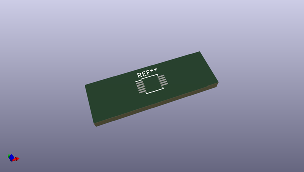
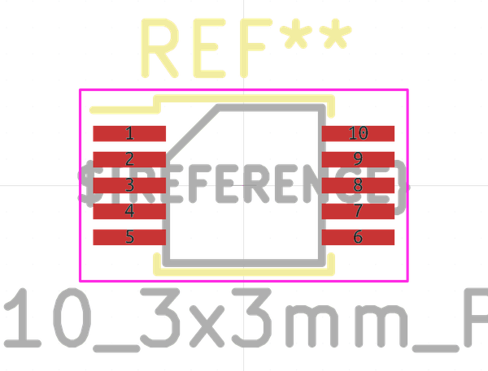

# OOMP Footprint  
## MSOP-10_3x3mm_P0.5mm  by none  
  
oomp key: oomp_kicad_package_so_msop_10_3x3mm_p0_5mm  
  
source repo at: [http://gitlab.com/kicad/libraries/kicad-footprints//blob/master/tmp/libraries/kicad-footprints/Varistor.pretty/RV_Rect_V25S440P_L26.5mm_W8.2mm_P12.7mm.kicad_mod](http://gitlab.com/kicad/libraries/kicad-footprints//blob/master/tmp/libraries/kicad-footprints/Varistor.pretty/RV_Rect_V25S440P_L26.5mm_W8.2mm_P12.7mm.kicad_mod)  
## Footprint  
  
  
  
  
| name | value | 
| --- | --- | 
| footprint name | MSOP-10_3x3mm_P0.5mm | 
| footprint description | 10-Lead Plastic Micro Small Outline Package (MS) [MSOP] (see Microchip Packaging Specification 00000049BS.pdf) | 
| number of pads | 10 | 
| github path | http://github.com/kicad/libraries/kicad-footprints//blob/master/tmp/libraries/kicad-footprints/Package_SO.pretty/MSOP-10_3x3mm_P0.5mm.kicad_mod | 
| oomp key | oomp_kicad_package_so_msop_10_3x3mm_p0_5mm | 
| oomp bot github | https://github.com/oomlout/oomlout_oomp_footprint_bot/tree/main/footprints/kicad_package_so_msop_10_3x3mm_p0_5mm/working | 
## Images  
