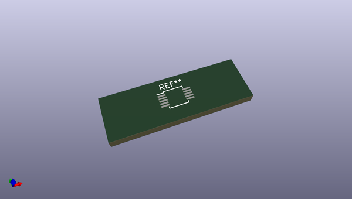

# OOMP Footprint  
## MSOP-10_3x3mm_P0.5mm  by oomlout  
  
oomp key: oomp_oomlout_oomlout_oomp_part_footprints_imsp10mpump21rs2227_electronic_ic_msop_10_multiplexer_usb_multiplexer_two_to_one_jiangsu_runic_tech_rs2227xn  
  
source repo at: [http://github.com/oomlout/oomlout_oomp_part_kicad_footprints/blob/master/tmp/data/oomlout_oomp_footprint_src/oomlout_oomp_part_footprints.pretty/xcr3213mhz8_electronic_ceramic_resonator_3213_3_pin_ground_pin_2_8_mega_hertz_1.kicad_mod](http://github.com/oomlout/oomlout_oomp_part_kicad_footprints/blob/master/tmp/data/oomlout_oomp_footprint_src/oomlout_oomp_part_footprints.pretty/xcr3213mhz8_electronic_ceramic_resonator_3213_3_pin_ground_pin_2_8_mega_hertz_1.kicad_mod)  
## Footprint  
  
  
  
  
| name | value | 
| --- | --- | 
| footprint name | MSOP-10_3x3mm_P0.5mm | 
| footprint description | 10-Lead Plastic Micro Small Outline Package (MS) [MSOP] (see Microchip Packaging Specification 00000049BS.pdf) | 
| number of pads | 10 | 
| github path | http://github.com/oomlout/oomlout_oomp_part_kicad_footprints/blob/master/tmp/data/oomlout_oomp_footprint_src/oomlout_oomp_part_footprints.pretty/imsp10mpump21rs2227_electronic_ic_msop_10_multiplexer_usb_multiplexer_two_to_one_jiangsu_runic_tech_rs2227xn.kicad_mod | 
| oomp key | oomp_oomlout_oomlout_oomp_part_footprints_imsp10mpump21rs2227_electronic_ic_msop_10_multiplexer_usb_multiplexer_two_to_one_jiangsu_runic_tech_rs2227xn | 
| oomp bot github | https://github.com/oomlout/oomlout_oomp_footprint_bot/tree/main/tmp/data/oomlout_oomp_footprint_src/footprints/oomlout_oomlout_oomp_part_footprints_imsp10mpump21rs2227_electronic_ic_msop_10_multiplexer_usb_multiplexer_two_to_one_jiangsu_runic_tech_rs2227xn/working | 
## Images  
  
  
  
  
  
  
  
  
