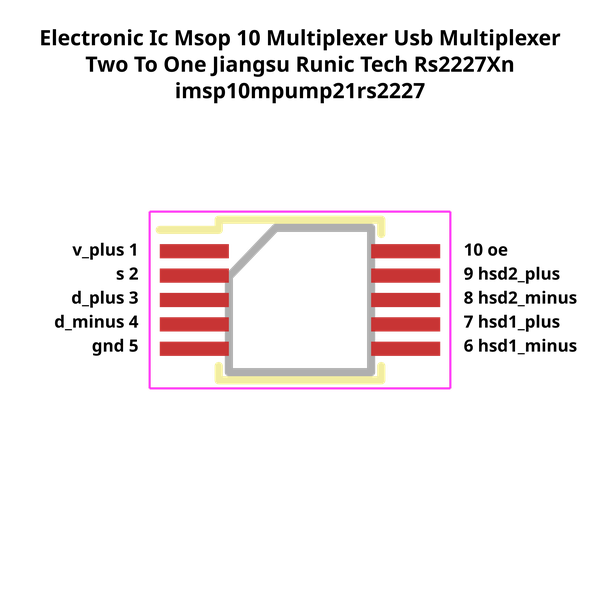

# Electronic Ic Msop 10 Multiplexer Usb Multiplexer Two To One Jiangsu Runic Tech Rs2227Xn

  
* oomp_key: oomp_electronic_ic_msop_10_multiplexer_usb_multiplexer_two_to_one_jiangsu_runic_tech_rs2227xn 
* short_code: imsp10mpump21rs2227
* md5_6: 3a1002  
* github_link: https://github.com/oomlout/oomlout_oomp_part_src/tree/main/parts/electronic_ic_msop_10_multiplexer_usb_multiplexer_two_to_one_jiangsu_runic_tech_rs2227xn/working  
## naming details
* classification -- electronic
* type -- ic
* size -- msop_10
* color -- multiplexer
* description_main -- usb_multiplexer
* description_extra -- two_to_one
* manucaturer -- jiangsu_runic_tech
* part_number -- rs2227xn
## pinout
  
List of Pins:

* 1 : v_positive
* 2 : s
* 3 : d_positive
* 4 : d_negative
* 5 : gnd
* 6 : hsd1_negative
* 7 : hsd1_positive
* 8 : hsd2_negative
* 9 : hsd2_positive
* 10 : oe
## distributors
* [LCSC - C255478](https://lcsc.com/product-detail/C255478.html)   

## footprint

  
oomp_key: oomp_kicad_package_so_msop_10_3x3mm_p0_5mm  
link: https://github.com/oomlout/oomlout_oomp_footprint_bot/tree/main/footprints/kicad_package_so_msop_10_3x3mm_p0_5mm/working  

  
oomp_key: oomp_oomp_imsp10mpump21rs2227_electronic_ic_msop_10_multiplexer_usb_multiplexer_two_to_one_jiangsu_runic_tech_rs2227xn  
link: https://github.com/oomlout/oomlout_oomp_footprint_bot/tree/main/footprints/oomp_imsp10mpump21rs2227_electronic_ic_msop_10_multiplexer_usb_multiplexer_two_to_one_jiangsu_runic_tech_rs2227xn/working  

## full_summary
| name | value | 
| --- | --- | 
| name | value | 
| classification | electronic | 
| type | ic | 
| size | msop_10 | 
| color | multiplexer | 
| description_main | usb_multiplexer | 
| description_extra | two_to_one | 
| manufacturer | jiangsu_runic_tech | 
| part_number | rs2227xn | 
| short_name | usb multiplexer 2 to 1 (rs2227xn) | 
| pins_pin_1_name | v_positive | 
| pins_pin_1_number | 1 | 
| pins_pin_1_type | signal | 
| pins_pin_2_name | s | 
| pins_pin_2_number | 2 | 
| pins_pin_2_type | signal | 
| pins_pin_3_name | d_positive | 
| pins_pin_3_number | 3 | 
| pins_pin_3_type | signal | 
| pins_pin_4_name | d_negative | 
| pins_pin_4_number | 4 | 
| pins_pin_4_type | signal | 
| pins_pin_5_name | gnd | 
| pins_pin_5_number | 5 | 
| pins_pin_5_type | signal | 
| pins_pin_6_name | hsd1_negative | 
| pins_pin_6_number | 6 | 
| pins_pin_6_type | gnd | 
| pins_pin_7_name | hsd1_positive | 
| pins_pin_7_number | 7 | 
| pins_pin_7_type | signal | 
| pins_pin_8_name | hsd2_negative | 
| pins_pin_8_number | 8 | 
| pins_pin_8_type | signal | 
| pins_pin_9_name | hsd2_positive | 
| pins_pin_9_number | 9 | 
| pins_pin_9_type | signal | 
| pins_pin_10_name | oe | 
| pins_pin_10_number | 10 | 
| pins_pin_10_type | signal | 
| kicad_reference | U | 
| notes | [] | 
| classification_upper | ELECTRONIC | 
| classification_capital | Electronic | 
| classification_first_letter | e | 
| classification_first_letter_upper | E | 
| type_upper | IC | 
| type_capital | Ic | 
| type_first_letter | i | 
| type_first_letter_upper | I | 
| size_upper | MSOP_10 | 
| size_capital | Msop 10 | 
| size_first_letter | m | 
| size_first_letter_upper | M | 
| color_upper | MULTIPLEXER | 
| color_capital | Multiplexer | 
| color_first_letter | m | 
| color_first_letter_upper | M | 
| description_main_upper | USB_MULTIPLEXER | 
| description_main_capital | Usb Multiplexer | 
| description_main_first_letter | u | 
| description_main_first_letter_upper | U | 
| description_extra_upper | TWO_TO_ONE | 
| description_extra_capital | Two To One | 
| description_extra_first_letter | t | 
| description_extra_first_letter_upper | T | 
| manufacturer_upper | JIANGSU_RUNIC_TECH | 
| manufacturer_capital | Jiangsu Runic Tech | 
| manufacturer_first_letter | j | 
| manufacturer_first_letter_upper | J | 
| part_number_upper | RS2227XN | 
| part_number_capital | Rs2227Xn | 
| part_number_first_letter | r | 
| part_number_first_letter_upper | R | 
| id | electronic_ic_msop_10_multiplexer_usb_multiplexer_two_to_one_jiangsu_runic_tech_rs2227xn | 
| id_no_class | ic_msop_10_multiplexer_usb_multiplexer_two_to_one_jiangsu_runic_tech_rs2227xn | 
| id_no_type | msop_10_multiplexer_usb_multiplexer_two_to_one_jiangsu_runtech_rs2227xn | 
| id_no_size | multiplexer_usb_multiplexer_two_to_one_jiangsu_runtech_rs2227xn | 
| oomp_key | oomp_electronic_ic_msop_10_multiplexer_usb_multiplexer_two_to_one_jiangsu_runic_tech_rs2227xn | 
| github_link | https://github.com/oomlout/oomlout_oomp_part_src/tree/main/parts/electronic_ic_msop_10_multiplexer_usb_multiplexer_two_to_one_jiangsu_runic_tech_rs2227xn/working | 
| directory | parts/electronic_ic_msop_10_multiplexer_usb_multiplexer_two_to_one_jiangsu_runic_tech_rs2227xn | 
| name | Electronic Ic Msop 10 Multiplexer Usb Multiplexer Two To One Jiangsu Runic Tech Rs2227Xn | 
| name_no_class | Ic Msop 10 Multiplexer Usb Multiplexer Two To One Jiangsu Runic Tech Rs2227Xn | 
| name_no_type | Msop 10 Multiplexer Usb Multiplexer Two To One Jiangsu Runtech Rs2227Xn | 
| name_no_size | Multiplexer Usb Multiplexer Two To One Jiangsu Runtech Rs2227Xn | 
| short_code | imsp10mpump21rs2227 | 
| short_code_upper | IMSP10MPUMP21RS2227 | 
| distributors | [{'name': 'LCSC', 'part_number': 'C255478', 'link': 'https://lcsc.com/product-detail/C255478.html', 'id': 'distributor_lcsc'}] | 
| manufacturers | [] | 
| md5 | 3a10020ea9997e59872f6e32c7913236 | 
| md5_5 | 3a100 | 
| md5_5_upper | 3A100 | 
| md5_6 | 3a1002 | 
| md5_6_upper | 3A1002 | 
| md5_6_alpha | 29k3m | 
| md5_6_alpha_upper | 29K3M | 
| md5_10 | 3a10020ea9 | 
| md5_10_upper | 3A10020EA9 | 
| size_only_numbers | 10 | 
| size_only_numbers_no_zeros | 1 | 
| description_only_numbers |  | 
| description_only_numbers_short |   | 
| name_no_size_short | Multiplexer Usb Multiplexer Two To One Jiangsu Runtech Rs2227Xn | 
| description_or_color | M  | 
| description_or_color_upper | M  | 
| markdown_full | [electronic_ic_msop_10_multiplexer_usb_multiplexer_two_to_one_jiangsu_runic_tech_rs2227xn](https://github.com/oomlout/oomlout_oomp_part_src/tree/main/parts/electronic_ic_msop_10_multiplexer_usb_multiplexer_two_to_one_jiangsu_runic_tech_rs2227xn/working) [imsp10mpump21rs2227](https://github.com/oomlout/oomlout_oomp_part_src/tree/main/parts/electronic_ic_msop_10_multiplexer_usb_multiplexer_two_to_one_jiangsu_runic_tech_rs2227xn/working) [Electronic Ic Msop 10 Multiplexer Usb Multiplexer Two To One Jiangsu Runic Tech Rs2227Xn](https://github.com/oomlout/oomlout_oomp_part_src/tree/main/parts/electronic_ic_msop_10_multiplexer_usb_multiplexer_two_to_one_jiangsu_runic_tech_rs2227xn/working) [LCSC - C255478 ](https://lcsc.com/product-detail/C255478.html)  | 
| markdown_short | [electronic_ic_msop_10_multiplexer_usb_multiplexer_two_to_one_jiangsu_runic_tech_rs2227xn](https://github.com/oomlout/oomlout_oomp_part_src/tree/main/parts/electronic_ic_msop_10_multiplexer_usb_multiplexer_two_to_one_jiangsu_runic_tech_rs2227xn/working) [LCSC - C255478 ](https://lcsc.com/product-detail/C255478.html)  | 
| footprint | [{'link': 'https://github.com/oomlout/oomlout_oomp_footprint_bot/tree/main/foootprntss/kicad_package_so_msop_10_3x3mm_p0_5mm', 'oomp_key': 'oomp_kicad_package_so_msop_10_3x3mm_p0_5mm', 'directory': 'oomlout_oomp_footprint_bot/footprints/kicad_package_so_msop_10_3x3mm_p0_5mm//working/working.kicad_mod', 'note': 'source footprint kicad_package_so_msop_10_3x3mm_p0_5mm', 'index': 0}, {'link': 'https://github.com/oomlout/oomlout_oomp_footprint_bot/tree/main/foootprntss/oomp_imsp10mpump21rs2227_electronic_ic_msop_10_multiplexer_usb_multiplexer_two_to_one_jiangsu_runic_tech_rs2227xn', 'oomp_key': 'oomp_oomp_imsp10mpump21rs2227_electronic_ic_msop_10_multiplexer_usb_multiplexer_two_to_one_jiangsu_runic_tech_rs2227xn', 'directory': 'oomlout_oomp_footprint_bot/footprints/oomp_imsp10mpump21rs2227_electronic_ic_msop_10_multiplexer_usb_multiplexer_two_to_one_jiangsu_runic_tech_rs2227xn//working/working.kicad_mod', 'note': 'oomp generated footprint', 'index': 1}] | 
