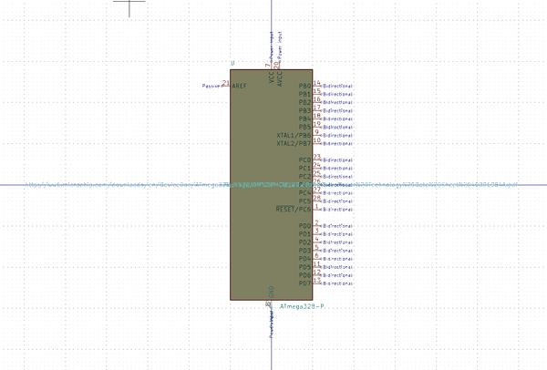

# Electronic Ic Qfn 28 Mcu Atmega328 Microchip Atmega328P Mn

  
* oomp_key: oomp_electronic_ic_qfn_28_mcu_atmega328_microchip_atmega328p_mn 
* short_code: iq28at328
* md5_6: 4e3ceb  
* github_link: https://github.com/oomlout/oomlout_oomp_part_src/tree/main/parts/electronic_ic_qfn_28_mcu_atmega328_microchip_atmega328p_mn/working  
## naming details
* classification -- electronic
* type -- ic
* size -- qfn_28
* color -- mcu
* description_main -- atmega328
* description_extra -- 
* manucaturer -- microchip
* part_number -- atmega328p_mn

## symbol

  
oomp_key: oomp_kicad_mcu_microchip_atmega_atmega328_p  
link: https://github.com/oomlout/oomlout_oomp_symbol_bot/tree/main/symbols/kicad_mcu_microchip_atmega_atmega328_p/working  

## full_summary
| name | value | 
| --- | --- | 
| name | value | 
| classification | electronic | 
| type | ic | 
| size | qfn_28 | 
| color | mcu | 
| description_main | atmega328 | 
| description_extra |  | 
| manufacturer | microchip | 
| part_number | atmega328p_mn | 
| short_name | atmega328 28 pin qfn | 
| id | electronic_ic_qfn_28_mcu_atmega328_microchip_atmega328p_mn | 
| id_no_class | ic_qfn_28_mcu_atmega328_microchip_atmega328p_mn | 
| id_no_type | qfn_28_mcu_atmega328_microchip_atmega328p_mn | 
| oomp_key | oomp_electronic_ic_qfn_28_mcu_atmega328_microchip_atmega328p_mn | 
| github_link | https://github.com/oomlout/oomlout_oomp_part_src/tree/main/parts/electronic_ic_qfn_28_mcu_atmega328_microchip_atmega328p_mn/working | 
| directory | parts/electronic_ic_qfn_28_mcu_atmega328_microchip_atmega328p_mn | 
| name | Electronic Ic Qfn 28 Mcu Atmega328 Microchip Atmega328P Mn | 
| short_code | iq28at328 | 
| short_code_upper | IQ28AT328 | 
| distributors | [] | 
| manufacturers | [] | 
| md5 | 4e3cebccf7cb76a5984fa97b7a893de9 | 
| md5_5 | 4e3ce | 
| md5_5_upper | 4E3CE | 
| md5_6 | 4e3ceb | 
| md5_6_upper | 4E3CEB | 
| md5_10 | 4e3cebccf7 | 
| md5_10_upper | 4E3CEBCCF7 | 
| type_first_letter | i | 
| type_first_letter_upper | I | 
| size_only_numbers | 28 | 
| size_only_numbers_no_zeros | 28 | 
| color_upper | MCU | 
| color_first_letter | m | 
| color_first_letter_upper | M | 
| description_only_numbers | 328 | 
| description_only_numbers_short | 328 | 
| description_or_color | m328 | 
| description_or_color_upper | M328 | 
| markdown_full | [electronic_ic_qfn_28_mcu_atmega328_microchip_atmega328p_mn](https://github.com/oomlout/oomlout_oomp_part_src/tree/main/parts/electronic_ic_qfn_28_mcu_atmega328_microchip_atmega328p_mn/working) [iq28at328](https://github.com/oomlout/oomlout_oomp_part_src/tree/main/parts/electronic_ic_qfn_28_mcu_atmega328_microchip_atmega328p_mn/working) [Electronic Ic Qfn 28 Mcu Atmega328 Microchip Atmega328P Mn](https://github.com/oomlout/oomlout_oomp_part_src/tree/main/parts/electronic_ic_qfn_28_mcu_atmega328_microchip_atmega328p_mn/working)   | 
| markdown_short | [electronic_ic_qfn_28_mcu_atmega328_microchip_atmega328p_mn](https://github.com/oomlout/oomlout_oomp_part_src/tree/main/parts/electronic_ic_qfn_28_mcu_atmega328_microchip_atmega328p_mn/working)   | 
| symbol | [{'link': 'https://github.com/oomlout/oomlout_oomp_symbol_bot/tree/main/symbols/kicad_mcu_microchip_atmega_atmega328_p', 'oomp_key': 'oomp_kicad_mcu_microchip_atmega_atmega328_p', 'directory': 'oomlout_oomp_symbol_bot/symbols/kicad_mcu_microchip_atmega_atmega328_p//working/working.kicad_sym'}] | 
