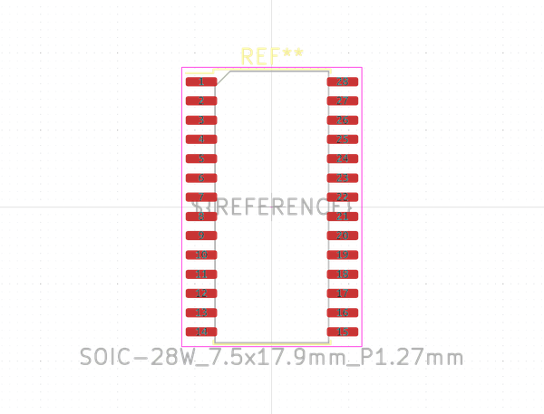

# Electronic Ic Soic 28 Wide Led Driver Led Matrix Driver 16 X 8 Wuxi I Core Electronics Co Ltd Aip1640

  
* oomp_key: oomp_electronic_ic_soic_28_wide_led_driver_led_matrix_driver_16_x_8_wuxi_i_core_electronics_co_ltd_aip1640 
* short_code: isoic28waip1640
* md5_6: 0f044b  
* github_link: https://github.com/oomlout/oomlout_oomp_part_src/tree/main/parts/electronic_ic_soic_28_wide_led_driver_led_matrix_driver_16_x_8_wuxi_i_core_electronics_co_ltd_aip1640/working  
## naming details
* classification -- electronic
* type -- ic
* size -- soic_28_wide
* color -- led_driver
* description_main -- led_matrix_driver_16_x_8
* description_extra -- 
* manucaturer -- wuxi_i_core_electronics_co_ltd
* part_number -- aip1640
## pinout
  
List of Pins:

* 1 : grid12
* 2 : grid13
* 3 : grid14
* 4 : grid15
* 5 : grid16
* 6 : vss
* 7 : din
* 8 : sclk
* 9 : seg1
* 10 : seg2
* 11 : seg3
* 12 : seg4
* 13 : seg5
* 14 : seg6
* 15 : seg7
* 16 : seg8
* 17 : vdd
* 18 : grid1
* 19 : grid2
* 20 : grid3
* 21 : grid4
* 22 : grid5
* 23 : grid6
* 24 : grid7
* 25 : grid8
* 26 : grid9
* 27 : grid10
* 28 : grid11

## footprint

  
oomp_key: oomp_kicad_package_so_soic_28w_7_5x17_9mm_p1_27mm  
link: https://github.com/oomlout/oomlout_oomp_footprint_bot/tree/main/footprints/kicad_package_so_soic_28w_7_5x17_9mm_p1_27mm/working  

## full_summary
| name | value | 
| --- | --- | 
| name | value | 
| classification | electronic | 
| type | ic | 
| size | soic_28_wide | 
| color | led_driver | 
| description_main | led_matrix_driver_16_x_8 | 
| description_extra |  | 
| manufacturer | wuxi_i_core_electronics_co_ltd | 
| part_number | aip1640 | 
| short_name | 16x8 led matrix driver (aip1640) | 
| pins_pin_1_name | grid12 | 
| pins_pin_1_number | 1 | 
| pins_pin_1_type | signal | 
| pins_pin_2_name | grid13 | 
| pins_pin_2_number | 2 | 
| pins_pin_2_type | signal | 
| pins_pin_3_name | grid14 | 
| pins_pin_3_number | 3 | 
| pins_pin_3_type | signal | 
| pins_pin_4_name | grid15 | 
| pins_pin_4_number | 4 | 
| pins_pin_4_type | signal | 
| pins_pin_5_name | grid16 | 
| pins_pin_5_number | 5 | 
| pins_pin_5_type | signal | 
| pins_pin_6_name | vss | 
| pins_pin_6_number | 6 | 
| pins_pin_6_type | gnd | 
| pins_pin_7_name | din | 
| pins_pin_7_number | 7 | 
| pins_pin_7_type | signal | 
| pins_pin_8_name | sclk | 
| pins_pin_8_number | 8 | 
| pins_pin_8_type | signal | 
| pins_pin_9_name | seg1 | 
| pins_pin_9_number | 9 | 
| pins_pin_9_type | signal | 
| pins_pin_10_name | seg2 | 
| pins_pin_10_number | 10 | 
| pins_pin_10_type | signal | 
| pins_pin_11_name | seg3 | 
| pins_pin_11_number | 11 | 
| pins_pin_11_type | signal | 
| pins_pin_12_name | seg4 | 
| pins_pin_12_number | 12 | 
| pins_pin_12_type | signal | 
| pins_pin_13_name | seg5 | 
| pins_pin_13_number | 13 | 
| pins_pin_13_type | signal | 
| pins_pin_14_name | seg6 | 
| pins_pin_14_number | 14 | 
| pins_pin_14_type | signal | 
| pins_pin_15_name | seg7 | 
| pins_pin_15_number | 15 | 
| pins_pin_15_type | signal | 
| pins_pin_16_name | seg8 | 
| pins_pin_16_number | 16 | 
| pins_pin_16_type | signal | 
| pins_pin_17_name | vdd | 
| pins_pin_17_number | 17 | 
| pins_pin_17_type | power | 
| pins_pin_18_name | grid1 | 
| pins_pin_18_number | 18 | 
| pins_pin_18_type | signal | 
| pins_pin_19_name | grid2 | 
| pins_pin_19_number | 19 | 
| pins_pin_19_type | signal | 
| pins_pin_20_name | grid3 | 
| pins_pin_20_number | 20 | 
| pins_pin_20_type | signal | 
| pins_pin_21_name | grid4 | 
| pins_pin_21_number | 21 | 
| pins_pin_21_type | signal | 
| pins_pin_22_name | grid5 | 
| pins_pin_22_number | 22 | 
| pins_pin_22_type | signal | 
| pins_pin_23_name | grid6 | 
| pins_pin_23_number | 23 | 
| pins_pin_23_type | signal | 
| pins_pin_24_name | grid7 | 
| pins_pin_24_number | 24 | 
| pins_pin_24_type | signal | 
| pins_pin_25_name | grid8 | 
| pins_pin_25_number | 25 | 
| pins_pin_25_type | signal | 
| pins_pin_26_name | grid9 | 
| pins_pin_26_number | 26 | 
| pins_pin_26_type | signal | 
| pins_pin_27_name | grid10 | 
| pins_pin_27_number | 27 | 
| pins_pin_27_type | signal | 
| pins_pin_28_name | grid11 | 
| pins_pin_28_number | 28 | 
| pins_pin_28_type | signal | 
| kicad_reference | U | 
| notes | [] | 
| id | electronic_ic_soic_28_wide_led_driver_led_matrix_driver_16_x_8_wuxi_i_core_electronics_co_ltd_aip1640 | 
| id_no_class | ic_soic_28_wide_led_driver_led_matrix_driver_16_x_8_wuxi_i_core_electronics_co_ltd_aip1640 | 
| id_no_type | so28_wide_led_driver_led_matrix_driver_16_x_8_wuxi_i_core_electronics_co_ltd_aip1640 | 
| oomp_key | oomp_electronic_ic_soic_28_wide_led_driver_led_matrix_driver_16_x_8_wuxi_i_core_electronics_co_ltd_aip1640 | 
| github_link | https://github.com/oomlout/oomlout_oomp_part_src/tree/main/parts/electronic_ic_soic_28_wide_led_driver_led_matrix_driver_16_x_8_wuxi_i_core_electronics_co_ltd_aip1640/working | 
| directory | parts/electronic_ic_soic_28_wide_led_driver_led_matrix_driver_16_x_8_wuxi_i_core_electronics_co_ltd_aip1640 | 
| name | Electronic Ic Soic 28 Wide Led Driver Led Matrix Driver 16 X 8 Wuxi I Core Electronics Co Ltd Aip1640 | 
| short_code | isoic28waip1640 | 
| short_code_upper | ISOIC28WAIP1640 | 
| distributors | [] | 
| manufacturers | [] | 
| md5 | 0f044b55d79afe75a134069d87ede35f | 
| md5_5 | 0f044 | 
| md5_5_upper | 0F044 | 
| md5_6 | 0f044b | 
| md5_6_upper | 0F044B | 
| md5_10 | 0f044b55d7 | 
| md5_10_upper | 0F044B55D7 | 
| type_first_letter | i | 
| type_first_letter_upper | I | 
| size_only_numbers | 28 | 
| size_only_numbers_no_zeros | 28 | 
| color_upper | LED_DRIVER | 
| color_first_letter | l | 
| color_first_letter_upper | L | 
| description_only_numbers | 168 | 
| description_only_numbers_short | 168 | 
| description_or_color | l168 | 
| description_or_color_upper | L168 | 
| markdown_full | [electronic_ic_soic_28_wide_led_driver_led_matrix_driver_16_x_8_wuxi_i_core_electronics_co_ltd_aip1640](https://github.com/oomlout/oomlout_oomp_part_src/tree/main/parts/electronic_ic_soic_28_wide_led_driver_led_matrix_driver_16_x_8_wuxi_i_core_electronics_co_ltd_aip1640/working) [isoic28waip1640](https://github.com/oomlout/oomlout_oomp_part_src/tree/main/parts/electronic_ic_soic_28_wide_led_driver_led_matrix_driver_16_x_8_wuxi_i_core_electronics_co_ltd_aip1640/working) [Electronic Ic Soic 28 Wide Led Driver Led Matrix Driver 16 X 8 Wuxi I Core Electronics Co Ltd Aip1640](https://github.com/oomlout/oomlout_oomp_part_src/tree/main/parts/electronic_ic_soic_28_wide_led_driver_led_matrix_driver_16_x_8_wuxi_i_core_electronics_co_ltd_aip1640/working)   | 
| markdown_short | [electronic_ic_soic_28_wide_led_driver_led_matrix_driver_16_x_8_wuxi_i_core_electronics_co_ltd_aip1640](https://github.com/oomlout/oomlout_oomp_part_src/tree/main/parts/electronic_ic_soic_28_wide_led_driver_led_matrix_driver_16_x_8_wuxi_i_core_electronics_co_ltd_aip1640/working)   | 
| footprint | [{'link': 'https://github.com/oomlout/oomlout_oomp_footprint_bot/tree/main/foootprntss/kicad_package_so_soic_28w_7_5x17_9mm_p1_27mm', 'oomp_key': 'oomp_kicad_package_so_soic_28w_7_5x17_9mm_p1_27mm', 'directory': 'oomlout_oomp_footprint_bot/footprints/kicad_package_so_soic_28w_7_5x17_9mm_p1_27mm//working/working.kicad_mod'}] | 
