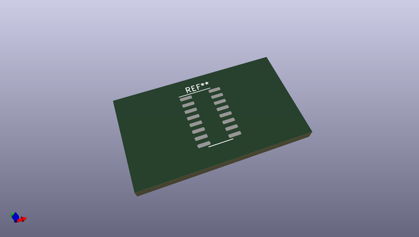

# OOMP Footprint  
## SOP-16_3.9x9.9mm_P1.27mm  by none  
  
oomp key: oomp_kicad_package_so_sop_16_3_9x9_9mm_p1_27mm  
  
source repo at: [http://gitlab.com/kicad/libraries/kicad-footprints//blob/master/tmp/libraries/kicad-footprints/Varistor.pretty/RV_Rect_V25S440P_L26.5mm_W8.2mm_P12.7mm.kicad_mod](http://gitlab.com/kicad/libraries/kicad-footprints//blob/master/tmp/libraries/kicad-footprints/Varistor.pretty/RV_Rect_V25S440P_L26.5mm_W8.2mm_P12.7mm.kicad_mod)  
## Footprint  
  
  
  
  
| name | value | 
| --- | --- | 
| footprint name | SOP-16_3.9x9.9mm_P1.27mm | 
| footprint description | SOP, 16 Pin (https://www.diodes.com/assets/Datasheets/PAM8403.pdf), generated with kicad-footprint-generator ipc_gullwing_generator.py | 
| number of pads | 16 | 
| github path | http://github.com/kicad/libraries/kicad-footprints//blob/master/tmp/libraries/kicad-footprints/Package_SO.pretty/SOP-16_3.9x9.9mm_P1.27mm.kicad_mod | 
| oomp key | oomp_kicad_package_so_sop_16_3_9x9_9mm_p1_27mm | 
| oomp bot github | https://github.com/oomlout/oomlout_oomp_footprint_bot/tree/main/footprints/kicad_package_so_sop_16_3_9x9_9mm_p1_27mm/working | 
## Images  
