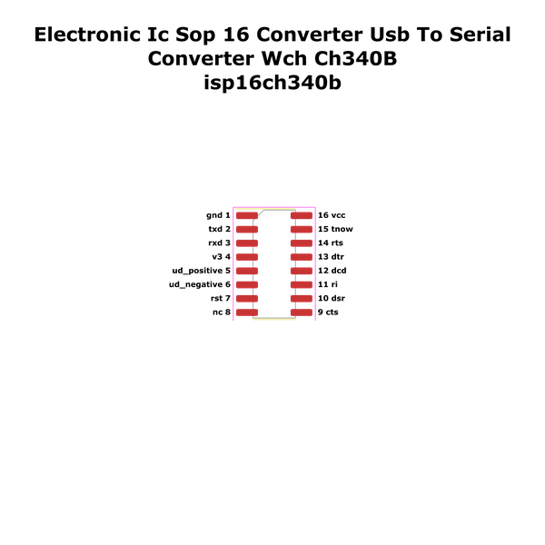

# Electronic Ic Sop 16 Converter Usb To Serial Converter Wch Ch340B

  
* oomp_key: oomp_electronic_ic_sop_16_converter_usb_to_serial_converter_wch_ch340b 
* short_code: isp16ch340b
* md5_6: ea28b6  
* github_link: https://github.com/oomlout/oomlout_oomp_part_src/tree/main/parts/electronic_ic_sop_16_converter_usb_to_serial_converter_wch_ch340b/working  
## naming details
* classification -- electronic
* type -- ic
* size -- sop_16
* color -- converter
* description_main -- usb_to_serial_converter
* description_extra -- 
* manucaturer -- wch
* part_number -- ch340b
## pinout
  
List of Pins:

* 1 : gnd
* 2 : txd
* 3 : rxd
* 4 : v3
* 5 : ud_plus
* 6 : ud_negative
* 7 : rst
* 8 : nc
* 9 : cts
* 10 : dsr
* 11 : ri
* 12 : dcd
* 13 : dtr
* 14 : rts
* 15 : tnow
* 16 : vcc
## distributors
* [LCSC - C81010](https://lcsc.com/product-detail/C81010.html)  

## footprint

  
oomp_key: oomp_kicad_package_so_sop_16_3_9x9_9mm_p1_27mm  
link: https://github.com/oomlout/oomlout_oomp_footprint_bot/tree/main/footprints/kicad_package_so_sop_16_3_9x9_9mm_p1_27mm/working  

## full_summary
| name | value | 
| --- | --- | 
| name | value | 
| classification | electronic | 
| type | ic | 
| size | sop_16 | 
| color | converter | 
| description_main | usb_to_serial_converter | 
| description_extra |  | 
| manufacturer | wch | 
| part_number | ch340b | 
| short_name | usb to serial converter (ch340b) | 
| pins_pin_1_name | gnd | 
| pins_pin_1_number | 1 | 
| pins_pin_1_type | signal | 
| pins_pin_2_name | txd | 
| pins_pin_2_number | 2 | 
| pins_pin_2_type | signal | 
| pins_pin_3_name | rxd | 
| pins_pin_3_number | 3 | 
| pins_pin_3_type | signal | 
| pins_pin_4_name | v3 | 
| pins_pin_4_number | 4 | 
| pins_pin_4_type | signal | 
| pins_pin_5_name | ud_plus | 
| pins_pin_5_number | 5 | 
| pins_pin_5_type | signal | 
| pins_pin_6_name | ud_negative | 
| pins_pin_6_number | 6 | 
| pins_pin_6_type | gnd | 
| pins_pin_7_name | rst | 
| pins_pin_7_number | 7 | 
| pins_pin_7_type | signal | 
| pins_pin_8_name | nc | 
| pins_pin_8_number | 8 | 
| pins_pin_8_type | signal | 
| pins_pin_9_name | cts | 
| pins_pin_9_number | 9 | 
| pins_pin_9_type | signal | 
| pins_pin_10_name | dsr | 
| pins_pin_10_number | 10 | 
| pins_pin_10_type | signal | 
| pins_pin_11_name | ri | 
| pins_pin_11_number | 11 | 
| pins_pin_11_type | signal | 
| pins_pin_12_name | dcd | 
| pins_pin_12_number | 12 | 
| pins_pin_12_type | signal | 
| pins_pin_13_name | dtr | 
| pins_pin_13_number | 13 | 
| pins_pin_13_type | signal | 
| pins_pin_14_name | rts | 
| pins_pin_14_number | 14 | 
| pins_pin_14_type | signal | 
| pins_pin_15_name | tnow | 
| pins_pin_15_number | 15 | 
| pins_pin_15_type | signal | 
| pins_pin_16_name | vcc | 
| pins_pin_16_number | 16 | 
| pins_pin_16_type | signal | 
| kicad_reference | U | 
| notes | [] | 
| id | electronic_ic_sop_16_converter_usb_to_serial_converter_wch_ch340b | 
| oomp_key | oomp_electronic_ic_sop_16_converter_usb_to_serial_converter_wch_ch340b | 
| github_link | https://github.com/oomlout/oomlout_oomp_part_src/tree/main/parts/electronic_ic_sop_16_converter_usb_to_serial_converter_wch_ch340b/working | 
| directory | parts/electronic_ic_sop_16_converter_usb_to_serial_converter_wch_ch340b | 
| name | Electronic Ic Sop 16 Converter Usb To Serial Converter Wch Ch340B | 
| short_code | isp16ch340b | 
| short_code_upper | ISP16CH340B | 
| distributors | [{'name': 'LCSC', 'part_number': 'C81010', 'link': 'https://lcsc.com/product-detail/C81010.html', 'id': 'distributor_lcsc'}] | 
| manufacturers | [] | 
| md5 | ea28b63f284b0c72f54f9c49ad14c793 | 
| md5_5 | ea28b | 
| md5_6 | ea28b6 | 
| md5_10 | ea28b63f28 | 
| markdown_full | [electronic_ic_sop_16_converter_usb_to_serial_converter_wch_ch340b](https://github.com/oomlout/oomlout_oomp_part_src/tree/main/parts/electronic_ic_sop_16_converter_usb_to_serial_converter_wch_ch340b/working) [isp16ch340b](https://github.com/oomlout/oomlout_oomp_part_src/tree/main/parts/electronic_ic_sop_16_converter_usb_to_serial_converter_wch_ch340b/working) [Electronic Ic Sop 16 Converter Usb To Serial Converter Wch Ch340B](https://github.com/oomlout/oomlout_oomp_part_src/tree/main/parts/electronic_ic_sop_16_converter_usb_to_serial_converter_wch_ch340b/working) [LCSC - C81010 ](https://lcsc.com/product-detail/C81010.html)  | 
| markdown_short | [electronic_ic_sop_16_converter_usb_to_serial_converter_wch_ch340b](https://github.com/oomlout/oomlout_oomp_part_src/tree/main/parts/electronic_ic_sop_16_converter_usb_to_serial_converter_wch_ch340b/working) [LCSC - C81010 ](https://lcsc.com/product-detail/C81010.html)  | 
| footprint | [{'link': 'https://github.com/oomlout/oomlout_oomp_footprint_bot/tree/main/foootprntss/kicad_package_so_sop_16_3_9x9_9mm_p1_27mm', 'oomp_key': 'oomp_kicad_package_so_sop_16_3_9x9_9mm_p1_27mm', 'directory': 'oomlout_oomp_footprint_bot/footprints/kicad_package_so_sop_16_3_9x9_9mm_p1_27mm//working/working.kicad_mod'}] | 
