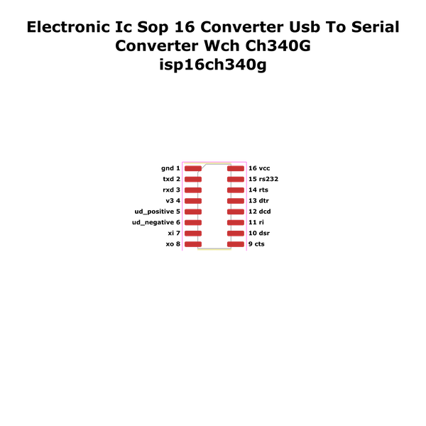

# Electronic Ic Sop 16 Converter Usb To Serial Converter Wch Ch340G

  
* oomp_key: oomp_electronic_ic_sop_16_converter_usb_to_serial_converter_wch_ch340g 
* short_code: isp16ch340g
* md5_6: 0f3b38  
* github_link: https://github.com/oomlout/oomlout_oomp_part_src/tree/main/parts/electronic_ic_sop_16_converter_usb_to_serial_converter_wch_ch340g/working  
## naming details
* classification -- electronic
* type -- ic
* size -- sop_16
* color -- converter
* description_main -- usb_to_serial_converter
* description_extra -- 
* manucaturer -- wch
* part_number -- ch340g
## pinout
  
List of Pins:

* 1 : gnd
* 2 : txd
* 3 : rxd
* 4 : v3
* 5 : ud_positive
* 6 : ud_negative
* 7 : xi
* 8 : xo
* 9 : cts
* 10 : dsr
* 11 : ri
* 12 : dcd
* 13 : dtr
* 14 : rts
* 15 : rs232
* 16 : vcc
## distributors
* [LCSC - C14267](https://lcsc.com/product-detail/C14267.html)   

## symbol

  
oomp_key: oomp_kicad_interface_usb_ch340g  
link: https://github.com/oomlout/oomlout_oomp_symbol_bot/tree/main/symbols/kicad_interface_usb_ch340g/working  

## footprint

  
oomp_key: oomp_kicad_package_so_sop_16_3_9x9_9mm_p1_27mm  
link: https://github.com/oomlout/oomlout_oomp_footprint_bot/tree/main/footprints/kicad_package_so_sop_16_3_9x9_9mm_p1_27mm/working  

  
oomp_key: oomp_oomlout_oomlout_oomp_part_footprints_isp16ch340g_electronic_ic_sop_16_converter_usb_to_serial_converter_wch_ch340g  
link: https://github.com/oomlout/oomlout_oomp_footprint_bot/tree/main/footprints/oomlout_oomlout_oomp_part_footprints_isp16ch340g_electronic_ic_sop_16_converter_usb_to_serial_converter_wch_ch340g/working  

## full_summary
| name | value | 
| --- | --- | 
| name | value | 
| classification | electronic | 
| type | ic | 
| size | sop_16 | 
| color | converter | 
| description_main | usb_to_serial_converter | 
| description_extra |  | 
| manufacturer | wch | 
| part_number | ch340g | 
| short_name | usb to serial converter (ch340g) | 
| pins_pin_1_name | gnd | 
| pins_pin_1_number | 1 | 
| pins_pin_1_type | signal | 
| pins_pin_2_name | txd | 
| pins_pin_2_number | 2 | 
| pins_pin_2_type | signal | 
| pins_pin_3_name | rxd | 
| pins_pin_3_number | 3 | 
| pins_pin_3_type | signal | 
| pins_pin_4_name | v3 | 
| pins_pin_4_number | 4 | 
| pins_pin_4_type | signal | 
| pins_pin_5_name | ud_positive | 
| pins_pin_5_number | 5 | 
| pins_pin_5_type | signal | 
| pins_pin_6_name | ud_negative | 
| pins_pin_6_number | 6 | 
| pins_pin_6_type | gnd | 
| pins_pin_7_name | xi | 
| pins_pin_7_number | 7 | 
| pins_pin_7_type | signal | 
| pins_pin_8_name | xo | 
| pins_pin_8_number | 8 | 
| pins_pin_8_type | signal | 
| pins_pin_9_name | cts | 
| pins_pin_9_number | 9 | 
| pins_pin_9_type | signal | 
| pins_pin_10_name | dsr | 
| pins_pin_10_number | 10 | 
| pins_pin_10_type | signal | 
| pins_pin_11_name | ri | 
| pins_pin_11_number | 11 | 
| pins_pin_11_type | signal | 
| pins_pin_12_name | dcd | 
| pins_pin_12_number | 12 | 
| pins_pin_12_type | signal | 
| pins_pin_13_name | dtr | 
| pins_pin_13_number | 13 | 
| pins_pin_13_type | signal | 
| pins_pin_14_name | rts | 
| pins_pin_14_number | 14 | 
| pins_pin_14_type | signal | 
| pins_pin_15_name | rs232 | 
| pins_pin_15_number | 15 | 
| pins_pin_15_type | signal | 
| pins_pin_16_name | vcc | 
| pins_pin_16_number | 16 | 
| pins_pin_16_type | signal | 
| kicad_reference | U | 
| notes | [] | 
| classification_upper | ELECTRONIC | 
| classification_capital | Electronic | 
| classification_first_letter | e | 
| classification_first_letter_upper | E | 
| type_upper | IC | 
| type_capital | Ic | 
| type_first_letter | i | 
| type_first_letter_upper | I | 
| size_upper | SOP_16 | 
| size_capital | Sop 16 | 
| size_first_letter | s | 
| size_first_letter_upper | S | 
| color_upper | CONVERTER | 
| color_capital | Converter | 
| color_first_letter | c | 
| color_first_letter_upper | C | 
| description_main_upper | USB_TO_SERIAL_CONVERTER | 
| description_main_capital | Usb To Serial Converter | 
| description_main_first_letter | u | 
| description_main_first_letter_upper | U | 
| description_extra_upper |  | 
| description_extra_capital |  | 
| description_extra_first_letter |  | 
| description_extra_first_letter_upper |  | 
| manufacturer_upper | WCH | 
| manufacturer_capital | Wch | 
| manufacturer_first_letter | w | 
| manufacturer_first_letter_upper | W | 
| part_number_upper | CH340G | 
| part_number_capital | Ch340G | 
| part_number_first_letter | c | 
| part_number_first_letter_upper | C | 
| id | electronic_ic_sop_16_converter_usb_to_serial_converter_wch_ch340g | 
| id_no_class | ic_sop_16_converter_usb_to_serial_converter_wch_ch340g | 
| id_no_type | sop_16_converter_usb_to_serial_converter_wch_ch340g | 
| id_no_size | converter_usb_to_serial_converter_wch_ch340g | 
| oomp_key | oomp_electronic_ic_sop_16_converter_usb_to_serial_converter_wch_ch340g | 
| github_link | https://github.com/oomlout/oomlout_oomp_part_src/tree/main/parts/electronic_ic_sop_16_converter_usb_to_serial_converter_wch_ch340g/working | 
| directory | parts/electronic_ic_sop_16_converter_usb_to_serial_converter_wch_ch340g | 
| name | Electronic Ic Sop 16 Converter Usb To Serial Converter Wch Ch340G | 
| name_no_class | Ic Sop 16 Converter Usb To Serial Converter Wch Ch340G | 
| name_no_type | Sop 16 Converter Usb To Serial Converter Wch Ch340G | 
| name_no_size | Converter Usb To Serial Converter Wch Ch340G | 
| short_code | isp16ch340g | 
| short_code_upper | ISP16CH340G | 
| distributors | [{'name': 'LCSC', 'part_number': 'C14267', 'link': 'https://lcsc.com/product-detail/C14267.html', 'id': 'distributor_lcsc'}] | 
| manufacturers | [] | 
| md5 | 0f3b38de4bb8ab11ae1d9cca34a3b7af | 
| md5_5 | 0f3b3 | 
| md5_5_upper | 0F3B3 | 
| md5_6 | 0f3b38 | 
| md5_6_upper | 0F3B38 | 
| md5_6_alpha | le7s | 
| md5_6_alpha_upper | LE7S | 
| md5_10 | 0f3b38de4b | 
| md5_10_upper | 0F3B38DE4B | 
| size_only_numbers | 16 | 
| size_only_numbers_no_zeros | 16 | 
| description_only_numbers |  | 
| description_only_numbers_short |   | 
| name_no_size_short | Converter Usb To Serial Converter Wch Ch340G | 
| description_or_color | C  | 
| description_or_color_upper | C  | 
| markdown_full | [electronic_ic_sop_16_converter_usb_to_serial_converter_wch_ch340g](https://github.com/oomlout/oomlout_oomp_part_src/tree/main/parts/electronic_ic_sop_16_converter_usb_to_serial_converter_wch_ch340g/working) [isp16ch340g](https://github.com/oomlout/oomlout_oomp_part_src/tree/main/parts/electronic_ic_sop_16_converter_usb_to_serial_converter_wch_ch340g/working) [Electronic Ic Sop 16 Converter Usb To Serial Converter Wch Ch340G](https://github.com/oomlout/oomlout_oomp_part_src/tree/main/parts/electronic_ic_sop_16_converter_usb_to_serial_converter_wch_ch340g/working) [LCSC - C14267 ](https://lcsc.com/product-detail/C14267.html)  | 
| markdown_short | [electronic_ic_sop_16_converter_usb_to_serial_converter_wch_ch340g](https://github.com/oomlout/oomlout_oomp_part_src/tree/main/parts/electronic_ic_sop_16_converter_usb_to_serial_converter_wch_ch340g/working) [LCSC - C14267 ](https://lcsc.com/product-detail/C14267.html)  | 
| footprint | [{'link': 'https://github.com/oomlout/oomlout_oomp_footprint_bot/tree/main/foootprntss/kicad_package_so_sop_16_3_9x9_9mm_p1_27mm', 'oomp_key': 'oomp_kicad_package_so_sop_16_3_9x9_9mm_p1_27mm', 'directory': 'oomlout_oomp_footprint_bot/footprints/kicad_package_so_sop_16_3_9x9_9mm_p1_27mm//working/working.kicad_mod', 'note': 'source footprint kicad_package_so_sop_16_3_9x9_9mm_p1_27mm', 'index': 0}, {'link': 'https://github.com/oomlout/oomlout_oomp_footprint_bot/tree/main/foootprntss/oomlout_oomlout_oomp_part_footprints_isp16ch340g_electronic_ic_sop_16_converter_usb_to_serial_converter_wch_ch340g', 'oomp_key': 'oomp_oomlout_oomlout_oomp_part_footprints_isp16ch340g_electronic_ic_sop_16_converter_usb_to_serial_converter_wch_ch340g', 'directory': 'oomlout_oomp_footprint_bot/footprints/oomlout_oomlout_oomp_part_footprints_isp16ch340g_electronic_ic_sop_16_converter_usb_to_serial_converter_wch_ch340g//working/working.kicad_mod', 'note': 'oomp generated footprint', 'index': 1}] | 
| symbol | [{'link': 'https://github.com/oomlout/oomlout_oomp_symbol_bot/tree/main/symbols/kicad_interface_usb_ch340g', 'oomp_key': 'oomp_kicad_interface_usb_ch340g', 'directory': 'oomlout_oomp_symbol_bot/symbols/kicad_interface_usb_ch340g//working/working.kicad_sym', 'index': 0}] | 
