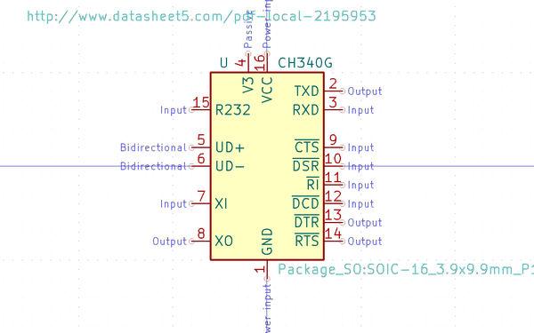
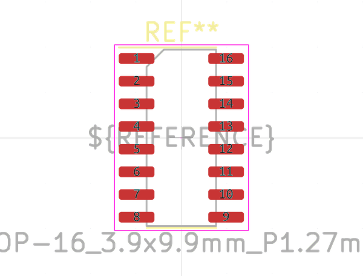

# Electronic Ic Sop 16 Converter Usb To Serial Converter Wch Ch340G
oomp_key: oomp_electronic_ic_sop_16_converter_usb_to_serial_converter_wch_ch340g  

short_code: isp16ch340g
## naming details
* classification -- electronic
* type -- ic
* size -- sop_16
* color -- converter
* description_main -- usb_to_serial_converter
* description_extra -- 
* manucaturer -- wch
* part_number -- ch340g
## pinout

List of Pins:

* 1 : gnd
* 2 : txd
* 3 : rxd
* 4 : v3
* 5 : ud_plus
* 6 : ud_negative
* 7 : xi
* 8 : xo
* 9 : cts
* 10 : dsr
* 11 : ri
* 12 : dcd
* 13 : dtr
* 14 : rts
* 15 : rs232
* 16 : vcc
## symbol

oomp_key: oomp_kicad_interface_usb_ch340g
link: https://github.com/oomlout/oomlout_oomp_symbol_bot/tree/main/symbols/kicad_interface_usb_ch340g

## footprint

oomp_key: oomp_kicad_package_so_sop_16_3_9x9_9mm_p1_27mm
link: https://github.com/oomlout/oomlout_oomp_footprint_bot/tree/main/foootprntss/kicad_package_so_sop_16_3_9x9_9mm_p1_27mm
