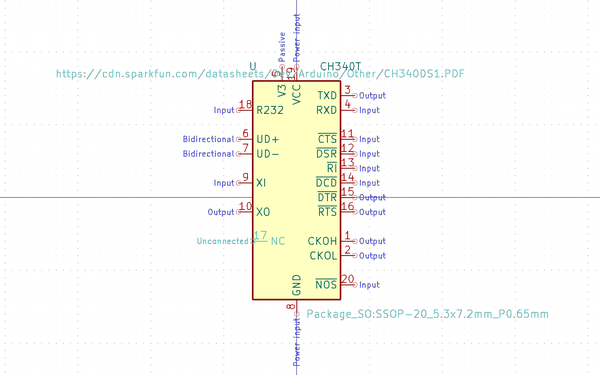

# Electronic Ic Ssop 20 Converter Usb To Serial Converter Wch Ch340T

  
* oomp_key: oomp_electronic_ic_ssop_20_converter_usb_to_serial_converter_wch_ch340t 
* short_code: ich340t
* md5_6: e07223  
* github_link: https://github.com/oomlout/oomlout_oomp_part_src/tree/main/parts/electronic_ic_ssop_20_converter_usb_to_serial_converter_wch_ch340t/working  
## naming details
* classification -- electronic
* type -- ic
* size -- ssop_20
* color -- converter
* description_main -- usb_to_serial_converter
* description_extra -- 
* manucaturer -- wch
* part_number -- ch340t
## pinout
  
List of Pins:

* 1 : cko
* 2 : act
* 3 : txd
* 4 : rxd
* 5 : v3
* 6 : ud_plus
* 7 : ud_negative
* 8 : gnd
* 9 : xi
* 10 : xo
* 11 : cts
* 12 : dsr
* 13 : ri
* 14 : dcd
* 15 : dtr
* 16 : rts
* 16 : tnow
* 16 : r232
* 16 : vcc
* 16 : nos
## distributors
* [LCSC - C8689](https://lcsc.com/product-detail/C8689.html)  

## symbol

  
oomp_key: oomp_kicad_interface_usb_ch340t  
link: https://github.com/oomlout/oomlout_oomp_symbol_bot/tree/main/symbols/kicad_interface_usb_ch340t/working  

## full_summary
| name | value | 
| --- | --- | 
| name | value | 
| classification | electronic | 
| type | ic | 
| size | ssop_20 | 
| color | converter | 
| description_main | usb_to_serial_converter | 
| description_extra |  | 
| manufacturer | wch | 
| part_number | ch340t | 
| short_name | usb to serial converter (ch340t) | 
| pins_pin_1_name | cko | 
| pins_pin_1_number | 1 | 
| pins_pin_1_type | signal | 
| pins_pin_2_name | act | 
| pins_pin_2_number | 2 | 
| pins_pin_2_type | signal | 
| pins_pin_3_name | txd | 
| pins_pin_3_number | 3 | 
| pins_pin_3_type | signal | 
| pins_pin_4_name | rxd | 
| pins_pin_4_number | 4 | 
| pins_pin_4_type | signal | 
| pins_pin_5_name | v3 | 
| pins_pin_5_number | 5 | 
| pins_pin_5_type | signal | 
| pins_pin_6_name | ud_plus | 
| pins_pin_6_number | 6 | 
| pins_pin_6_type | gnd | 
| pins_pin_7_name | ud_negative | 
| pins_pin_7_number | 7 | 
| pins_pin_7_type | signal | 
| pins_pin_8_name | gnd | 
| pins_pin_8_number | 8 | 
| pins_pin_8_type | signal | 
| pins_pin_9_name | xi | 
| pins_pin_9_number | 9 | 
| pins_pin_9_type | signal | 
| pins_pin_10_name | xo | 
| pins_pin_10_number | 10 | 
| pins_pin_10_type | signal | 
| pins_pin_11_name | cts | 
| pins_pin_11_number | 11 | 
| pins_pin_11_type | signal | 
| pins_pin_12_name | dsr | 
| pins_pin_12_number | 12 | 
| pins_pin_12_type | signal | 
| pins_pin_13_name | ri | 
| pins_pin_13_number | 13 | 
| pins_pin_13_type | signal | 
| pins_pin_14_name | dcd | 
| pins_pin_14_number | 14 | 
| pins_pin_14_type | signal | 
| pins_pin_15_name | dtr | 
| pins_pin_15_number | 15 | 
| pins_pin_15_type | signal | 
| pins_pin_16_name | rts | 
| pins_pin_16_number | 16 | 
| pins_pin_16_type | signal | 
| pins_pin_17_name | tnow | 
| pins_pin_17_number | 16 | 
| pins_pin_17_type | signal | 
| pins_pin_18_name | r232 | 
| pins_pin_18_number | 16 | 
| pins_pin_18_type | signal | 
| pins_pin_19_name | vcc | 
| pins_pin_19_number | 16 | 
| pins_pin_19_type | signal | 
| pins_pin_20_name | nos | 
| pins_pin_20_number | 16 | 
| pins_pin_20_type | signal | 
| kicad_reference | U | 
| notes | [] | 
| id | electronic_ic_ssop_20_converter_usb_to_serial_converter_wch_ch340t | 
| oomp_key | oomp_electronic_ic_ssop_20_converter_usb_to_serial_converter_wch_ch340t | 
| github_link | https://github.com/oomlout/oomlout_oomp_part_src/tree/main/parts/electronic_ic_ssop_20_converter_usb_to_serial_converter_wch_ch340t/working | 
| directory | parts/electronic_ic_ssop_20_converter_usb_to_serial_converter_wch_ch340t | 
| name | Electronic Ic Ssop 20 Converter Usb To Serial Converter Wch Ch340T | 
| short_code | ich340t | 
| distributors | [{'name': 'LCSC', 'part_number': 'C8689', 'link': 'https://lcsc.com/product-detail/C8689.html', 'id': 'distributor_lcsc'}] | 
| manufacturers | [] | 
| md5 | e07223f3446f9e6a9ed62db546344b87 | 
| md5_5 | e0722 | 
| md5_6 | e07223 | 
| md5_10 | e07223f344 | 
| markdown_full | [electronic_ic_ssop_20_converter_usb_to_serial_converter_wch_ch340t](https://github.com/oomlout/oomlout_oomp_part_src/tree/main/parts/electronic_ic_ssop_20_converter_usb_to_serial_converter_wch_ch340t/working) [ich340t](https://github.com/oomlout/oomlout_oomp_part_src/tree/main/parts/electronic_ic_ssop_20_converter_usb_to_serial_converter_wch_ch340t/working)  | 
| symbol | [{'link': 'https://github.com/oomlout/oomlout_oomp_symbol_bot/tree/main/symbols/kicad_interface_usb_ch340t', 'oomp_key': 'oomp_kicad_interface_usb_ch340t', 'directory': 'oomlout_oomp_symbol_bot/symbols/kicad_interface_usb_ch340t//working/working.kicad_sym'}] | 
