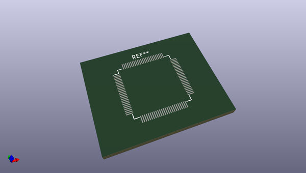
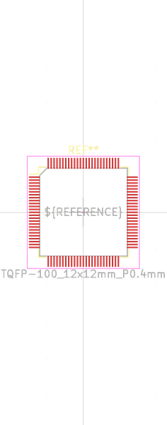

# OOMP Footprint  
## TQFP-100_12x12mm_P0.4mm  by oomlout  
  
oomp key: oomp_oomlout_oomlout_oomp_part_footprints_imcup32mk1024_electronic_ic_tqfp_100_mcu_pic32_microchip_pic32mk1024gpk100  
  
source repo at: [http://github.com/oomlout/oomlout_oomp_part_kicad_footprints/blob/master/tmp/data/oomlout_oomp_footprint_src/oomlout_oomp_part_footprints.pretty/xcr3213mhz8_electronic_ceramic_resonator_3213_3_pin_ground_pin_2_8_mega_hertz_1.kicad_mod](http://github.com/oomlout/oomlout_oomp_part_kicad_footprints/blob/master/tmp/data/oomlout_oomp_footprint_src/oomlout_oomp_part_footprints.pretty/xcr3213mhz8_electronic_ceramic_resonator_3213_3_pin_ground_pin_2_8_mega_hertz_1.kicad_mod)  
## Footprint  
  
  
  
  
| name | value | 
| --- | --- | 
| footprint name | TQFP-100_12x12mm_P0.4mm | 
| footprint description | 100-Lead Plastic Thin Quad Flatpack (PT) - 12x12x1 mm Body, 2.00 mm [TQFP] (see Microchip Packaging Specification 00000049BS.pdf) | 
| number of pads | 100 | 
| github path | http://github.com/oomlout/oomlout_oomp_part_kicad_footprints/blob/master/tmp/data/oomlout_oomp_footprint_src/oomlout_oomp_part_footprints.pretty/imcup32mk1024_electronic_ic_tqfp_100_mcu_pic32_microchip_pic32mk1024gpk100.kicad_mod | 
| oomp key | oomp_oomlout_oomlout_oomp_part_footprints_imcup32mk1024_electronic_ic_tqfp_100_mcu_pic32_microchip_pic32mk1024gpk100 | 
| oomp bot github | https://github.com/oomlout/oomlout_oomp_footprint_bot/tree/main/tmp/data/oomlout_oomp_footprint_src/footprints/oomlout_oomlout_oomp_part_footprints_imcup32mk1024_electronic_ic_tqfp_100_mcu_pic32_microchip_pic32mk1024gpk100/working | 
## Images  
