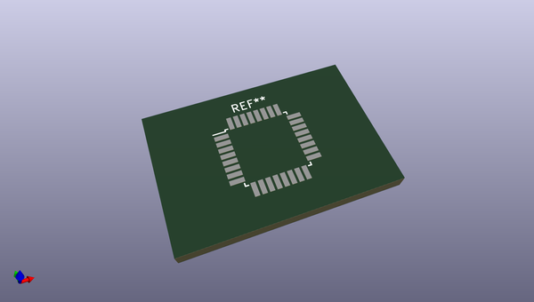

# OOMP Footprint  
## TQFP-32_7x7mm_P0.8mm  by none  
  
oomp key: oomp_kicad_package_qfp_tqfp_32_7x7mm_p0_8mm  
  
source repo at: [http://gitlab.com/kicad/libraries/kicad-footprints//blob/master/tmp/libraries/kicad-footprints/Varistor.pretty/RV_Rect_V25S440P_L26.5mm_W8.2mm_P12.7mm.kicad_mod](http://gitlab.com/kicad/libraries/kicad-footprints//blob/master/tmp/libraries/kicad-footprints/Varistor.pretty/RV_Rect_V25S440P_L26.5mm_W8.2mm_P12.7mm.kicad_mod)  
## Footprint  
  
  
  
  
| name | value | 
| --- | --- | 
| footprint name | TQFP-32_7x7mm_P0.8mm | 
| footprint description | 32-Lead Plastic Thin Quad Flatpack (PT) - 7x7x1.0 mm Body, 2.00 mm [TQFP] (see Microchip Packaging Specification 00000049BS.pdf) | 
| number of pads | 32 | 
| github path | http://github.com/kicad/libraries/kicad-footprints//blob/master/tmp/libraries/kicad-footprints/Package_QFP.pretty/TQFP-32_7x7mm_P0.8mm.kicad_mod | 
| oomp key | oomp_kicad_package_qfp_tqfp_32_7x7mm_p0_8mm | 
| oomp bot github | https://github.com/oomlout/oomlout_oomp_footprint_bot/tree/main/footprints/kicad_package_qfp_tqfp_32_7x7mm_p0_8mm/working | 
## Images  
