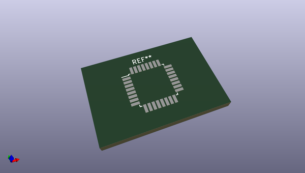
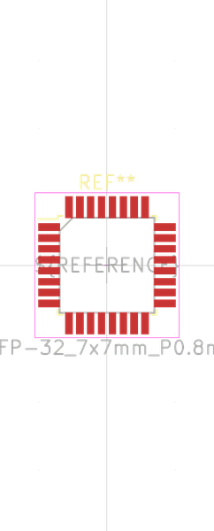

# OOMP Footprint  
## TQFP-32_7x7mm_P0.8mm  by oomlout  
  
oomp key: oomp_oomlout_oomlout_oomp_part_footprints_itq32mcuat328_electronic_ic_tqfp_32_mcu_atmega328_microchip_atmega328p_au  
  
source repo at: [http://github.com/oomlout/oomlout_oomp_part_kicad_footprints/blob/master/tmp/data/oomlout_oomp_footprint_src/oomlout_oomp_part_footprints.pretty/xcr3213mhz8_electronic_ceramic_resonator_3213_3_pin_ground_pin_2_8_mega_hertz_1.kicad_mod](http://github.com/oomlout/oomlout_oomp_part_kicad_footprints/blob/master/tmp/data/oomlout_oomp_footprint_src/oomlout_oomp_part_footprints.pretty/xcr3213mhz8_electronic_ceramic_resonator_3213_3_pin_ground_pin_2_8_mega_hertz_1.kicad_mod)  
## Footprint  
  
  
  
  
| name | value | 
| --- | --- | 
| footprint name | TQFP-32_7x7mm_P0.8mm | 
| footprint description | 32-Lead Plastic Thin Quad Flatpack (PT) - 7x7x1.0 mm Body, 2.00 mm [TQFP] (see Microchip Packaging Specification 00000049BS.pdf) | 
| number of pads | 32 | 
| github path | http://github.com/oomlout/oomlout_oomp_part_kicad_footprints/blob/master/tmp/data/oomlout_oomp_footprint_src/oomlout_oomp_part_footprints.pretty/itq32mcuat328_electronic_ic_tqfp_32_mcu_atmega328_microchip_atmega328p_au.kicad_mod | 
| oomp key | oomp_oomlout_oomlout_oomp_part_footprints_itq32mcuat328_electronic_ic_tqfp_32_mcu_atmega328_microchip_atmega328p_au | 
| oomp bot github | https://github.com/oomlout/oomlout_oomp_footprint_bot/tree/main/tmp/data/oomlout_oomp_footprint_src/footprints/oomlout_oomlout_oomp_part_footprints_itq32mcuat328_electronic_ic_tqfp_32_mcu_atmega328_microchip_atmega328p_au/working | 
## Images  
