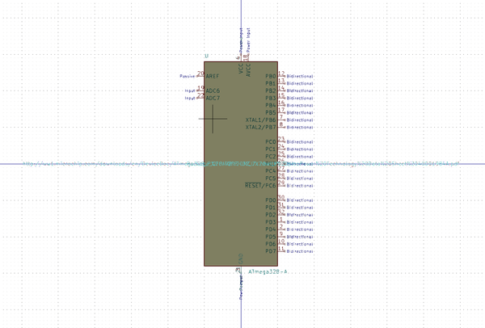
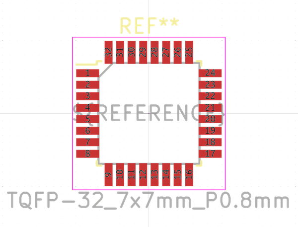

# Electronic Ic Tqfp 32 Mcu Atmega328 Microchip Atmega328P Au

  
* oomp_key: oomp_electronic_ic_tqfp_32_mcu_atmega328_microchip_atmega328p_au 
* short_code: itq32at328
* md5_6: 16166f  
* github_link: https://github.com/oomlout/oomlout_oomp_part_src/tree/main/parts/electronic_ic_tqfp_32_mcu_atmega328_microchip_atmega328p_au/working  
## naming details
* classification -- electronic
* type -- ic
* size -- tqfp_32
* color -- mcu
* description_main -- atmega328
* description_extra -- 
* manucaturer -- microchip
* part_number -- atmega328p_au

## distributors
* [LCSC - C14877](https://lcsc.com/product-detail/C14877.html)  
* [LCSC - C618816](https://lcsc.com/product-detail/C618816.html)  

## manufacturers
* [Microchip - ATMEGA328P-AU](https://www.microchip.com/wwwproducts/en/ATMEGA328P-AU)  
* [Microchip - ATMEGA328P-AUR](https://www.microchip.com/wwwproducts/en/ATMEGA328P-AUR)  

## symbol

  
oomp_key: oomp_kicad_mcu_microchip_atmega_atmega328_a  
link: https://github.com/oomlout/oomlout_oomp_symbol_bot/tree/main/symbols/kicad_mcu_microchip_atmega_atmega328_a/working  

## footprint

  
oomp_key: oomp_kicad_package_qfp_tqfp_32_7x7mm_p0_8mm  
link: https://github.com/oomlout/oomlout_oomp_footprint_bot/tree/main/footprints/kicad_package_qfp_tqfp_32_7x7mm_p0_8mm/working  

## full_summary
| name | value | 
| --- | --- | 
| name | value | 
| classification | electronic | 
| type | ic | 
| size | tqfp_32 | 
| color | mcu | 
| description_main | atmega328 | 
| description_extra |  | 
| manufacturer | microchip | 
| part_number | atmega328p_au | 
| short_name | atmega328 32 pin tqfp | 
| id | electronic_ic_tqfp_32_mcu_atmega328_microchip_atmega328p_au | 
| oomp_key | oomp_electronic_ic_tqfp_32_mcu_atmega328_microchip_atmega328p_au | 
| github_link | https://github.com/oomlout/oomlout_oomp_part_src/tree/main/parts/electronic_ic_tqfp_32_mcu_atmega328_microchip_atmega328p_au/working | 
| directory | parts/electronic_ic_tqfp_32_mcu_atmega328_microchip_atmega328p_au | 
| name | Electronic Ic Tqfp 32 Mcu Atmega328 Microchip Atmega328P Au | 
| short_code | itq32at328 | 
| distributors | [{'name': 'LCSC', 'part_number': 'C14877', 'link': 'https://lcsc.com/product-detail/C14877.html', 'id': 'distributor_lcsc'}, {'name': 'LCSC', 'part_number': 'C618816', 'link': 'https://lcsc.com/product-detail/C618816.html', 'id': 'distributor_lcsc'}] | 
| manufacturers | [{'name': 'Microchip', 'part_number': 'ATMEGA328P-AU', 'link': 'https://www.microchip.com/wwwproducts/en/ATMEGA328P-AU', 'id': 'manufacturer_microchip'}, {'name': 'Microchip', 'part_number': 'ATMEGA328P-AUR', 'link': 'https://www.microchip.com/wwwproducts/en/ATMEGA328P-AUR', 'id': 'manufacturer_microchip'}] | 
| package_style | tray | 
| md5 | 16166fb725b2a6d4d2a6cc8dfeeccaf7 | 
| md5_5 | 16166 | 
| md5_6 | 16166f | 
| md5_10 | 16166fb725 | 
| markdown_full | [electronic_ic_tqfp_32_mcu_atmega328_microchip_atmega328p_au](https://github.com/oomlout/oomlout_oomp_part_src/tree/main/parts/electronic_ic_tqfp_32_mcu_atmega328_microchip_atmega328p_au/working) [itq32at328](https://github.com/oomlout/oomlout_oomp_part_src/tree/main/parts/electronic_ic_tqfp_32_mcu_atmega328_microchip_atmega328p_au/working) [Microchip - ATMEGA328P-AU ](https://www.microchip.com/wwwproducts/en/ATMEGA328P-AU)[Microchip - ATMEGA328P-AUR ](https://www.microchip.com/wwwproducts/en/ATMEGA328P-AUR) | 
| footprint | [{'link': 'https://github.com/oomlout/oomlout_oomp_footprint_bot/tree/main/foootprntss/kicad_package_qfp_tqfp_32_7x7mm_p0_8mm', 'oomp_key': 'oomp_kicad_package_qfp_tqfp_32_7x7mm_p0_8mm', 'directory': 'oomlout_oomp_footprint_bot/footprints/kicad_package_qfp_tqfp_32_7x7mm_p0_8mm//working/working.kicad_mod'}] | 
| symbol | [{'link': 'https://github.com/oomlout/oomlout_oomp_symbol_bot/tree/main/symbols/kicad_mcu_microchip_atmega_atmega328_a', 'oomp_key': 'oomp_kicad_mcu_microchip_atmega_atmega328_a', 'directory': 'oomlout_oomp_symbol_bot/symbols/kicad_mcu_microchip_atmega_atmega328_a//working/working.kicad_sym'}] | 
