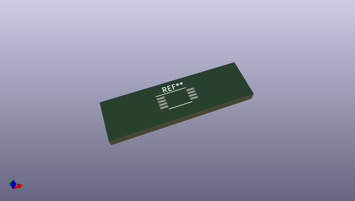
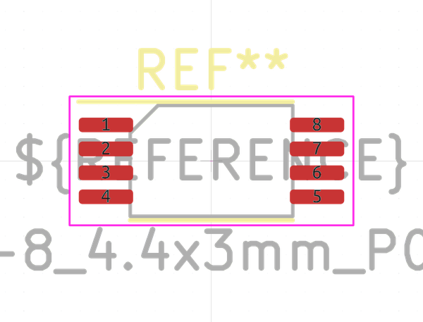

# OOMP Footprint  
## TSSOP-8_4.4x3mm_P0.65mm  by none  
  
oomp key: oomp_kicad_package_so_tssop_8_4_4x3mm_p0_65mm  
  
source repo at: [http://gitlab.com/kicad/libraries/kicad-footprints//blob/master/tmp/libraries/kicad-footprints/Varistor.pretty/RV_Rect_V25S440P_L26.5mm_W8.2mm_P12.7mm.kicad_mod](http://gitlab.com/kicad/libraries/kicad-footprints//blob/master/tmp/libraries/kicad-footprints/Varistor.pretty/RV_Rect_V25S440P_L26.5mm_W8.2mm_P12.7mm.kicad_mod)  
## Footprint  
  
  
  
  
| name | value | 
| --- | --- | 
| footprint name | TSSOP-8_4.4x3mm_P0.65mm | 
| footprint description | TSSOP, 8 Pin (JEDEC MO-153 Var AA https://www.jedec.org/document_search?search_api_views_fulltext=MO-153), generated with kicad-footprint-generator ipc_gullwing_generator.py | 
| number of pads | 8 | 
| github path | http://github.com/kicad/libraries/kicad-footprints//blob/master/tmp/libraries/kicad-footprints/Package_SO.pretty/TSSOP-8_4.4x3mm_P0.65mm.kicad_mod | 
| oomp key | oomp_kicad_package_so_tssop_8_4_4x3mm_p0_65mm | 
| oomp bot github | https://github.com/oomlout/oomlout_oomp_footprint_bot/tree/main/footprints/kicad_package_so_tssop_8_4_4x3mm_p0_65mm/working | 
## Images  
