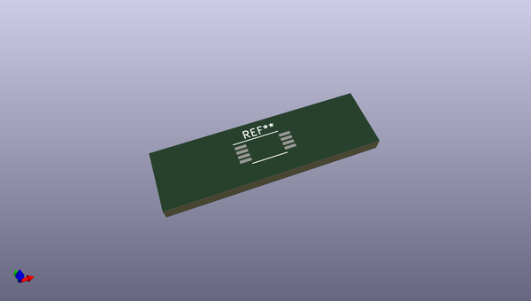

# OOMP Footprint  
## TSSOP-8_4.4x3mm_P0.65mm  by oomlout  
  
oomp key: oomp_oomlout_oomlout_oomp_part_footprints_itssp8mpptps2113_electronic_ic_tssop_8_multiplexer_power_multiplexer_texas_instruments_tps2113apw  
  
source repo at: [http://github.com/oomlout/oomlout_oomp_part_kicad_footprints/blob/master/tmp/data/oomlout_oomp_footprint_src/oomlout_oomp_part_footprints.pretty/xcr3213mhz8_electronic_ceramic_resonator_3213_3_pin_ground_pin_2_8_mega_hertz_1.kicad_mod](http://github.com/oomlout/oomlout_oomp_part_kicad_footprints/blob/master/tmp/data/oomlout_oomp_footprint_src/oomlout_oomp_part_footprints.pretty/xcr3213mhz8_electronic_ceramic_resonator_3213_3_pin_ground_pin_2_8_mega_hertz_1.kicad_mod)  
## Footprint  
  
  
  
  
| name | value | 
| --- | --- | 
| footprint name | TSSOP-8_4.4x3mm_P0.65mm | 
| footprint description | TSSOP, 8 Pin (JEDEC MO-153 Var AA https://www.jedec.org/document_search?search_api_views_fulltext=MO-153), generated with kicad-footprint-generator ipc_gullwing_generator.py | 
| number of pads | 8 | 
| github path | http://github.com/oomlout/oomlout_oomp_part_kicad_footprints/blob/master/tmp/data/oomlout_oomp_footprint_src/oomlout_oomp_part_footprints.pretty/itssp8mpptps2113_electronic_ic_tssop_8_multiplexer_power_multiplexer_texas_instruments_tps2113apw.kicad_mod | 
| oomp key | oomp_oomlout_oomlout_oomp_part_footprints_itssp8mpptps2113_electronic_ic_tssop_8_multiplexer_power_multiplexer_texas_instruments_tps2113apw | 
| oomp bot github | https://github.com/oomlout/oomlout_oomp_footprint_bot/tree/main/tmp/data/oomlout_oomp_footprint_src/footprints/oomlout_oomlout_oomp_part_footprints_itssp8mpptps2113_electronic_ic_tssop_8_multiplexer_power_multiplexer_texas_instruments_tps2113apw/working | 
## Images  
