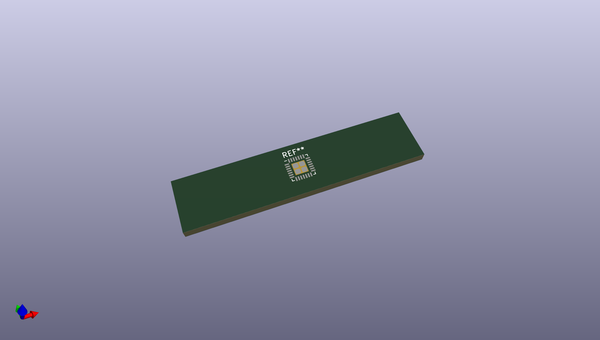

# OOMP Footprint  
## VQFN-28-1EP_4x4mm_P0.45mm_EP2.4x2.4mm  by none  
  
oomp key: oomp_kicad_package_dfn_qfn_vqfn_28_1ep_4x4mm_p0_45mm_ep2_4x2_4mm  
  
source repo at: [http://gitlab.com/kicad/libraries/kicad-footprints//blob/master/tmp/libraries/kicad-footprints/Varistor.pretty/RV_Rect_V25S440P_L26.5mm_W8.2mm_P12.7mm.kicad_mod](http://gitlab.com/kicad/libraries/kicad-footprints//blob/master/tmp/libraries/kicad-footprints/Varistor.pretty/RV_Rect_V25S440P_L26.5mm_W8.2mm_P12.7mm.kicad_mod)  
## Footprint  
  
  
  
  
| name | value | 
| --- | --- | 
| footprint name | VQFN-28-1EP_4x4mm_P0.45mm_EP2.4x2.4mm | 
| footprint description | VQFN, 28 Pin (http://ww1.microchip.com/downloads/en/DeviceDoc/Atmel-9505-AT42-QTouch-BSW-AT42QT1060_Datasheet.pdf#page=28), generated with kicad-footprint-generator ipc_noLead_generator.py | 
| number of pads | 33 | 
| github path | http://github.com/kicad/libraries/kicad-footprints//blob/master/tmp/libraries/kicad-footprints/Package_DFN_QFN.pretty/VQFN-28-1EP_4x4mm_P0.45mm_EP2.4x2.4mm.kicad_mod | 
| oomp key | oomp_kicad_package_dfn_qfn_vqfn_28_1ep_4x4mm_p0_45mm_ep2_4x2_4mm | 
| oomp bot github | https://github.com/oomlout/oomlout_oomp_footprint_bot/tree/main/footprints/kicad_package_dfn_qfn_vqfn_28_1ep_4x4mm_p0_45mm_ep2_4x2_4mm/working | 
## Images  
