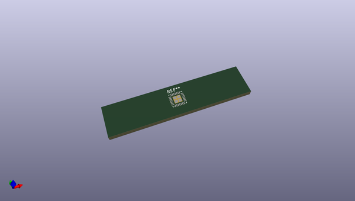
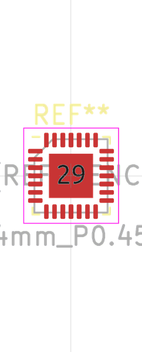
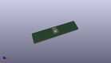
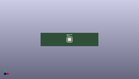

# OOMP Footprint  
## VQFN-28-1EP_4x4mm_P0.45mm_EP2.4x2.4mm  by oomlout  
  
oomp key: oomp_oomlout_oomlout_oomp_part_footprints_ivq28mcuat328_electronic_ic_vqfn_28_mcu_atmega328_microchip_atmega328p_mmh  
  
source repo at: [http://github.com/oomlout/oomlout_oomp_part_kicad_footprints/blob/master/tmp/data/oomlout_oomp_footprint_src/oomlout_oomp_part_footprints.pretty/xcr3213mhz8_electronic_ceramic_resonator_3213_3_pin_ground_pin_2_8_mega_hertz_1.kicad_mod](http://github.com/oomlout/oomlout_oomp_part_kicad_footprints/blob/master/tmp/data/oomlout_oomp_footprint_src/oomlout_oomp_part_footprints.pretty/xcr3213mhz8_electronic_ceramic_resonator_3213_3_pin_ground_pin_2_8_mega_hertz_1.kicad_mod)  
## Footprint  
  
  
  
  
| name | value | 
| --- | --- | 
| footprint name | VQFN-28-1EP_4x4mm_P0.45mm_EP2.4x2.4mm | 
| footprint description | VQFN, 28 Pin (http://ww1.microchip.com/downloads/en/DeviceDoc/Atmel-9505-AT42-QTouch-BSW-AT42QT1060_Datasheet.pdf#page=28), generated with kicad-footprint-generator ipc_noLead_generator.py | 
| number of pads | 33 | 
| github path | http://github.com/oomlout/oomlout_oomp_part_kicad_footprints/blob/master/tmp/data/oomlout_oomp_footprint_src/oomlout_oomp_part_footprints.pretty/ivq28mcuat328_electronic_ic_vqfn_28_mcu_atmega328_microchip_atmega328p_mmh.kicad_mod | 
| oomp key | oomp_oomlout_oomlout_oomp_part_footprints_ivq28mcuat328_electronic_ic_vqfn_28_mcu_atmega328_microchip_atmega328p_mmh | 
| oomp bot github | https://github.com/oomlout/oomlout_oomp_footprint_bot/tree/main/tmp/data/oomlout_oomp_footprint_src/footprints/oomlout_oomlout_oomp_part_footprints_ivq28mcuat328_electronic_ic_vqfn_28_mcu_atmega328_microchip_atmega328p_mmh/working | 
## Images  
  
  
  
  
  
  
  
  
