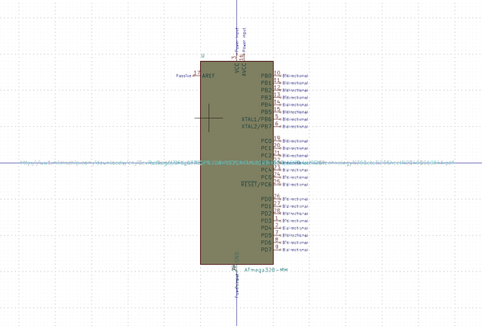

# Electronic Ic Vqfn 28 Mcu Atmega328 Microchip Atmega328P Mmh

  
* oomp_key: oomp_electronic_ic_vqfn_28_mcu_atmega328_microchip_atmega328p_mmh 
* short_code: ivq28at328
* md5_6: 5c1e39  
* github_link: https://github.com/oomlout/oomlout_oomp_part_src/tree/main/parts/electronic_ic_vqfn_28_mcu_atmega328_microchip_atmega328p_mmh/working  
## naming details
* classification -- electronic
* type -- ic
* size -- vqfn_28
* color -- mcu
* description_main -- atmega328
* description_extra -- 
* manucaturer -- microchip
* part_number -- atmega328p_mmh

## symbol

  
oomp_key: oomp_kicad_mcu_microchip_atmega_atmega328_mm  
link: https://github.com/oomlout/oomlout_oomp_symbol_bot/tree/main/symbols/kicad_mcu_microchip_atmega_atmega328_mm/working  

## footprint

  
oomp_key: oomp_kicad_package_dfn_qfn_vqfn_28_1ep_4x4mm_p0_45mm_ep2_4x2_4mm  
link: https://github.com/oomlout/oomlout_oomp_footprint_bot/tree/main/footprints/kicad_package_dfn_qfn_vqfn_28_1ep_4x4mm_p0_45mm_ep2_4x2_4mm/working  

## full_summary
| name | value | 
| --- | --- | 
| name | value | 
| classification | electronic | 
| type | ic | 
| size | vqfn_28 | 
| color | mcu | 
| description_main | atmega328 | 
| description_extra |  | 
| manufacturer | microchip | 
| part_number | atmega328p_mmh | 
| short_name | atmega328 28 pin vqfn | 
| id | electronic_ic_vqfn_28_mcu_atmega328_microchip_atmega328p_mmh | 
| id_no_class | ic_vqfn_28_mcu_atmega328_microchip_atmega328p_mmh | 
| id_no_type | vqfn_28_mcu_atmega328_microchip_atmega328p_mmh | 
| oomp_key | oomp_electronic_ic_vqfn_28_mcu_atmega328_microchip_atmega328p_mmh | 
| github_link | https://github.com/oomlout/oomlout_oomp_part_src/tree/main/parts/electronic_ic_vqfn_28_mcu_atmega328_microchip_atmega328p_mmh/working | 
| directory | parts/electronic_ic_vqfn_28_mcu_atmega328_microchip_atmega328p_mmh | 
| name | Electronic Ic Vqfn 28 Mcu Atmega328 Microchip Atmega328P Mmh | 
| short_code | ivq28at328 | 
| short_code_upper | IVQ28AT328 | 
| distributors | [] | 
| manufacturers | [] | 
| md5 | 5c1e39c0204a190c5ee2c8d7d640acf5 | 
| md5_5 | 5c1e3 | 
| md5_6 | 5c1e39 | 
| md5_10 | 5c1e39c020 | 
| markdown_full | [electronic_ic_vqfn_28_mcu_atmega328_microchip_atmega328p_mmh](https://github.com/oomlout/oomlout_oomp_part_src/tree/main/parts/electronic_ic_vqfn_28_mcu_atmega328_microchip_atmega328p_mmh/working) [ivq28at328](https://github.com/oomlout/oomlout_oomp_part_src/tree/main/parts/electronic_ic_vqfn_28_mcu_atmega328_microchip_atmega328p_mmh/working) [Electronic Ic Vqfn 28 Mcu Atmega328 Microchip Atmega328P Mmh](https://github.com/oomlout/oomlout_oomp_part_src/tree/main/parts/electronic_ic_vqfn_28_mcu_atmega328_microchip_atmega328p_mmh/working)   | 
| markdown_short | [electronic_ic_vqfn_28_mcu_atmega328_microchip_atmega328p_mmh](https://github.com/oomlout/oomlout_oomp_part_src/tree/main/parts/electronic_ic_vqfn_28_mcu_atmega328_microchip_atmega328p_mmh/working)   | 
| footprint | [{'link': 'https://github.com/oomlout/oomlout_oomp_footprint_bot/tree/main/foootprntss/kicad_package_dfn_qfn_vqfn_28_1ep_4x4mm_p0_45mm_ep2_4x2_4mm', 'oomp_key': 'oomp_kicad_package_dfn_qfn_vqfn_28_1ep_4x4mm_p0_45mm_ep2_4x2_4mm', 'directory': 'oomlout_oomp_footprint_bot/footprints/kicad_package_dfn_qfn_vqfn_28_1ep_4x4mm_p0_45mm_ep2_4x2_4mm//working/working.kicad_mod'}] | 
| symbol | [{'link': 'https://github.com/oomlout/oomlout_oomp_symbol_bot/tree/main/symbols/kicad_mcu_microchip_atmega_atmega328_mm', 'oomp_key': 'oomp_kicad_mcu_microchip_atmega_atmega328_mm', 'directory': 'oomlout_oomp_symbol_bot/symbols/kicad_mcu_microchip_atmega_atmega328_mm//working/working.kicad_sym'}] | 
