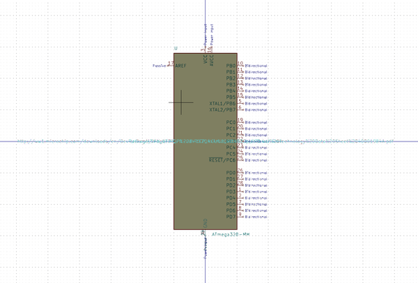

# Electronic Ic Vqfn 28 Mcu Atmega328 Microchip Atmega328P Mmhr
oomp_key: oomp_electronic_ic_vqfn_28_mcu_atmega328_microchip_atmega328p_mmhr  

short_code: ivq28at328
## naming details
* classification -- electronic
* type -- ic
* size -- vqfn_28
* color -- mcu
* description_main -- atmega328
* description_extra -- 
* manucaturer -- microchip
* part_number -- atmega328p_mmhr
## pinout

List of Pins:

## symbol

  
oomp_key: oomp_kicad_mcu_microchip_atmega_atmega328_mm
link: https://github.com/oomlout/oomlout_oomp_symbol_bot/tree/main/symbols/kicad_mcu_microchip_atmega_atmega328_mm/working

## footprint

  
oomp_key: oomp_kicad_package_dfn_qfn_vqfn_28_1ep_4x4mm_p0_45mm_ep2_4x2_4mm
link: https://github.com/oomlout/oomlout_oomp_footprint_bot/tree/main/foootprntss/kicad_package_dfn_qfn_vqfn_28_1ep_4x4mm_p0_45mm_ep2_4x2_4mm/working
