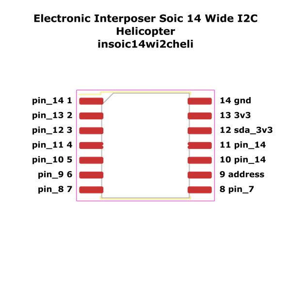

# Electronic Interposer Soic 14 Wide I2C Helicopter

An interposer between an i2c chip and a soic_14_wide package, The pins are numbered in the reverse order of being expected because the footprint is used as a mirror image, ie. it is the chip rather than a chuip being placed on it. This is the helicopter side (the side with the chips on it)  
* oomp_key: oomp_electronic_interposer_soic_14_wide_i2c_helicopter 
* short_code: insoic14wi2cheli
* md5_6: 674569  
* github_link: https://github.com/oomlout/oomlout_oomp_part_src/tree/main/parts/electronic_interposer_soic_14_wide_i2c_helicopter/working  
## naming details
* classification -- electronic
* type -- interposer
* size -- soic_14_wide
* color -- 
* description_main -- i2c
* description_extra -- helicopter
* manucaturer -- 
* part_number -- 
## pinout
  
List of Pins:

* 1 : pin_14
* 2 : pin_13
* 3 : pin_12
* 4 : pin_11
* 5 : pin_10
* 6 : pin_9
* 7 : pin_8
* 8 : pin_7
* 9 : address
* 10 : cs
* 11 : scl_3v3
* 12 : sda_3v3
* 13 : 3v3
* 14 : gnd

## footprint

  
oomp_key: oomp_kicad_package_so_soic_14w_7_5x9mm_p1_27mm  
link: https://github.com/oomlout/oomlout_oomp_footprint_bot/tree/main/footprints/kicad_package_so_soic_14w_7_5x9mm_p1_27mm/working  

  
oomp_key: oomp_oomlout_oomlout_oomp_part_footprints_insoic14wi2cheli_electronic_interposer_soic_14_wide_i2c_helicopter  
link: https://github.com/oomlout/oomlout_oomp_footprint_bot/tree/main/footprints/oomlout_oomlout_oomp_part_footprints_insoic14wi2cheli_electronic_interposer_soic_14_wide_i2c_helicopter/working  

## full_summary
| name | value | 
| --- | --- | 
| name | value | 
| classification | electronic | 
| type | interposer | 
| size | soic_14_wide | 
| color |  | 
| description_main | i2c | 
| description_extra | helicopter | 
| manufacturer |  | 
| part_number |  | 
| description | An interposer between an i2c chip and a soic_14_wide package, The pins are numbered in the reverse order of being expected because the footprint is used as a mirror image, ie. it is the chip rather than a chuip being placed on it. This is the helicopter side (the side with the chips on it) | 
| short_name |  | 
| pins_pin_1_name | pin_14 | 
| pins_pin_1_number | 1 | 
| pins_pin_1_type | power | 
| pins_pin_2_name | pin_13 | 
| pins_pin_2_number | 2 | 
| pins_pin_2_type | power | 
| pins_pin_3_name | pin_12 | 
| pins_pin_3_number | 3 | 
| pins_pin_3_type | signal | 
| pins_pin_4_name | pin_11 | 
| pins_pin_4_number | 4 | 
| pins_pin_4_type | signal | 
| pins_pin_5_name | pin_10 | 
| pins_pin_5_number | 5 | 
| pins_pin_5_type | signal | 
| pins_pin_6_name | pin_9 | 
| pins_pin_6_number | 6 | 
| pins_pin_6_type | signal | 
| pins_pin_7_name | pin_8 | 
| pins_pin_7_number | 7 | 
| pins_pin_7_type | signal | 
| pins_pin_8_name | pin_7 | 
| pins_pin_8_number | 8 | 
| pins_pin_8_type | signal | 
| pins_pin_9_name | address | 
| pins_pin_9_number | 9 | 
| pins_pin_9_type | signal | 
| pins_pin_10_name | cs | 
| pins_pin_10_number | 10 | 
| pins_pin_10_type | signal | 
| pins_pin_11_name | scl_3v3 | 
| pins_pin_11_number | 11 | 
| pins_pin_11_type | signal | 
| pins_pin_12_name | sda_3v3 | 
| pins_pin_12_number | 12 | 
| pins_pin_12_type | signal | 
| pins_pin_13_name | 3v3 | 
| pins_pin_13_number | 13 | 
| pins_pin_13_type | signal | 
| pins_pin_14_name | gnd | 
| pins_pin_14_number | 14 | 
| pins_pin_14_type | signal | 
| kicad_reference | U | 
| notes | [] | 
| classification_upper | ELECTRONIC | 
| classification_capital | Electronic | 
| classification_first_letter | e | 
| classification_first_letter_upper | E | 
| type_upper | INTERPOSER | 
| type_capital | Interposer | 
| type_first_letter | i | 
| type_first_letter_upper | I | 
| size_upper | SOIC_14_WIDE | 
| size_capital | Soic 14 Wide | 
| size_first_letter | s | 
| size_first_letter_upper | S | 
| color_upper |  | 
| color_capital |  | 
| color_first_letter |  | 
| color_first_letter_upper |  | 
| description_main_upper | I2C | 
| description_main_capital | I2C | 
| description_main_first_letter | i | 
| description_main_first_letter_upper | I | 
| description_extra_upper | HELICOPTER | 
| description_extra_capital | Helicopter | 
| description_extra_first_letter | h | 
| description_extra_first_letter_upper | H | 
| manufacturer_upper |  | 
| manufacturer_capital |  | 
| manufacturer_first_letter |  | 
| manufacturer_first_letter_upper |  | 
| part_number_upper |  | 
| part_number_capital |  | 
| part_number_first_letter |  | 
| part_number_first_letter_upper |  | 
| id | electronic_interposer_soic_14_wide_i2c_helicopter | 
| id_no_class | interposer_soic_14_wide_i2c_helicopter | 
| id_no_type | soic_14_wide_i2c_helicopter | 
| id_no_size | i2c_helicopter | 
| oomp_key | oomp_electronic_interposer_soic_14_wide_i2c_helicopter | 
| github_link | https://github.com/oomlout/oomlout_oomp_part_src/tree/main/parts/electronic_interposer_soic_14_wide_i2c_helicopter/working | 
| directory | parts/electronic_interposer_soic_14_wide_i2c_helicopter | 
| name | Electronic Interposer Soic 14 Wide I2C Helicopter | 
| name_no_class | Interposer Soic 14 Wide I2C Helicopter | 
| name_no_type | Soic 14 Wide I2C Helicopter | 
| name_no_size | I2C Helicopter | 
| short_code | insoic14wi2cheli | 
| short_code_upper | INSOIC14WI2CHELI | 
| distributors | [] | 
| manufacturers | [] | 
| md5 | 67456919c33f39dd13824a5f4470e6b9 | 
| md5_5 | 67456 | 
| md5_5_upper | 67456 | 
| md5_6 | 674569 | 
| md5_6_upper | 674569 | 
| md5_6_alpha | 4127d | 
| md5_6_alpha_upper | 4127D | 
| md5_10 | 67456919c3 | 
| md5_10_upper | 67456919C3 | 
| size_only_numbers | 14 | 
| size_only_numbers_no_zeros | 14 | 
| description_only_numbers | 2 | 
| description_only_numbers_short | 2 | 
| name_no_size_short | I2C Helicopter | 
| description_or_color | 2 | 
| description_or_color_upper | 2 | 
| markdown_full | [electronic_interposer_soic_14_wide_i2c_helicopter](https://github.com/oomlout/oomlout_oomp_part_src/tree/main/parts/electronic_interposer_soic_14_wide_i2c_helicopter/working) [insoic14wi2cheli](https://github.com/oomlout/oomlout_oomp_part_src/tree/main/parts/electronic_interposer_soic_14_wide_i2c_helicopter/working) [Electronic Interposer Soic 14 Wide I2C Helicopter](https://github.com/oomlout/oomlout_oomp_part_src/tree/main/parts/electronic_interposer_soic_14_wide_i2c_helicopter/working)   | 
| markdown_short | [electronic_interposer_soic_14_wide_i2c_helicopter](https://github.com/oomlout/oomlout_oomp_part_src/tree/main/parts/electronic_interposer_soic_14_wide_i2c_helicopter/working)   | 
| footprint | [{'link': 'https://github.com/oomlout/oomlout_oomp_footprint_bot/tree/main/foootprntss/kicad_package_so_soic_14w_7_5x9mm_p1_27mm', 'oomp_key': 'oomp_kicad_package_so_soic_14w_7_5x9mm_p1_27mm', 'directory': 'oomlout_oomp_footprint_bot/footprints/kicad_package_so_soic_14w_7_5x9mm_p1_27mm//working/working.kicad_mod', 'note': 'source footprint kicad_package_so_soic_14w_7_5x9mm_p1_27mm', 'index': 0}, {'link': 'https://github.com/oomlout/oomlout_oomp_footprint_bot/tree/main/foootprntss/oomlout_oomlout_oomp_part_footprints_insoic14wi2cheli_electronic_interposer_soic_14_wide_i2c_helicopter', 'oomp_key': 'oomp_oomlout_oomlout_oomp_part_footprints_insoic14wi2cheli_electronic_interposer_soic_14_wide_i2c_helicopter', 'directory': 'oomlout_oomp_footprint_bot/footprints/oomlout_oomlout_oomp_part_footprints_insoic14wi2cheli_electronic_interposer_soic_14_wide_i2c_helicopter//working/working.kicad_mod', 'note': 'oomp generated footprint', 'index': 1}] | 
