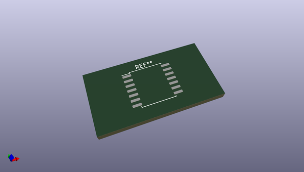
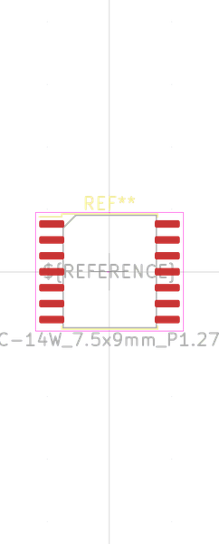

# OOMP Footprint  
## SOIC-14W_7.5x9mm_P1.27mm  by oomlout  
  
oomp key: oomp_oomlout_oomlout_oomp_part_footprints_insoic14wi2cland_electronic_interposer_soic_14_wide_i2c_landing  
  
source repo at: [http://github.com/oomlout/oomlout_oomp_part_kicad_footprints/blob/master/tmp/data/oomlout_oomp_footprint_src/oomlout_oomp_part_footprints.pretty/xcr3213mhz8_electronic_ceramic_resonator_3213_3_pin_ground_pin_2_8_mega_hertz_1.kicad_mod](http://github.com/oomlout/oomlout_oomp_part_kicad_footprints/blob/master/tmp/data/oomlout_oomp_footprint_src/oomlout_oomp_part_footprints.pretty/xcr3213mhz8_electronic_ceramic_resonator_3213_3_pin_ground_pin_2_8_mega_hertz_1.kicad_mod)  
## Footprint  
  
  
  
  
| name | value | 
| --- | --- | 
| footprint name | SOIC-14W_7.5x9mm_P1.27mm | 
| footprint description | SOIC, 14 Pin (JEDEC MS-013AF, https://www.analog.com/media/en/package-pcb-resources/package/54614177245586rw_14.pdf), generated with kicad-footprint-generator ipc_gullwing_generator.py | 
| number of pads | 14 | 
| github path | http://github.com/oomlout/oomlout_oomp_part_kicad_footprints/blob/master/tmp/data/oomlout_oomp_footprint_src/oomlout_oomp_part_footprints.pretty/insoic14wi2cland_electronic_interposer_soic_14_wide_i2c_landing.kicad_mod | 
| oomp key | oomp_oomlout_oomlout_oomp_part_footprints_insoic14wi2cland_electronic_interposer_soic_14_wide_i2c_landing | 
| oomp bot github | https://github.com/oomlout/oomlout_oomp_footprint_bot/tree/main/tmp/data/oomlout_oomp_footprint_src/footprints/oomlout_oomlout_oomp_part_footprints_insoic14wi2cland_electronic_interposer_soic_14_wide_i2c_landing/working | 
## Images  
  
  
  
  
  
  
  
  
