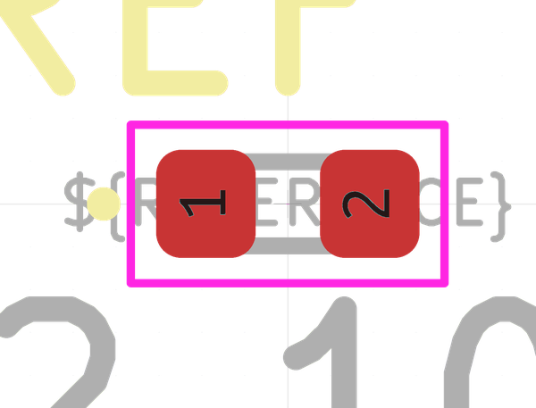

# Electronic Led 0402 White

  
* oomp_key: oomp_electronic_led_0402_white 
* short_code: l4w
* md5_6: 34959d  
* github_link: https://github.com/oomlout/oomlout_oomp_part_src/tree/main/parts/electronic_led_0402_white/working  
## naming details
* classification -- electronic
* type -- led
* size -- 0402
* color -- white
* description_main -- 
* description_extra -- 
* manucaturer -- 
* part_number -- 

## symbol

  
oomp_key: oomp_kicad_device_led  
link: https://github.com/oomlout/oomlout_oomp_symbol_bot/tree/main/symbols/kicad_device_led/working  

## footprint

  
oomp_key: oomp_kicad_led_smd_led_0402_1005metric  
link: https://github.com/oomlout/oomlout_oomp_footprint_bot/tree/main/footprints/kicad_led_smd_led_0402_1005metric/working  

## full_summary
| name | value | 
| --- | --- | 
| name | value | 
| classification | electronic | 
| type | led | 
| size | 0402 | 
| color | white | 
| description_main |  | 
| description_extra |  | 
| manufacturer |  | 
| part_number |  | 
| filter |  | 
| kicad_reference | L | 
| id | electronic_led_0402_white | 
| id_no_class | led_0402_white | 
| id_no_type | 0402_white | 
| oomp_key | oomp_electronic_led_0402_white | 
| github_link | https://github.com/oomlout/oomlout_oomp_part_src/tree/main/parts/electronic_led_0402_white/working | 
| directory | parts/electronic_led_0402_white | 
| name | Electronic Led 0402 White | 
| short_code | l4w | 
| short_code_upper | L4W | 
| short_name | 0402 White Led | 
| distributors | [] | 
| manufacturers | [] | 
| md5 | 34959d44b747802d2d0f3c26672ee231 | 
| md5_5 | 34959 | 
| md5_5_upper | 34959 | 
| md5_6 | 34959d | 
| md5_6_upper | 34959D | 
| md5_10 | 34959d44b7 | 
| md5_10_upper | 34959D44B7 | 
| type_first_letter | l | 
| type_first_letter_upper | L | 
| size_only_numbers | 0402 | 
| size_only_numbers_no_zeros | 42 | 
| color_upper | WHITE | 
| color_first_letter | w | 
| color_first_letter_upper | W | 
| description_only_numbers |  | 
| description_only_numbers_short |   | 
| description_or_color | w  | 
| description_or_color_upper | W  | 
| markdown_full | [electronic_led_0402_white](https://github.com/oomlout/oomlout_oomp_part_src/tree/main/parts/electronic_led_0402_white/working) [l4w](https://github.com/oomlout/oomlout_oomp_part_src/tree/main/parts/electronic_led_0402_white/working) [Electronic Led 0402 White](https://github.com/oomlout/oomlout_oomp_part_src/tree/main/parts/electronic_led_0402_white/working)   | 
| markdown_short | [electronic_led_0402_white](https://github.com/oomlout/oomlout_oomp_part_src/tree/main/parts/electronic_led_0402_white/working)   | 
| footprint | [{'link': 'https://github.com/oomlout/oomlout_oomp_footprint_bot/tree/main/foootprntss/kicad_led_smd_led_0402_1005metric', 'oomp_key': 'oomp_kicad_led_smd_led_0402_1005metric', 'directory': 'oomlout_oomp_footprint_bot/footprints/kicad_led_smd_led_0402_1005metric//working/working.kicad_mod'}] | 
| symbol | [{'link': 'https://github.com/oomlout/oomlout_oomp_symbol_bot/tree/main/symbols/kicad_device_led', 'oomp_key': 'oomp_kicad_device_led', 'directory': 'oomlout_oomp_symbol_bot/symbols/kicad_device_led//working/working.kicad_sym'}] | 
