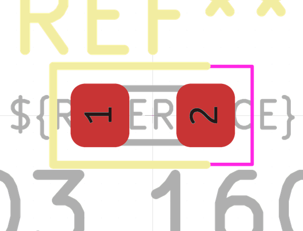

# Electronic Led 0603 Blue
oomp_key: oomp_electronic_led_0603_blue 

  
* short_code: l6
* md5_6: 9674f5  
* github_link: https://github.com/oomlout/oomlout_oomp_part_src/tree/main/parts/electronic_led_0603_blue/working  
## naming details
* classification -- electronic
* type -- led
* size -- 0603
* color -- blue
* description_main -- 
* description_extra -- 
* manucaturer -- 
* part_number -- 

## symbol

  
oomp_key: oomp_kicad_device_led  
link: https://github.com/oomlout/oomlout_oomp_symbol_bot/tree/main/symbols/kicad_device_led/working  

## footprint

  
oomp_key: oomp_kicad_led_smd_led_0603_1608metric  
link: https://github.com/oomlout/oomlout_oomp_footprint_bot/tree/main/foootprntss/kicad_led_smd_led_0603_1608metric/working  

## full_summary
| name | value | 
| --- | --- | 
| name | value | 
| classification | electronic | 
| type | led | 
| size | 0603 | 
| color | blue | 
| description_main |  | 
| description_extra |  | 
| manufacturer |  | 
| part_number |  | 
| from_yaml | False | 
| filter |  | 
| kicad_reference | L | 
| id | electronic_led_0603_blue | 
| oomp_key | oomp_electronic_led_0603_blue | 
| github_link | https://github.com/oomlout/oomlout_oomp_part_src/tree/main/parts/electronic_led_0603_blue/working | 
| directory | parts/electronic_led_0603_blue | 
| name | Electronic Led 0603 Blue | 
| short_code | l6 | 
| short_name | 0603 Blue Led | 
| distributors | [] | 
| manufacturers | [] | 
| md5 | 9674f50c150069fafacfa3671b299b20 | 
| md5_5 | 9674f | 
| md5_6 | 9674f5 | 
| md5_10 | 9674f50c15 | 
| footprint | [{'link': 'https://github.com/oomlout/oomlout_oomp_footprint_bot/tree/main/foootprntss/kicad_led_smd_led_0603_1608metric', 'oomp_key': 'oomp_kicad_led_smd_led_0603_1608metric', 'directory': 'oomlout_oomp_footprint_bot/footprints/kicad_led_smd_led_0603_1608metric//working/working.kicad_mod'}] | 
| symbol | [{'link': 'https://github.com/oomlout/oomlout_oomp_symbol_bot/tree/main/symbols/kicad_device_led', 'oomp_key': 'oomp_kicad_device_led', 'directory': 'oomlout_oomp_symbol_bot/symbols/kicad_device_led//working/working.kicad_sym'}] | 
