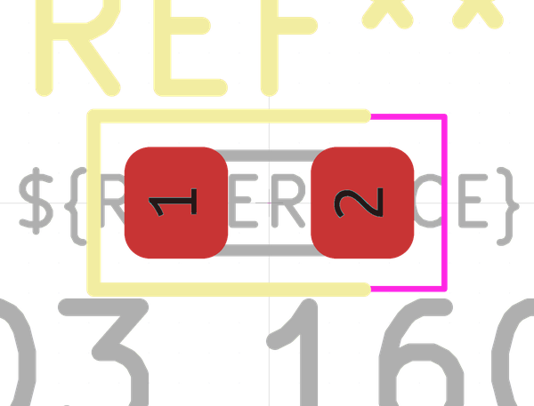

# Electronic Led 0603 Green
oomp_key: oomp_electronic_led_0603_green  

short_code: l6g
## naming details
* classification -- electronic
* type -- led
* size -- 0603
* color -- green
* description_main -- 
* description_extra -- 
* manucaturer -- 
* part_number -- 
## pinout

List of Pins:

## symbol

  
oomp_key: oomp_kicad_device_led
link: https://github.com/oomlout/oomlout_oomp_symbol_bot/tree/main/symbols/kicad_device_led/working

## footprint

  
oomp_key: oomp_kicad_led_smd_led_0603_1608metric
link: https://github.com/oomlout/oomlout_oomp_footprint_bot/tree/main/foootprntss/kicad_led_smd_led_0603_1608metric/working
