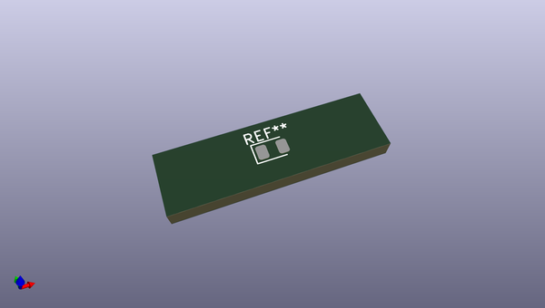
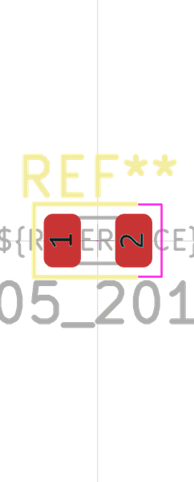
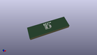
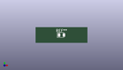

# OOMP Footprint  
## LED_0805_2012Metric  by oomlout  
  
oomp key: oomp_oomlout_oomlout_oomp_part_footprints_l8l_electronic_led_0805_blue  
  
source repo at: [http://github.com/oomlout/oomlout_oomp_part_kicad_footprints/blob/master/tmp/data/oomlout_oomp_footprint_src/oomlout_oomp_part_footprints.pretty/xcr3213mhz8_electronic_ceramic_resonator_3213_3_pin_ground_pin_2_8_mega_hertz_1.kicad_mod](http://github.com/oomlout/oomlout_oomp_part_kicad_footprints/blob/master/tmp/data/oomlout_oomp_footprint_src/oomlout_oomp_part_footprints.pretty/xcr3213mhz8_electronic_ceramic_resonator_3213_3_pin_ground_pin_2_8_mega_hertz_1.kicad_mod)  
## Footprint  
  
  
  
  
| name | value | 
| --- | --- | 
| footprint name | LED_0805_2012Metric | 
| footprint description | LED SMD 0805 (2012 Metric), square (rectangular) end terminal, IPC_7351 nominal, (Body size source: https://docs.google.com/spreadsheets/d/1BsfQQcO9C6DZCsRaXUlFlo91Tg2WpOkGARC1WS5S8t0/edit?usp=sharing), generated with kicad-footprint-generator | 
| number of pads | 2 | 
| github path | http://github.com/oomlout/oomlout_oomp_part_kicad_footprints/blob/master/tmp/data/oomlout_oomp_footprint_src/oomlout_oomp_part_footprints.pretty/l8l_electronic_led_0805_blue.kicad_mod | 
| oomp key | oomp_oomlout_oomlout_oomp_part_footprints_l8l_electronic_led_0805_blue | 
| oomp bot github | https://github.com/oomlout/oomlout_oomp_footprint_bot/tree/main/tmp/data/oomlout_oomp_footprint_src/footprints/oomlout_oomlout_oomp_part_footprints_l8l_electronic_led_0805_blue/working | 
## Images  
  
  
  
  
  
  
  
  
