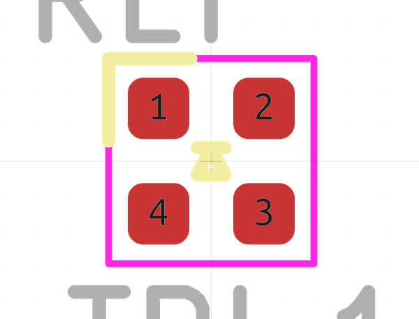

# OOMP Footprint  
## LED_TRI_1010  by none  
  
oomp key: oomp_esden_pkl_led_led_tri_1010  
  
source repo at: [http://gitlab.com/esden/pretty-kicad-libs/blob/master/pkl_tag_connect.pretty/TC2050_SMALL.kicad_mod](http://gitlab.com/esden/pretty-kicad-libs/blob/master/pkl_tag_connect.pretty/TC2050_SMALL.kicad_mod)  
## Footprint  
  
  
  
  
| name | value | 
| --- | --- | 
| footprint name | LED_TRI_1010 | 
| footprint description | LED Tri SMD 1010, reflow soldering | 
| number of pads | 4 | 
| github path | http://github.com/esden/pretty-kicad-libs/blob/master/pkl_led.pretty/LED_TRI_1010.kicad_mod | 
| oomp key | oomp_esden_pkl_led_led_tri_1010 | 
| oomp bot github | https://github.com/oomlout/oomlout_oomp_footprint_bot/tree/main/footprints/esden_pkl_led_led_tri_1010/working | 
## Images  
