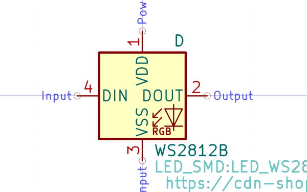

# Electronic Led 1010 Rgb Ws2812B Xinglight 1010Rgbc

  
* oomp_key: oomp_electronic_led_1010_rgb_ws2812b_xinglight_1010rgbc 
* short_code: l
* md5_6: c9145f  
* github_link: https://github.com/oomlout/oomlout_oomp_part_src/tree/main/parts/electronic_led_1010_rgb_ws2812b_xinglight_1010rgbc/working  
## naming details
* classification -- electronic
* type -- led
* size -- 1010
* color -- rgb
* description_main -- ws2812b
* description_extra -- 
* manucaturer -- xinglight
* part_number -- 1010rgbc

## symbol

  
oomp_key: oomp_kicad_device_led  
link: https://github.com/oomlout/oomlout_oomp_symbol_bot/tree/main/symbols/kicad_device_led/working  

## full_summary
| name | value | 
| --- | --- | 
| name | value | 
| classification | electronic | 
| type | led | 
| size | 1010 | 
| color | rgb | 
| description_main | ws2812b | 
| description_extra |  | 
| manufacturer | xinglight | 
| part_number | 1010rgbc | 
| filter |  | 
| kicad_reference | L | 
| id | electronic_led_1010_rgb_ws2812b_xinglight_1010rgbc | 
| oomp_key | oomp_electronic_led_1010_rgb_ws2812b_xinglight_1010rgbc | 
| github_link | https://github.com/oomlout/oomlout_oomp_part_src/tree/main/parts/electronic_led_1010_rgb_ws2812b_xinglight_1010rgbc/working | 
| directory | parts/electronic_led_1010_rgb_ws2812b_xinglight_1010rgbc | 
| name | Electronic Led 1010 Rgb Ws2812B Xinglight 1010Rgbc | 
| short_code | l | 
| short_name | 1010 Rgbws2812B Led | 
| distributors | [] | 
| manufacturers | [] | 
| md5 | c9145fe9ede8e1774735fd150a6d82f7 | 
| md5_5 | c9145 | 
| md5_6 | c9145f | 
| md5_10 | c9145fe9ed | 
| markdown_full | [electronic_led_1010_rgb_ws2812b_xinglight_1010rgbc](https://github.com/oomlout/oomlout_oomp_part_src/tree/main/parts/electronic_led_1010_rgb_ws2812b_xinglight_1010rgbc/working) [l](https://github.com/oomlout/oomlout_oomp_part_src/tree/main/parts/electronic_led_1010_rgb_ws2812b_xinglight_1010rgbc/working) [Electronic Led 1010 Rgb Ws2812B Xinglight 1010Rgbc](https://github.com/oomlout/oomlout_oomp_part_src/tree/main/parts/electronic_led_1010_rgb_ws2812b_xinglight_1010rgbc/working)   | 
| symbol | [{'link': 'https://github.com/oomlout/oomlout_oomp_symbol_bot/tree/main/symbols/kicad_device_led', 'oomp_key': 'oomp_kicad_device_led', 'directory': 'oomlout_oomp_symbol_bot/symbols/kicad_device_led//working/working.kicad_sym'}] | 
