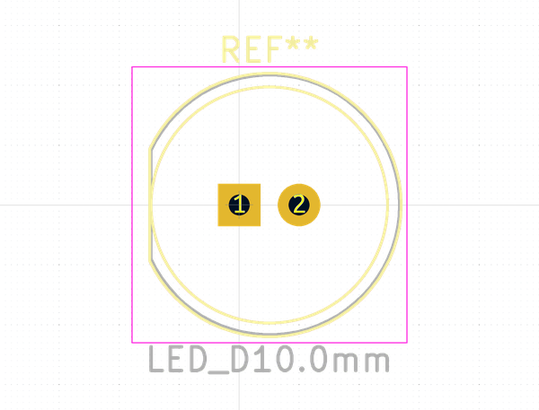

# Electronic Led 10 Mm Green

  
* oomp_key: oomp_electronic_led_10_mm_green 
* short_code: l10g
* md5_6: 5f6525  
* github_link: https://github.com/oomlout/oomlout_oomp_part_src/tree/main/parts/electronic_led_10_mm_green/working  
## naming details
* classification -- electronic
* type -- led
* size -- 10_mm
* color -- green
* description_main -- 
* description_extra -- 
* manucaturer -- 
* part_number -- 

## symbol

  
oomp_key: oomp_kicad_device_led  
link: https://github.com/oomlout/oomlout_oomp_symbol_bot/tree/main/symbols/kicad_device_led/working  

## footprint

  
oomp_key: oomp_kicad_led_tht_led_d10_0mm  
link: https://github.com/oomlout/oomlout_oomp_footprint_bot/tree/main/footprints/kicad_led_tht_led_d10_0mm/working  

## full_summary
| name | value | 
| --- | --- | 
| name | value | 
| classification | electronic | 
| type | led | 
| size | 10_mm | 
| color | green | 
| description_main |  | 
| description_extra |  | 
| manufacturer |  | 
| part_number |  | 
| filter |  | 
| kicad_reference | L | 
| id | electronic_led_10_mm_green | 
| oomp_key | oomp_electronic_led_10_mm_green | 
| github_link | https://github.com/oomlout/oomlout_oomp_part_src/tree/main/parts/electronic_led_10_mm_green/working | 
| directory | parts/electronic_led_10_mm_green | 
| name | Electronic Led 10 Mm Green | 
| short_code | l10g | 
| short_name | 10 Mm Green Led | 
| distributors | [] | 
| manufacturers | [] | 
| md5 | 5f6525ecafb65df19e6187ca04358bfa | 
| md5_5 | 5f652 | 
| md5_6 | 5f6525 | 
| md5_10 | 5f6525ecaf | 
| markdown_full | [electronic_led_10_mm_green](https://github.com/oomlout/oomlout_oomp_part_src/tree/main/parts/electronic_led_10_mm_green/working) [l10g](https://github.com/oomlout/oomlout_oomp_part_src/tree/main/parts/electronic_led_10_mm_green/working)  | 
| footprint | [{'link': 'https://github.com/oomlout/oomlout_oomp_footprint_bot/tree/main/foootprntss/kicad_led_tht_led_d10_0mm', 'oomp_key': 'oomp_kicad_led_tht_led_d10_0mm', 'directory': 'oomlout_oomp_footprint_bot/footprints/kicad_led_tht_led_d10_0mm//working/working.kicad_mod'}] | 
| symbol | [{'link': 'https://github.com/oomlout/oomlout_oomp_symbol_bot/tree/main/symbols/kicad_device_led', 'oomp_key': 'oomp_kicad_device_led', 'directory': 'oomlout_oomp_symbol_bot/symbols/kicad_device_led//working/working.kicad_sym'}] | 
