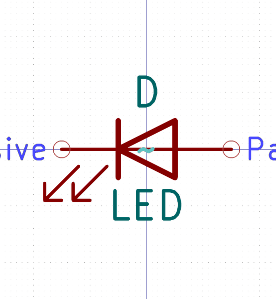

# Electronic Led 3 Mm White

  
* oomp_key: oomp_electronic_led_3_mm_white 
* short_code: l3w
* md5_6: 799a76  
* github_link: https://github.com/oomlout/oomlout_oomp_part_src/tree/main/parts/electronic_led_3_mm_white/working  
## naming details
* classification -- electronic
* type -- led
* size -- 3_mm
* color -- white
* description_main -- 
* description_extra -- 
* manucaturer -- 
* part_number -- 

## symbol

  
oomp_key: oomp_kicad_device_led  
link: https://github.com/oomlout/oomlout_oomp_symbol_bot/tree/main/symbols/kicad_device_led/working  

## full_summary
| name | value | 
| --- | --- | 
| name | value | 
| classification | electronic | 
| type | led | 
| size | 3_mm | 
| color | white | 
| description_main |  | 
| description_extra |  | 
| manufacturer |  | 
| part_number |  | 
| filter |  | 
| kicad_reference | L | 
| id | electronic_led_3_mm_white | 
| oomp_key | oomp_electronic_led_3_mm_white | 
| github_link | https://github.com/oomlout/oomlout_oomp_part_src/tree/main/parts/electronic_led_3_mm_white/working | 
| directory | parts/electronic_led_3_mm_white | 
| name | Electronic Led 3 Mm White | 
| short_code | l3w | 
| short_code_upper | L3W | 
| short_name | 3 Mm White Led | 
| distributors | [] | 
| manufacturers | [] | 
| md5 | 799a76eca4e04a8148fb90484fe20265 | 
| md5_5 | 799a7 | 
| md5_6 | 799a76 | 
| md5_10 | 799a76eca4 | 
| markdown_full | [electronic_led_3_mm_white](https://github.com/oomlout/oomlout_oomp_part_src/tree/main/parts/electronic_led_3_mm_white/working) [l3w](https://github.com/oomlout/oomlout_oomp_part_src/tree/main/parts/electronic_led_3_mm_white/working) [Electronic Led 3 Mm White](https://github.com/oomlout/oomlout_oomp_part_src/tree/main/parts/electronic_led_3_mm_white/working)   | 
| markdown_short | [electronic_led_3_mm_white](https://github.com/oomlout/oomlout_oomp_part_src/tree/main/parts/electronic_led_3_mm_white/working)   | 
| symbol | [{'link': 'https://github.com/oomlout/oomlout_oomp_symbol_bot/tree/main/symbols/kicad_device_led', 'oomp_key': 'oomp_kicad_device_led', 'directory': 'oomlout_oomp_symbol_bot/symbols/kicad_device_led//working/working.kicad_sym'}] | 
