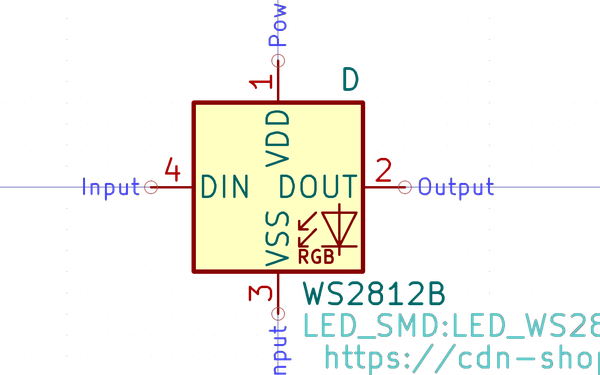

# Electronic Led 5050 Rgb Ws2812B Worldsemi Ws2812B B W

  
* oomp_key: oomp_electronic_led_5050_rgb_ws2812b_worldsemi_ws2812b_b_w 
* short_code: l50502812ws2812bbw
* md5_6: f0d9be  
* github_link: https://github.com/oomlout/oomlout_oomp_part_src/tree/main/parts/electronic_led_5050_rgb_ws2812b_worldsemi_ws2812b_b_w/working  
## naming details
* classification -- electronic
* type -- led
* size -- 5050
* color -- rgb
* description_main -- ws2812b
* description_extra -- 
* manucaturer -- worldsemi
* part_number -- ws2812b_b_w
## pinout
  
List of Pins:

* 1 : vdd
* 2 : dout
* 3 : vss
* 4 : din
## distributors
* [LCSC - C114586](https://lcsc.com/product-detail/C114586.html)  

## manufacturers
* [Worldsmi - WS2812B-B/W](http://www.world-semi.com/web/index.php?topclassid=16&classid=302&lanstr=en)  

## symbol

  
oomp_key: oomp_kicad_device_led  
link: https://github.com/oomlout/oomlout_oomp_symbol_bot/tree/main/symbols/kicad_device_led/working  

  
oomp_key: oomp_kicad_led_ws2812b  
link: https://github.com/oomlout/oomlout_oomp_symbol_bot/tree/main/symbols/kicad_led_ws2812b/working  

## footprint

  
oomp_key: oomp_kicad_led_smd_led_ws2812b_plcc4_5_0x5_0mm_p3_2mm  
link: https://github.com/oomlout/oomlout_oomp_footprint_bot/tree/main/footprints/kicad_led_smd_led_ws2812b_plcc4_5_0x5_0mm_p3_2mm/working  

## full_summary
| name | value | 
| --- | --- | 
| name | value | 
| classification | electronic | 
| type | led | 
| size | 5050 | 
| color | rgb | 
| description_main | ws2812b | 
| description_extra |  | 
| manufacturer | worldsemi | 
| part_number | ws2812b_b_w | 
| filter |  | 
| kicad_reference | L | 
| pins_pin_1_name | vdd | 
| pins_pin_1_number | 1 | 
| pins_pin_1_type | signal | 
| pins_pin_2_name | dout | 
| pins_pin_2_number | 2 | 
| pins_pin_2_type | power | 
| pins_pin_3_name | vss | 
| pins_pin_3_number | 3 | 
| pins_pin_3_type | power | 
| pins_pin_4_name | din | 
| pins_pin_4_number | 4 | 
| pins_pin_4_type | signal | 
| id | electronic_led_5050_rgb_ws2812b_worldsemi_ws2812b_b_w | 
| oomp_key | oomp_electronic_led_5050_rgb_ws2812b_worldsemi_ws2812b_b_w | 
| github_link | https://github.com/oomlout/oomlout_oomp_part_src/tree/main/parts/electronic_led_5050_rgb_ws2812b_worldsemi_ws2812b_b_w/working | 
| directory | parts/electronic_led_5050_rgb_ws2812b_worldsemi_ws2812b_b_w | 
| name | Electronic Led 5050 Rgb Ws2812B Worldsemi Ws2812B B W | 
| short_code | l50502812ws2812bbw | 
| short_name | 5050 Rgbws2812B Led | 
| distributors | [{'name': 'LCSC', 'part_number': 'C114586', 'link': 'https://lcsc.com/product-detail/C114586.html', 'id': 'distributor_lcsc'}] | 
| manufacturers | [{'name': 'Worldsmi', 'part_number': 'WS2812B-B/W', 'link': 'http://www.world-semi.com/web/index.php?topclassid=16&classid=302&lanstr=en', 'id': 'manufacturer_worldsemi'}] | 
| md5 | f0d9be0ddd3684a3e6890ffe9f94fe71 | 
| md5_5 | f0d9b | 
| md5_6 | f0d9be | 
| md5_10 | f0d9be0ddd | 
| markdown_full | [electronic_led_5050_rgb_ws2812b_worldsemi_ws2812b_b_w](https://github.com/oomlout/oomlout_oomp_part_src/tree/main/parts/electronic_led_5050_rgb_ws2812b_worldsemi_ws2812b_b_w/working) [l50502812ws2812bbw](https://github.com/oomlout/oomlout_oomp_part_src/tree/main/parts/electronic_led_5050_rgb_ws2812b_worldsemi_ws2812b_b_w/working) [Electronic Led 5050 Rgb Ws2812B Worldsemi Ws2812B B W](https://github.com/oomlout/oomlout_oomp_part_src/tree/main/parts/electronic_led_5050_rgb_ws2812b_worldsemi_ws2812b_b_w/working) [LCSC - C114586 ](https://lcsc.com/product-detail/C114586.html) [Worldsmi - WS2812B-B/W](http://www.world-semi.com/web/index.php?topclassid=16&classid=302&lanstr=en) [(L)  ](https://www.lcsc.com/search?q=WS2812B-B/W)[(D)  ](https://www.digikey.com/en/products?keywords=WS2812B-B/W)[(M)  ](https://www.mouser.com/Search/Refine?Keyword=WS2812B-B/W)[(N)  ](https://www.newark.com/search?st=WS2812B-B/W)[(SZ)  ](https://so.szlcsc.com/global.html?k=WS2812B-B/W)  | 
| footprint | [{'link': 'https://github.com/oomlout/oomlout_oomp_footprint_bot/tree/main/foootprntss/kicad_led_smd_led_ws2812b_plcc4_5_0x5_0mm_p3_2mm', 'oomp_key': 'oomp_kicad_led_smd_led_ws2812b_plcc4_5_0x5_0mm_p3_2mm', 'directory': 'oomlout_oomp_footprint_bot/footprints/kicad_led_smd_led_ws2812b_plcc4_5_0x5_0mm_p3_2mm//working/working.kicad_mod'}] | 
| symbol | [{'link': 'https://github.com/oomlout/oomlout_oomp_symbol_bot/tree/main/symbols/kicad_device_led', 'oomp_key': 'oomp_kicad_device_led', 'directory': 'oomlout_oomp_symbol_bot/symbols/kicad_device_led//working/working.kicad_sym'}, {'link': 'https://github.com/oomlout/oomlout_oomp_symbol_bot/tree/main/symbols/kicad_led_ws2812b', 'oomp_key': 'oomp_kicad_led_ws2812b', 'directory': 'oomlout_oomp_symbol_bot/symbols/kicad_led_ws2812b//working/working.kicad_sym'}] | 
