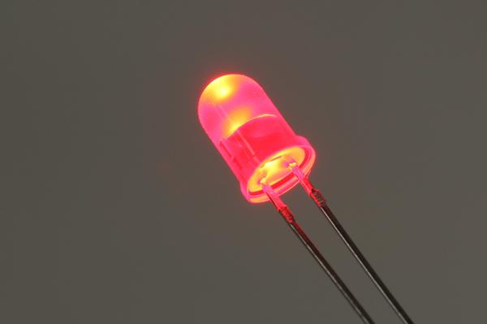

# Electronic Led 5 Mm
  

  
* oomp_key: oomp_electronic_led_5_mm 
* short_code: l5
* md5_6: 7297cd  
* github_link: https://github.com/oomlout/oomlout_oomp_part_src/tree/main/parts/electronic_led_5_mm/working  
## naming details
* classification -- electronic
* type -- led
* size -- 5_mm
* color -- 
* description_main -- 
* description_extra -- 
* manucaturer -- 
* part_number -- 

## symbol

  
oomp_key: oomp_kicad_device_led  
link: https://github.com/oomlout/oomlout_oomp_symbol_bot/tree/main/symbols/kicad_device_led/working  

## footprint

  
oomp_key: oomp_kicad_led_tht_led_d5_0mm  
link: https://github.com/oomlout/oomlout_oomp_footprint_bot/tree/main/footprints/kicad_led_tht_led_d5_0mm/working  

## full_summary
| name | value | 
| --- | --- | 
| name | value | 
| classification | electronic | 
| type | led | 
| size | 5_mm | 
| color |  | 
| description_main |  | 
| description_extra |  | 
| manufacturer |  | 
| part_number |  | 
| filter |  | 
| kicad_reference | L | 
| id | electronic_led_5_mm | 
| id_no_class | led_5_mm | 
| id_no_type | 5_mm | 
| oomp_key | oomp_electronic_led_5_mm | 
| github_link | https://github.com/oomlout/oomlout_oomp_part_src/tree/main/parts/electronic_led_5_mm/working | 
| directory | parts/electronic_led_5_mm | 
| name | Electronic Led 5 Mm | 
| short_code | l5 | 
| short_code_upper | L5 | 
| short_name | 5 Mm Led | 
| distributors | [] | 
| manufacturers | [] | 
| md5 | 7297cd778d1471689ae0db398d716719 | 
| md5_5 | 7297c | 
| md5_5_upper | 7297C | 
| md5_6 | 7297cd | 
| md5_6_upper | 7297CD | 
| md5_6_alpha | 4gyq5 | 
| md5_6_alpha_upper | 4GYQ5 | 
| md5_10 | 7297cd778d | 
| md5_10_upper | 7297CD778D | 
| type_first_letter | l | 
| type_first_letter_upper | L | 
| size_only_numbers | 5 | 
| size_only_numbers_no_zeros | 5 | 
| color_upper |  | 
| color_first_letter |  | 
| color_first_letter_upper |  | 
| description_only_numbers |  | 
| description_only_numbers_short |   | 
| description_or_color |   | 
| description_or_color_upper |   | 
| markdown_full | [electronic_led_5_mm](https://github.com/oomlout/oomlout_oomp_part_src/tree/main/parts/electronic_led_5_mm/working) [l5](https://github.com/oomlout/oomlout_oomp_part_src/tree/main/parts/electronic_led_5_mm/working) [Electronic Led 5 Mm](https://github.com/oomlout/oomlout_oomp_part_src/tree/main/parts/electronic_led_5_mm/working)   | 
| markdown_short | [electronic_led_5_mm](https://github.com/oomlout/oomlout_oomp_part_src/tree/main/parts/electronic_led_5_mm/working)   | 
| footprint | [{'link': 'https://github.com/oomlout/oomlout_oomp_footprint_bot/tree/main/foootprntss/kicad_led_tht_led_d5_0mm', 'oomp_key': 'oomp_kicad_led_tht_led_d5_0mm', 'directory': 'oomlout_oomp_footprint_bot/footprints/kicad_led_tht_led_d5_0mm//working/working.kicad_mod'}] | 
| symbol | [{'link': 'https://github.com/oomlout/oomlout_oomp_symbol_bot/tree/main/symbols/kicad_device_led', 'oomp_key': 'oomp_kicad_device_led', 'directory': 'oomlout_oomp_symbol_bot/symbols/kicad_device_led//working/working.kicad_sym'}] | 
