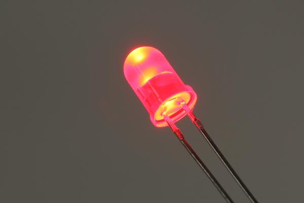

# OOMP Part  
## Electronic Led 5 Mm Red  
  
oomp key: oomp_electronic_led_5_mm_red  
  
### Part Details  
  
  
  
#### Important Bits  
| name | value | 
| --- | --- | 
| name | Electronic Led 5 Mm Red | 
| full id | electronic_led_5_mm_red | 
| short code | l5r | 
| short link (not yet working) | http://oom.lt/l5r http://oom.lt/30578 | 
| oomp key | oomp_electronic_led_5_mm_red | 
| md5_5 | 30578 | 
| md5_10 | 30578ce27b | 
| md5 | 30578ce27beae920469b86e05a198be3 | 
#### ID Composition  
| name | value | 
| --- | --- | 
| 1 classification | electronic | 
| 2 type | led | 
| 3 size | 5_mm | 
| 4 color | red | 
| 5 description main |  | 
| 6 description extra |  | 
| 7 manufacturer |  | 
| 8 part number |  | 
### Symbol  
| name | value | 
| --- | --- | 
| oomp_key | oomp_kicad_device_led | 
| link | https://github.com/oomlout/oomlout_oomp_symbol_bot/tree/main/symbols/kicad_device_led | 
| directory | oomlout_oomp_symbol_bot/symbols/kicad_device_led//working/working.kicad_sym | 
### Footprint  
### Images  
