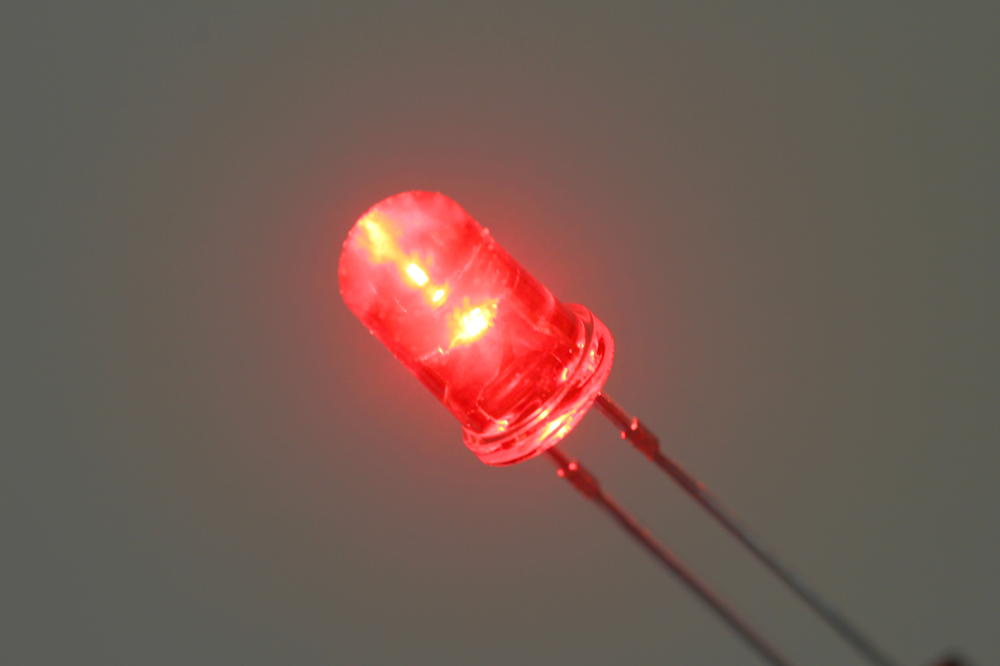
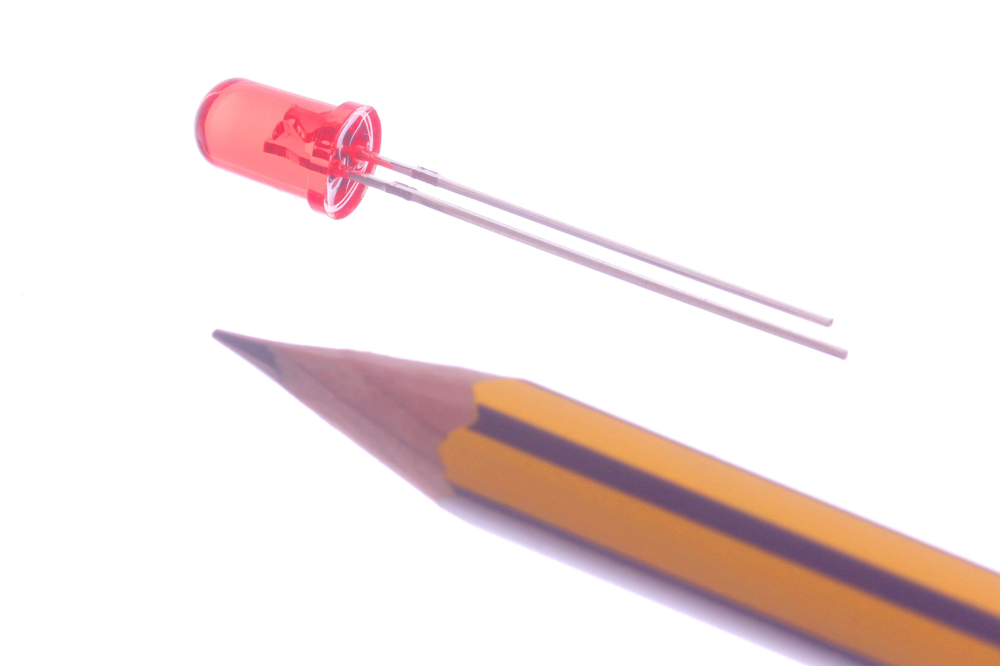

# Electronic Led 5 Mm Red Tinted

## Description

## Properties

## Image

## Values

| Key | Value |
| --- | --- |
| classification | electronic |
| type | led |
| size | 5_mm |
| color | red |
| description_main | tinted |
| description_extra |  |
| manufacturer |  |
| part_number |  |
| kicad_reference | L |
| id | electronic_led_5_mm_red_tinted |
| directory | parts/electronic_led_5_mm_red_tinted |
| name | Electronic Led 5 Mm Red Tinted |
| short_code | l5rt |
| distributors | [] |
| md5 | db1ff864f0d58c117377a5198578e76c |
| md5_5 | db1ff |
| md5_6 | db1ff8 |
| md5_10 | db1ff864f0 |
| footprint | [{'link': 'https://github.com/oomlout/oomlout_OOMP_eda_V2/tree/main/FOOTPRINT/kicad/kicad-footprints/LED_THT/LED_D5.0mm/', 'name': 'LED_D5.0mm', 'id': 'FOOTPRINT-kicad-kicad-footprints-LED_THT-LED_D5.0mm', 'directory': 'FOOTPRINT/kicad/kicad-footprints/LED_THT/LED_D5.0mm/'}] |
| symbol | [{'link': 'https://github.com/oomlout/oomlout_OOMP_eda_V2/tree/main/SYMBOL/kicad/kicad-symbols/Device/LED', 'name': 'LED', 'id': 'SYMBOL-kicad-kicad-symbols-Device-LED', 'directory': 'SYMBOL/kicad/kicad-symbols/Device/LED/'}] |

## Notes

