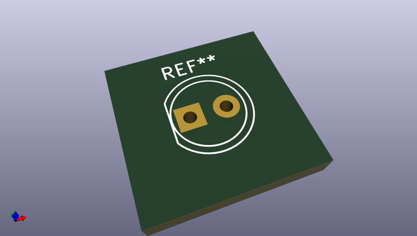

# OOMP Footprint  
## LED_D5.0mm  by none  
  
oomp key: oomp_kicad_led_tht_led_d5_0mm  
  
source repo at: [http://gitlab.com/kicad/libraries/kicad-footprints//blob/master/tmp/libraries/kicad-footprints/Varistor.pretty/RV_Rect_V25S440P_L26.5mm_W8.2mm_P12.7mm.kicad_mod](http://gitlab.com/kicad/libraries/kicad-footprints//blob/master/tmp/libraries/kicad-footprints/Varistor.pretty/RV_Rect_V25S440P_L26.5mm_W8.2mm_P12.7mm.kicad_mod)  
## Footprint  
  
  
  
  
| name | value | 
| --- | --- | 
| footprint name | LED_D5.0mm | 
| footprint description | LED, diameter 5.0mm, 2 pins, http://cdn-reichelt.de/documents/datenblatt/A500/LL-504BC2E-009.pdf | 
| number of pads | 2 | 
| github path | http://github.com/kicad/libraries/kicad-footprints//blob/master/tmp/libraries/kicad-footprints/LED_THT.pretty/LED_D5.0mm.kicad_mod | 
| oomp key | oomp_kicad_led_tht_led_d5_0mm | 
| oomp bot github | https://github.com/oomlout/oomlout_oomp_footprint_bot/tree/main/footprints/kicad_led_tht_led_d5_0mm/working | 
## Images  
