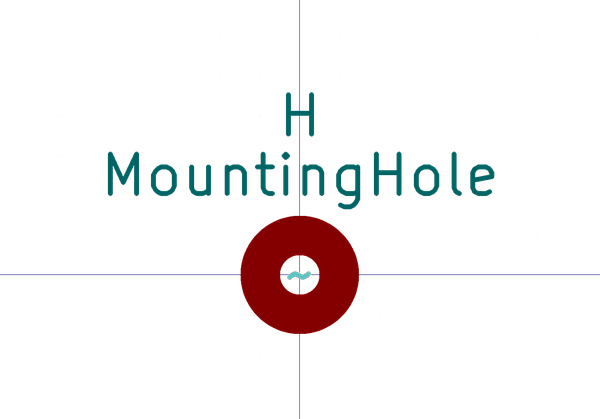

# Electronic Mounting Hole M3
oomp_key: oomp_electronic_mounting_hole_m3  

short_code: mhm3
## naming details
* classification -- electronic
* type -- mounting_hole
* size -- m3
* color -- 
* description_main -- 
* description_extra -- 
* manucaturer -- 
* part_number -- 

## symbol

  
oomp_key: oomp_kicad_mechanical_mountinghole  
link: https://github.com/oomlout/oomlout_oomp_symbol_bot/tree/main/symbols/kicad_mechanical_mountinghole/working  

