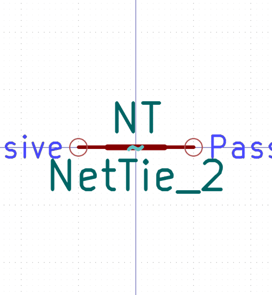

# Electronic Nettie 2 Nets Smd

  
* oomp_key: oomp_electronic_nettie_2_nets_smd 
* short_code: nt2
* md5_6: 4ef35d  
* github_link: https://github.com/oomlout/oomlout_oomp_part_src/tree/main/parts/electronic_nettie_2_nets_smd/working  
## naming details
* classification -- electronic
* type -- nettie
* size -- 2_nets
* color -- 
* description_main -- smd
* description_extra -- 
* manucaturer -- 
* part_number -- 

## symbol

  
oomp_key: oomp_kicad_device_nettie_2  
link: https://github.com/oomlout/oomlout_oomp_symbol_bot/tree/main/symbols/kicad_device_nettie_2/working  

## footprint

  
oomp_key: oomp_kicad_nettie_nettie_2_smd_pad0_5mm  
link: https://github.com/oomlout/oomlout_oomp_footprint_bot/tree/main/footprints/kicad_nettie_nettie_2_smd_pad0_5mm/working  

## full_summary
| name | value | 
| --- | --- | 
| name | value | 
| classification | electronic | 
| type | nettie | 
| size | 2_nets | 
| color |  | 
| description_main | smd | 
| description_extra |  | 
| manufacturer |  | 
| part_number |  | 
| filter |  | 
| kicad_reference |  | 
| id | electronic_nettie_2_nets_smd | 
| id_no_class | nettie_2_nets_smd | 
| id_no_type | 2_nets_smd | 
| oomp_key | oomp_electronic_nettie_2_nets_smd | 
| github_link | https://github.com/oomlout/oomlout_oomp_part_src/tree/main/parts/electronic_nettie_2_nets_smd/working | 
| directory | parts/electronic_nettie_2_nets_smd | 
| name | Electronic Nettie 2 Nets Smd | 
| short_code | nt2 | 
| short_code_upper | NT2 | 
| distributors | [] | 
| manufacturers | [] | 
| md5 | 4ef35d1f2d790456123942109a5f27e9 | 
| md5_5 | 4ef35 | 
| md5_5_upper | 4EF35 | 
| md5_6 | 4ef35d | 
| md5_6_upper | 4EF35D | 
| md5_6_alpha | 32wd9 | 
| md5_6_alpha_upper | 32WD9 | 
| md5_10 | 4ef35d1f2d | 
| md5_10_upper | 4EF35D1F2D | 
| type_first_letter | n | 
| type_first_letter_upper | N | 
| size_only_numbers | 2 | 
| size_only_numbers_no_zeros | 2 | 
| color_upper |  | 
| color_first_letter |  | 
| color_first_letter_upper |  | 
| description_only_numbers |  | 
| description_only_numbers_short |   | 
| description_or_color |   | 
| description_or_color_upper |   | 
| markdown_full | [electronic_nettie_2_nets_smd](https://github.com/oomlout/oomlout_oomp_part_src/tree/main/parts/electronic_nettie_2_nets_smd/working) [nt2](https://github.com/oomlout/oomlout_oomp_part_src/tree/main/parts/electronic_nettie_2_nets_smd/working) [Electronic Nettie 2 Nets Smd](https://github.com/oomlout/oomlout_oomp_part_src/tree/main/parts/electronic_nettie_2_nets_smd/working)   | 
| markdown_short | [electronic_nettie_2_nets_smd](https://github.com/oomlout/oomlout_oomp_part_src/tree/main/parts/electronic_nettie_2_nets_smd/working)   | 
| footprint | [{'link': 'https://github.com/oomlout/oomlout_oomp_footprint_bot/tree/main/foootprntss/kicad_nettie_nettie_2_smd_pad0_5mm', 'oomp_key': 'oomp_kicad_nettie_nettie_2_smd_pad0_5mm', 'directory': 'oomlout_oomp_footprint_bot/footprints/kicad_nettie_nettie_2_smd_pad0_5mm//working/working.kicad_mod'}] | 
| symbol | [{'link': 'https://github.com/oomlout/oomlout_oomp_symbol_bot/tree/main/symbols/kicad_device_nettie_2', 'oomp_key': 'oomp_kicad_device_nettie_2', 'directory': 'oomlout_oomp_symbol_bot/symbols/kicad_device_nettie_2//working/working.kicad_sym'}] | 
