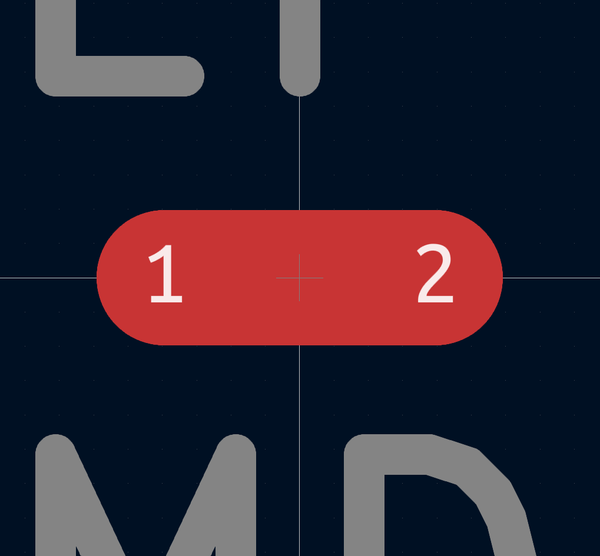

# Electronic Nettie 2 Nets Smd
oomp_key: oomp_electronic_nettie_2_nets_smd  

short_code: nt2
## naming details
* classification -- electronic
* type -- nettie
* size -- 2_nets
* color -- 
* description_main -- smd
* description_extra -- 
* manucaturer -- 
* part_number -- 
## pinout
  
List of Pins:

## symbol

  
oomp_key: oomp_kicad_device_nettie_2  
link: https://github.com/oomlout/oomlout_oomp_symbol_bot/tree/main/symbols/kicad_device_nettie_2/working  

## footprint

  
oomp_key: oomp_kicad_nettie_nettie_2_smd_pad0_5mm  
link: https://github.com/oomlout/oomlout_oomp_footprint_bot/tree/main/foootprntss/kicad_nettie_nettie_2_smd_pad0_5mm/working  
